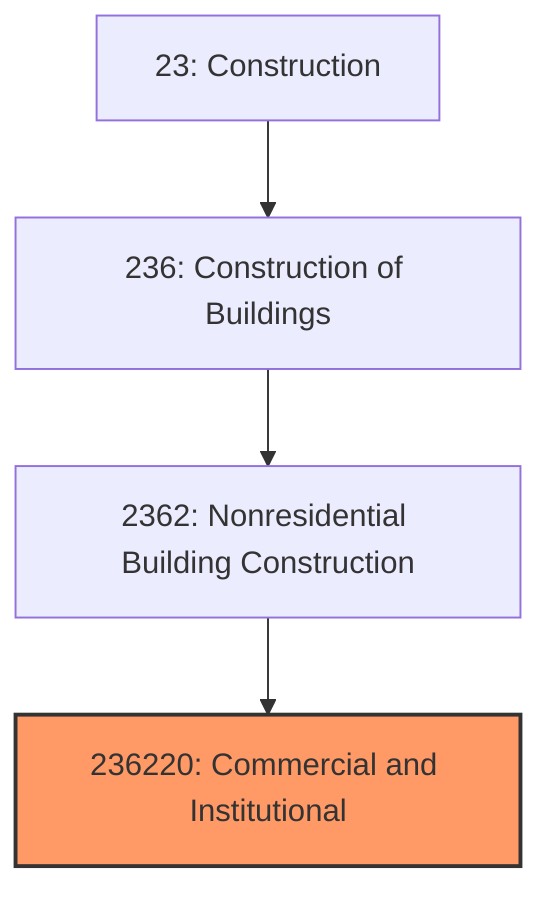

# Commercial and Institutional Building Construction

> This industry comprises establishments primarily responsible for the construction of commercial and institutional buildings, including office buildings, retail centers, schools, hospitals, and public buildings.

## Overview

Commercial and Institutional Building Construction (NAICS 236220) encompasses establishments engaged in constructing buildings used for commercial purposes, public services, and institutional functions. This diverse industry includes office towers, shopping centers, hotels, hospitals, schools, government buildings, religious facilities, and recreational structures.

The industry serves as a primary driver of economic development, creating the physical infrastructure where commerce, healthcare, education, and civic activities occur. Projects range from small retail fit-outs to massive mixed-use developments spanning millions of square feet.

## Market Context

The U.S. commercial and institutional building construction market represents approximately $350 billion in annual spending across major segments:

| Segment | Market Size | Growth Drivers |
|---------|-------------|----------------|
| Healthcare | $65 billion | Aging population, medical technology, outpatient expansion |
| Education | $55 billion | Enrollment growth, facility modernization, STEM facilities |
| Office Buildings | $50 billion | Corporate relocations, flight-to-quality, adaptive reuse |
| Retail/Hospitality | $45 billion | Experience retail, hotel renovation, mixed-use |
| Government/Public | $40 billion | Deferred maintenance, public safety, civic centers |
| Religious/Recreation | $25 billion | Community facilities, sports venues, worship centers |
| Other Commercial | $70 billion | Data centers, life sciences, entertainment |

Recent market dynamics include the shift toward hybrid work impacting office demand, healthcare construction boom driven by aging demographics, and data center expansion fueled by cloud computing and AI.

## Industry Hierarchy

## Key Statistics

| Metric | Value |
|--------|-------|
| NAICS Code | 236220 |
| Level | National Industry |
| Parent | [Nonresidential Building Construction](../) |
| U.S. Establishments | ~35,000 |
| Annual Revenue | ~$350 billion |
| Employment | ~450,000 |
| Average Project Size | $10-100 million |

## Project Types

### Healthcare Construction
- Hospitals and medical centers
- Outpatient surgery centers
- Medical office buildings
- Senior living and long-term care
- Behavioral health facilities

### Educational Facilities
- K-12 schools and additions
- College and university buildings
- Research laboratories
- Student housing
- Athletic facilities

### Commercial Buildings
- Corporate headquarters
- Speculative office buildings
- Retail centers and malls
- Hotels and resorts
- Mixed-use developments

### Institutional and Public
- Government office buildings
- Courthouses and public safety
- Libraries and cultural centers
- Religious facilities
- Convention centers

## Related Occupations

- [Construction Managers](/occupations/Management/ConstructionManagers) - Lead complex commercial projects with multiple stakeholders
- [Architects](/occupations/Architecture/Architects) - Design commercial buildings meeting functional and aesthetic requirements
- [Civil Engineers](/occupations/Architecture/CivilEngineers) - Design structural systems and site infrastructure
- [Mechanical Engineers](/occupations/Architecture/MechanicalEngineers) - Specify HVAC systems for large commercial spaces
- [Electrical Engineers](/occupations/Architecture/ElectricalEngineers) - Design power distribution and building automation
- [Project Superintendents](/occupations/Construction/Superintendents) - Manage daily field operations and subcontractors
- [Cost Estimators](/occupations/Business/CostEstimators) - Develop competitive bids and project budgets
- [BIM Managers](/occupations/Technology/BIMManagers) - Coordinate building information modeling across trades
- [Commissioning Agents](/occupations/Facilities/CommissioningAgents) - Verify building systems performance

## Core Business Processes

### Business Development

Securing commercial projects requires proactive relationship-building and strategic positioning.

**Key Activities:**
- Monitor market conditions and upcoming projects
- Develop relationships with owners, developers, and design professionals
- Evaluate opportunities against strategic criteria
- Prepare compelling proposals and presentations
- Participate in interviews and negotiations

### Pre-Construction Services

Commercial projects often engage contractors during design for cost and constructability input.

**Key Activities:**
- Develop conceptual budgets during schematic design
- Provide constructability reviews of design documents
- Identify long-lead equipment and materials
- Create detailed cost estimates and schedules
- Value engineer to meet budget constraints
- Pre-qualify and select subcontractors

### Construction Execution

Commercial projects require coordination of numerous specialized systems and trades.

**Key Activities:**
- Establish project organization and procedures
- Coordinate BIM among all project participants
- Manage complex MEP systems installation
- Process submittals and RFIs efficiently
- Track schedule and cost performance
- Maintain safety and quality programs

### Building Commissioning

Commercial buildings require systematic commissioning to ensure systems operate as designed.

**Key Activities:**
- Develop and execute commissioning plans
- Test and balance HVAC systems
- Verify lighting and electrical controls
- Document system operations
- Train owner's facility staff
- Address deficiencies before occupancy

## Industry Value Chain

## Regulatory Environment

Commercial and institutional construction operates under comprehensive regulatory oversight:

### Building Codes
- **International Building Code (IBC)** - Primary code governing commercial construction
- **NFPA 101 Life Safety Code** - Fire protection and egress requirements
- **ADA Accessibility Guidelines** - Requirements for accessible public buildings
- **ASHRAE 90.1** - Commercial building energy efficiency standards

### Industry-Specific Regulations
- **FGI Guidelines** - Facility Guidelines Institute standards for healthcare
- **State Education Department** - Requirements for school construction
- **FDA Food Code** - Commercial kitchen requirements
- **TIA-942** - Data center standards

### Safety Standards
- **OSHA 29 CFR 1926** - Construction industry safety requirements
- **Fall Protection Standards** - Working at heights requirements
- **Crane and Rigging** - Heavy equipment safety
- **Steel Erection Standards** - Structural steel installation requirements

### Environmental Requirements
- **LEED Certification** - Green building certification programs
- **WELL Building Standard** - Occupant health and wellness requirements
- **NPDES Permits** - Stormwater management during construction
- **Indoor Air Quality** - Building ventilation requirements

## Technology & Innovation

### Design Coordination
- **Building Information Modeling (BIM)** - 3D coordination and clash detection among all trades
- **Virtual Reality (VR)** - Immersive owner reviews of design
- **Augmented Reality (AR)** - Field visualization of installed systems
- **Digital Twin** - Real-time operational models for facilities management

### Construction Methods
- **Prefabrication** - Off-site manufacturing of MEP racks, curtain wall, and modular components
- **Mass Timber** - Cross-laminated timber (CLT) as structural alternative to steel
- **Automated Material Handling** - Robotics for material movement and installation
- **3D Printing** - Additive manufacturing for building components

### Project Management
- **Cloud Platforms** - Procore, Autodesk Build, Oracle Primavera for collaboration
- **AI Schedule Optimization** - Machine learning for schedule forecasting
- **Drone Progress Monitoring** - Aerial documentation and surveying
- **IoT Sensors** - Real-time monitoring of concrete curing, environmental conditions

### Sustainable Building
- **Net-Zero Energy** - Integration of efficiency and renewable energy
- **Embodied Carbon Tracking** - Tools for measuring construction carbon footprint
- **Smart Building Systems** - Building automation and energy management
- **Healthy Materials** - Low-VOC and sustainable material selection

## Delivery Methods

Commercial construction utilizes various contracting approaches:

| Method | Description | Typical Use |
|--------|-------------|-------------|
| Design-Bid-Build | Traditional sequential process | Public projects, simple scope |
| Design-Build | Single entity for design and construction | Speed, single responsibility |
| CM at Risk | Construction manager provides GMP during design | Complex projects |
| CM Multi-Prime | CM coordinates separate prime contracts | Large institutional projects |
| IPD | Integrated team with shared risk/reward | Healthcare, complex projects |

## Industry Trends and Outlook

Key trends shaping commercial and institutional construction:

- **Healthcare Boom** - Aging demographics driving hospital and outpatient construction
- **Data Center Growth** - Cloud computing and AI creating massive demand
- **Adaptive Reuse** - Converting obsolete office buildings to residential or mixed-use
- **Sustainability Mandates** - Growing requirements for net-zero and healthy buildings
- **Prefabrication Adoption** - Off-site construction to address labor shortages
- **Technology Integration** - Smart building systems becoming standard
- **Life Sciences** - Pharmaceutical and biotech facility investment

The outlook remains positive with healthcare, data center, and manufacturing reshoring driving demand. Office construction faces headwinds from remote work but flight-to-quality and adaptive reuse create opportunities.

---

*Source: NAICS 236220 - Commercial and Institutional Building Construction*
