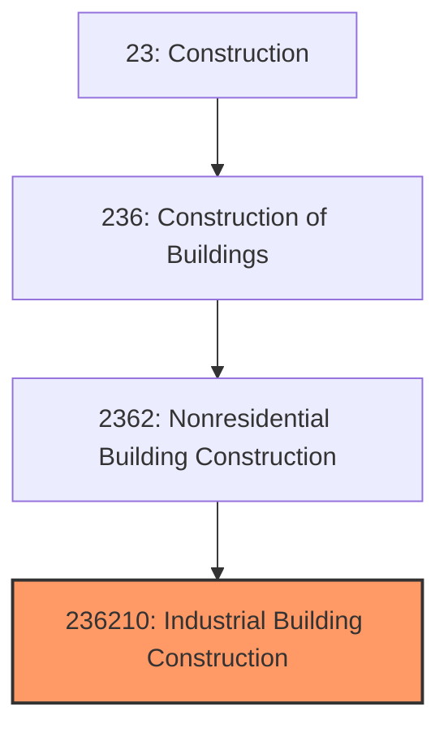

# Industrial Building Construction

> This industry comprises establishments primarily responsible for the construction of industrial buildings, including manufacturing plants, warehouses, and distribution centers.

## Overview

Industrial Building Construction (NAICS 236210) encompasses establishments engaged in constructing buildings designed for manufacturing, processing, storage, and distribution activities. This includes factories, assembly plants, warehouse facilities, distribution centers, cold storage buildings, and other industrial structures.

The industry serves as critical infrastructure for the manufacturing and logistics sectors, providing specialized facilities that must accommodate heavy equipment, high ceilings, large floor plates, complex utility systems, and efficient material flow. Projects range from speculative warehouse shells to highly customized manufacturing facilities with sophisticated process equipment integration.

## Market Context

The U.S. industrial building construction market has experienced significant growth, representing approximately $100 billion in annual spending:

| Segment | Market Size | Key Drivers |
|---------|-------------|-------------|
| Warehouse/Distribution | $45 billion | E-commerce growth, supply chain optimization |
| Manufacturing Facilities | $35 billion | Reshoring, advanced manufacturing, EVs |
| Cold Storage | $10 billion | Grocery delivery, pharmaceutical storage |
| Data Centers | $10 billion | Cloud computing, AI infrastructure |

The market has been transformed by e-commerce driving massive demand for last-mile distribution facilities, manufacturing reshoring returning production to North America, and the explosive growth of data center construction.

## Industry Hierarchy

## Key Statistics

| Metric | Value |
|--------|-------|
| NAICS Code | 236210 |
| Level | National Industry |
| Parent | [Nonresidential Building Construction](../) |
| U.S. Establishments | ~12,000 |
| Annual Revenue | ~$100 billion |
| Employment | ~150,000 |
| Average Project Size | $20-200 million |
| Typical Building Size | 100,000-1,000,000+ SF |

## Project Types

### Distribution and Fulfillment Centers
- E-commerce fulfillment facilities
- Regional distribution centers
- Last-mile delivery hubs
- Cross-dock facilities
- Parcel sorting facilities

### Manufacturing Plants
- Automotive assembly plants
- Electronics manufacturing
- Food processing facilities
- Pharmaceutical production
- Aerospace manufacturing
- Battery and EV component plants

### Cold Storage and Specialized
- Refrigerated warehouses
- Frozen food distribution
- Pharmaceutical cold chain
- Hazardous materials storage

### Data Centers
- Hyperscale data centers
- Enterprise data facilities
- Colocation centers
- Edge computing facilities

## Related Occupations

- [Construction Managers](/occupations/Management/ConstructionManagers) - Oversee complex industrial projects with process equipment integration
- [Civil Engineers](/occupations/Architecture/CivilEngineers) - Design structural systems for heavy loads and industrial requirements
- [Mechanical Engineers](/occupations/Architecture/MechanicalEngineers) - Design HVAC and process utility systems
- [Electrical Engineers](/occupations/Architecture/ElectricalEngineers) - Plan heavy power distribution and industrial electrical
- [Industrial Engineers](/occupations/Engineering/IndustrialEngineers) - Optimize facility layouts and material flow
- [Structural Ironworkers](/occupations/Construction/Ironworkers) - Erect steel structures for industrial buildings
- [Operating Engineers](/occupations/Construction/OperatingEngineers) - Operate cranes and heavy equipment
- [Concrete Workers](/occupations/Construction/ConcreteWorkers) - Install industrial floor systems

## Core Business Processes

### Site Selection and Development

Industrial projects require careful site selection to optimize logistics and operations.

**Key Activities:**
- Evaluate sites for transportation access, utilities, and labor markets
- Conduct geotechnical and environmental due diligence
- Navigate entitlement and zoning approval processes
- Design site improvements and utility infrastructure
- Coordinate with economic development agencies for incentives

### Industrial Building Design

Industrial buildings require specialized design for operational requirements.

**Key Activities:**
- Design clear-span structures with appropriate column spacing
- Specify industrial floor systems (flatness, load capacity)
- Plan truck court and dock configurations
- Design fire suppression systems (ESFR, in-rack)
- Specify heavy power requirements and distribution
- Plan process utility systems (compressed air, process water, gases)

### Construction Execution

Industrial construction emphasizes speed and efficiency for fast market entry.

**Key Activities:**
- Perform mass grading and utility installation
- Install foundations and industrial floor slabs
- Erect structural steel and metal building systems
- Install roofing and wall panel systems
- Complete electrical, fire protection, and HVAC
- Coordinate process equipment installation

### Process Equipment Integration

Manufacturing facilities require coordination of building with process equipment.

**Key Activities:**
- Coordinate equipment foundation requirements
- Install process piping and utilities
- Set and align production equipment
- Connect equipment to building systems
- Commission integrated systems
- Support owner production startup

## Industry Value Chain

## Regulatory Environment

Industrial construction operates under specific regulatory requirements:

### Building Codes
- **International Building Code (IBC)** - Requirements for industrial occupancies
- **NFPA 13** - Sprinkler system requirements for high-pile storage
- **FM Global Standards** - Insurance requirements for industrial facilities
- **ASME Codes** - Pressure vessel and piping standards

### Industrial-Specific Regulations
- **EPA Air Quality Permits** - Manufacturing emission controls
- **FDA cGMP** - Pharmaceutical manufacturing requirements
- **USDA/FSIS** - Food processing facility standards
- **ITAR/Export Control** - Defense manufacturing requirements

### Safety Standards
- **OSHA 29 CFR 1926** - Construction safety standards
- **Process Safety Management** - Hazardous chemical requirements
- **Machine Guarding** - Equipment safety requirements
- **Electrical Safety** - Arc flash and lockout/tagout

### Environmental Requirements
- **NPDES Stormwater** - Construction and operational permits
- **Hazardous Materials** - Storage and handling requirements
- **Air Quality** - Stack emission permits and monitoring
- **Wastewater** - Industrial discharge permits

## Technology & Innovation

### Design Technology
- **Building Information Modeling (BIM)** - Coordination of structure with process equipment
- **Virtual Reality (VR)** - Owner reviews of layouts and material flow
- **Simulation Software** - Material handling and logistics optimization
- **Generative Design** - AI-optimized facility layouts

### Construction Methods
- **Pre-Engineered Metal Buildings** - Rapid construction of warehouse shells
- **Tilt-Up Concrete** - Economical wall systems for industrial buildings
- **Fast-Track Construction** - Overlapping design and construction phases
- **Prefabricated Systems** - Off-site manufacturing of MEP components

### Industrial Floor Technology
- **Super-Flat Floors** - Precision floors for automated storage systems
- **Fiber-Reinforced Concrete** - Durable floors for heavy use
- **Floor Hardeners** - Surface treatments for durability
- **Laser-Guided Screeding** - Precision floor installation

### Building Systems
- **Automated Storage and Retrieval (AS/RS)** - High-bay automated warehousing
- **Robotics Integration** - Facilities designed for robotic operations
- **Energy-Efficient HVAC** - Destratification and make-up air systems
- **LED High-Bay Lighting** - Energy-efficient industrial lighting

## Specialized Industrial Construction

### Data Center Construction
- **Power Redundancy** - 2N and 2N+1 power systems
- **Cooling Systems** - Precision cooling, hot/cold aisle containment
- **Fire Suppression** - Clean agent systems for IT equipment
- **Security** - Multi-layer physical security systems
- **Speed to Market** - Modular and prefabricated construction

### Cold Storage Construction
- **Insulated Panel Systems** - High R-value wall and roof systems
- **Refrigeration Systems** - Ammonia and CO2 refrigerant systems
- **Freezer Floor Systems** - Heated slabs to prevent frost heave
- **Dock Equipment** - Temperature-controlled dock seals

### Advanced Manufacturing
- **Cleanrooms** - Controlled environments for electronics/pharma
- **Process Utilities** - Specialized gas, water, and chemical systems
- **Vibration Control** - Isolation systems for precision equipment
- **Environmental Controls** - Temperature and humidity-controlled spaces

## Industry Trends and Outlook

Key trends shaping industrial building construction:

- **E-commerce Demand** - Continued need for fulfillment and last-mile facilities
- **Manufacturing Reshoring** - Government incentives bringing production back
- **EV and Battery Plants** - Massive facilities for electric vehicle components
- **Data Center Boom** - AI and cloud computing driving unprecedented demand
- **Cold Chain Expansion** - Grocery delivery and pharmaceutical storage
- **Automation Integration** - Buildings designed for robotic operations
- **Sustainability** - Net-zero warehouses and LEED industrial certification

The outlook remains exceptionally strong with e-commerce, reshoring, data centers, and EV manufacturing driving sustained demand. Labor shortages continue to push adoption of prefabrication and faster construction methods.

---

*Source: NAICS 236210 - Industrial Building Construction*
