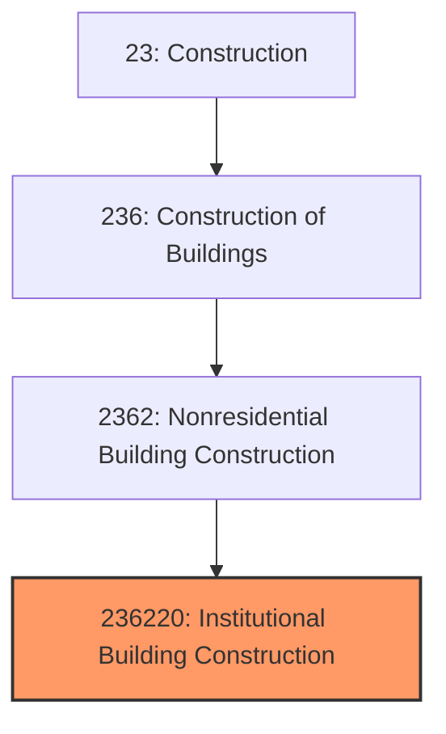

# Institutional Building Construction

> This industry comprises establishments primarily responsible for the construction of institutional buildings, including educational facilities, healthcare buildings, and government structures.

## Overview

Institutional Building Construction represents a specialized segment of nonresidential construction focused on buildings serving public purposes and community needs. This includes schools, colleges, hospitals, medical centers, government offices, courthouses, libraries, museums, and public safety facilities.

Institutional construction differs from commercial work through its emphasis on public accountability, community impact, complex stakeholder management, and specialized functional requirements. Projects often involve public funding, resulting in unique procurement methods, prevailing wage requirements, and transparency mandates.

## Market Context

The U.S. institutional building construction market represents approximately $180 billion in annual spending:

| Segment | Market Size | Key Drivers |
|---------|-------------|-------------|
| Healthcare | $65 billion | Aging population, technology advancement, outpatient shift |
| K-12 Education | $35 billion | Enrollment growth, modernization, safety upgrades |
| Higher Education | $25 billion | STEM facilities, student amenities, research labs |
| Government/Civic | $35 billion | Deferred maintenance, public safety, civic renewal |
| Cultural/Recreation | $20 billion | Museums, libraries, community centers |

The market benefits from relatively stable public funding but faces challenges from budget constraints, long approval processes, and complex stakeholder requirements.

## Industry Hierarchy

## Key Statistics

| Metric | Value |
|--------|-------|
| NAICS Code | 236220 |
| Level | National Industry |
| Parent | [Nonresidential Building Construction](../) |
| U.S. Establishments | ~20,000 |
| Annual Revenue | ~$180 billion |
| Employment | ~250,000 |
| Average Project Size | $15-150 million |

## Project Types

### Healthcare Facilities
- Acute care hospitals
- Ambulatory surgery centers
- Medical office buildings
- Cancer treatment centers
- Behavioral health facilities
- Senior living and long-term care

### Educational Facilities
- K-12 schools and additions
- College academic buildings
- Research laboratories
- Student housing
- Athletics and recreation
- Performing arts centers

### Government Buildings
- Federal office buildings
- State and local government
- Courthouses and justice
- Public safety (fire, police, EMS)
- Correctional facilities

### Civic and Cultural
- Libraries
- Museums
- Community centers
- Convention centers
- Houses of worship

## Related Occupations

- [Construction Managers](/occupations/Management/ConstructionManagers) - Lead complex institutional projects with multiple stakeholders
- [Healthcare Architects](/occupations/Architecture/Architects) - Specialize in medical facility planning and design
- [Civil Engineers](/occupations/Architecture/CivilEngineers) - Design structural systems meeting institutional requirements
- [MEP Engineers](/occupations/Architecture/MechanicalEngineers) - Design complex HVAC and plumbing systems
- [Cost Estimators](/occupations/Business/CostEstimators) - Develop budgets for public funding approval
- [Project Superintendents](/occupations/Construction/Superintendents) - Manage construction in occupied facilities
- [Safety Directors](/occupations/Management/SafetyManagers) - Ensure compliance in healthcare and educational settings
- [Commissioning Agents](/occupations/Facilities/CommissioningAgents) - Verify critical building systems performance

## Core Business Processes

```mermaid
flowchart LR
    subgraph Planning["Project Planning"]
        L1["Needs Assessment"]
        L2["Funding Approval"]
        L3["Design Selection"]
        L4["Community Input"]
    end

    subgraph Preconstruction["Pre-Construction"]
        P1["Procurement"]
        P2["Estimating"]
        P3["Permitting"]
        P4["Phasing Plans"]
    end

    subgraph Construction["Construction"]
        C1["Site Preparation"]
        C2["Structure"]
        C3["MEP Systems"]
        C4["Interiors"]
        C5["Commissioning"]
    end

    subgraph Occupancy["Occupancy"]
        O1["Training"]
        O2["Move-In"]
        O3["Warranty"]
    end

    L1 --> L2 --> L3 --> L4
    L4 --> P1 --> P2 --> P3 --> P4
    P4 --> C1 --> C2 --> C3 --> C4 --> C5
    C5 --> O1 --> O2 --> O3
```

### Project Planning and Funding

Institutional projects require extensive planning and funding approval before construction begins.

**Key Activities:**
- Conduct needs assessments and master planning
- Develop project budgets and funding strategies
- Navigate bond issuance or appropriation processes
- Select design teams through qualifications-based selection
- Conduct community outreach and stakeholder engagement
- Obtain board or legislative approval

### Procurement and Pre-Construction

Public projects often require specific procurement methods and competitive processes.

**Key Activities:**
- Develop bid packages meeting procurement requirements
- Conduct pre-bid conferences and site visits
- Evaluate bids and verify contractor qualifications
- Award contracts and execute agreements
- Develop phasing plans for occupied facility work
- Plan infection control (healthcare) or school operations coordination

### Construction in Occupied Facilities

Many institutional projects require construction while buildings remain operational.

**Key Activities:**
- Implement infection control risk assessment (ICRA) for healthcare
- Coordinate construction with school calendars
- Manage noise, dust, and vibration in occupied areas
- Maintain egress and life safety systems
- Schedule shutdowns and utility connections
- Communicate with building occupants and stakeholders

### Commissioning and Occupancy

Institutional buildings require thorough commissioning and transition planning.

**Key Activities:**
- Execute enhanced commissioning for critical systems
- Train facility operations staff on building systems
- Coordinate move-in and occupancy planning
- Support operational readiness activities
- Provide warranty service and post-occupancy support

## Industry Value Chain

```mermaid
graph LR
    subgraph Inputs["Inputs & Resources"]
        I1["Building Materials"]
        I2["Medical/Lab Equipment"]
        I3["Skilled Trades"]
        I4["Design Professionals"]
        I5["Public Funding"]
    end

    subgraph Primary["Primary Activities"]
        A1["Site Development"]
        A2["Building Construction"]
        A3["Systems Installation"]
        A4["Equipment Integration"]
    end

    subgraph Outputs["Deliverables"]
        O1["Healthcare Facilities"]
        O2["Educational Buildings"]
        O3["Government Facilities"]
        O4["Civic/Cultural Venues"]
    end

    subgraph Customers["Customer Segments"]
        C1["Hospital Systems"]
        C2["School Districts"]
        C3["Universities"]
        C4["Government Agencies"]
        C5["Nonprofit Organizations"]
    end

    Inputs --> Primary --> Outputs --> Customers
```

## Regulatory Environment

Institutional construction operates under extensive regulatory oversight:

### Building Codes
- **International Building Code (IBC)** - Base code for institutional occupancies
- **NFPA 101 Life Safety Code** - Fire and life safety requirements
- **ADA Accessibility Guidelines** - Comprehensive accessibility requirements
- **ASHRAE Standards** - Energy efficiency and indoor air quality

### Healthcare-Specific Regulations
- **FGI Guidelines** - Facility Guidelines Institute standards for healthcare
- **Joint Commission Standards** - Accreditation requirements
- **CMS Conditions of Participation** - Medicare/Medicaid requirements
- **State Health Department** - Licensing and inspection requirements

### Educational Facility Standards
- **State Education Department** - Facility standards and approval requirements
- **ADA/Section 504** - Accessibility for students with disabilities
- **FEMA Shelter Standards** - Safe room requirements for schools
- **EPA Indoor Air Quality** - School environmental requirements

### Government Building Requirements
- **GSA P100** - Federal building design standards
- **ATFP Standards** - Anti-terrorism force protection
- **Historic Preservation** - Section 106 compliance for historic buildings
- **Sustainable Buildings (E.O. 13834)** - Federal sustainability requirements

### Safety Standards
- **OSHA 29 CFR 1926** - Construction safety requirements
- **Infection Control Risk Assessment (ICRA)** - Healthcare construction safety
- **Interim Life Safety Measures** - Fire safety during construction

## Technology & Innovation

### Design Technology
- **Building Information Modeling (BIM)** - Coordination of complex systems in healthcare and labs
- **Virtual Reality (VR)** - Mock-up reviews for patient rooms and classrooms
- **Simulation Software** - Patient flow and building performance modeling
- **Evidence-Based Design** - Research-informed healthcare design

### Construction Methods
- **Prefabrication** - Off-site manufacturing of patient room headwalls and bathroom pods
- **Integrated Project Delivery (IPD)** - Collaborative contracts with shared risk/reward
- **Lean Construction** - Last Planner System and continuous improvement
- **Modular Construction** - Factory-built patient rooms and classrooms

### Healthcare Technology Integration
- **Medical Equipment Planning** - Integration of imaging, OR, and lab equipment
- **Nurse Call and Communications** - Hospital communication systems
- **Medical Gas Systems** - Oxygen, vacuum, and specialty gases
- **Sterilization Equipment** - Central sterile processing integration

### Sustainable and Healthy Buildings
- **LEED for Healthcare** - Green building certification for medical facilities
- **WELL Building Standard** - Occupant health and wellness certification
- **Net-Zero Energy** - Energy-efficient institutional buildings
- **Healthy Materials** - Low-VOC and sustainable material selection

## Delivery Methods for Institutional Projects

| Method | Description | Common Applications |
|--------|-------------|---------------------|
| Design-Bid-Build | Traditional public procurement | K-12 schools, government buildings |
| CM at Risk | Early contractor involvement with GMP | Healthcare, higher education |
| Design-Build | Single entity responsibility | Time-critical projects |
| IPD | Integrated team with shared incentives | Complex healthcare projects |
| CM Multi-Prime | Separate prime contracts | Large public projects |

## Major Market Segments

### Healthcare Construction

The largest institutional segment, driven by:
- Aging population requiring more healthcare services
- Technology advancement requiring facility updates
- Shift to outpatient and ambulatory care
- Replacement of aging hospital infrastructure
- Behavioral health and addiction treatment expansion

### K-12 School Construction

Driven by:
- Population growth and migration patterns
- Modernization of aging school buildings
- Safety and security upgrades
- Technology infrastructure requirements
- STEM and career technical education facilities

### Higher Education Construction

Driven by:
- Research facility investments
- Student life and housing improvements
- Athletic and recreation facilities
- Deferred maintenance backlog
- STEM and healthcare education expansion

## Industry Trends and Outlook

Key trends shaping institutional construction:

- **Healthcare Expansion** - Aging demographics driving sustained construction demand
- **School Safety** - Secure vestibules and safety upgrades across K-12
- **Flexible Learning** - Adaptable classroom and laboratory designs
- **Resilience** - Buildings designed to withstand natural disasters
- **Infection Control** - Pandemic-informed design for healthcare and education
- **Sustainability** - Net-zero and healthy building mandates
- **Behavioral Health** - Increased investment in mental health facilities

The outlook remains stable with healthcare construction particularly strong. Public funding constraints may limit growth in education and government segments, but aging infrastructure and population growth support continued demand.

---

*Source: NAICS 236220 - Institutional Building Construction*
