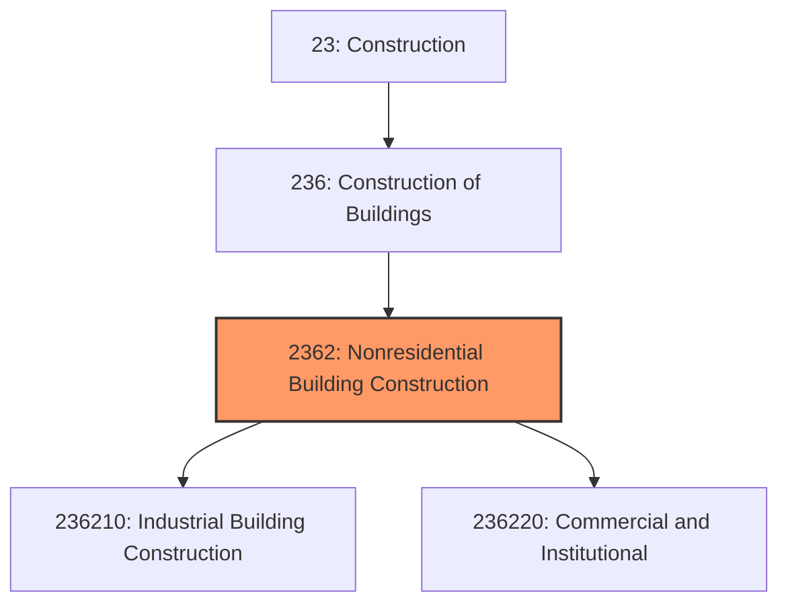

# Nonresidential Building Construction

> This industry group comprises establishments primarily responsible for the construction of nonresidential buildings, including commercial, industrial, and institutional structures.

## Overview

Nonresidential Building Construction encompasses establishments engaged in constructing buildings designed for purposes other than residential occupancy. This includes office buildings, retail centers, warehouses, manufacturing facilities, hospitals, schools, and government buildings. Establishments in this industry group may function as general contractors, design-builders, or construction managers.

The nonresidential sector differs fundamentally from residential construction in project scale, complexity, financing structures, and regulatory requirements. Projects typically involve longer construction timelines, more sophisticated building systems, and coordination among larger teams of architects, engineers, and specialty contractors.

## Market Context

The U.S. nonresidential building construction market represents approximately $450 billion in annual spending. Market segments include:

| Segment | Market Share | Key Drivers |
|---------|-------------|-------------|
| Commercial (Office, Retail) | 35% | Economic growth, employment trends, e-commerce adaptation |
| Industrial (Manufacturing, Warehouse) | 25% | Supply chain reshoring, e-commerce fulfillment, advanced manufacturing |
| Institutional (Healthcare, Education) | 30% | Population demographics, government funding, deferred maintenance |
| Other (Religious, Recreation) | 10% | Community investment, nonprofit development |

The market is influenced by commercial real estate cycles, interest rates, and corporate capital expenditure decisions. Recent trends include adaptive reuse of existing buildings and flight-to-quality in office markets.

## Industry Hierarchy

## Key Statistics

| Metric | Value |
|--------|-------|
| NAICS Code | 2362 |
| Level | Industry Group |
| Parent | [Construction of Buildings](../) |
| Child Industries | 2 |
| U.S. Establishments | ~45,000 |
| Annual Revenue | ~$450 billion |
| Average Project Value | $5-50 million |

## Sub-Industries

| Industry | Code | Description |
|----------|------|-------------|
| [Industrial Building Construction](./IndustrialBuildingConstruction/) | 236210 | Manufacturing plants, warehouses, and distribution centers |
| [Commercial and Institutional Building](./InstitutionalBuildingConstruction/) | 236220 | Office buildings, retail, healthcare, education facilities |

## Related Occupations

- [Construction Managers](/occupations/Management/ConstructionManagers) - Oversee complex commercial projects with multiple stakeholders
- [Civil Engineers](/occupations/Architecture/CivilEngineers) - Design structural and site systems for nonresidential buildings
- [Architects](/occupations/Architecture/Architects) - Create building designs meeting commercial and institutional requirements
- [Mechanical Engineers](/occupations/Architecture/MechanicalEngineers) - Design HVAC and mechanical systems for large buildings
- [Electrical Engineers](/occupations/Architecture/ElectricalEngineers) - Plan electrical distribution and building automation systems
- [Cost Estimators](/occupations/Business/CostEstimators) - Develop detailed estimates for competitive bidding
- [Project Superintendents](/occupations/Construction/Superintendents) - Manage day-to-day field operations
- [Safety Managers](/occupations/Management/SafetyManagers) - Ensure compliance with OSHA and safety programs

## Core Business Processes

### Pre-Construction Services

Nonresidential projects often include extensive pre-construction services where contractors provide input during design development.

**Key Activities:**
- Develop conceptual and detailed cost estimates
- Provide constructability reviews of design documents
- Create preliminary project schedules
- Identify long-lead equipment and materials
- Qualify and pre-select subcontractors
- Value engineer designs to meet budget constraints

### Construction Management

Coordinating complex building systems and multiple trades requires sophisticated project management approaches.

**Key Activities:**
- Establish and maintain master project schedule
- Coordinate Building Information Modeling (BIM) among trades
- Manage Requests for Information (RFIs) and submittals
- Process and track change orders
- Conduct progress meetings and reporting
- Ensure quality control and safety compliance

### Building Commissioning

Commissioning ensures building systems operate as designed before owner occupancy.

**Key Activities:**
- Develop commissioning plans and checklists
- Test and balance HVAC systems
- Verify electrical and lighting controls
- Document system operations for owners
- Train building operations staff
- Resolve deficiencies identified during testing

## Industry Value Chain

## Regulatory Environment

Nonresidential construction faces more stringent regulatory requirements than residential work:

### Building Codes
- **International Building Code (IBC)** - Primary code governing commercial construction
- **NFPA 101 Life Safety Code** - Fire protection and egress requirements
- **ADA Accessibility Guidelines** - Requirements for accessible design
- **ASHRAE Standards** - Energy efficiency and HVAC system requirements

### Industry-Specific Codes
- **Healthcare (FGI Guidelines)** - Facility Guidelines Institute standards for healthcare construction
- **Educational Facilities** - State education department requirements
- **Food Service (FDA Food Code)** - Requirements for commercial kitchens
- **Data Centers (TIA-942)** - Standards for mission-critical facilities

### Safety Requirements
- **OSHA 29 CFR 1926** - Construction industry safety standards
- **Crane and Rigging Standards** - Requirements for heavy lifting operations
- **Steel Erection Standards** - Specific requirements for structural steel work
- **Confined Space Requirements** - Protocols for work in enclosed areas

### Environmental Compliance
- **LEED Certification Requirements** - Green building certification standards
- **Stormwater Pollution Prevention** - NPDES permit requirements
- **Indoor Air Quality** - Requirements for building ventilation and materials

## Technology & Innovation

### Design Technology
- **Building Information Modeling (BIM)** - 3D/4D/5D modeling for design coordination, scheduling, and cost management
- **Virtual Reality (VR)** - Immersive design reviews with owners and stakeholders
- **Digital Twin Technology** - Real-time building models for operations and maintenance
- **Clash Detection** - Automated identification of design conflicts before construction

### Construction Technology
- **Prefabrication and Modular** - Off-site fabrication of building components and systems
- **Tower Cranes with GPS** - Precise material placement and collision avoidance
- **Concrete Monitoring Systems** - Real-time strength testing enabling faster construction
- **Automated Layout Systems** - Robotic total stations for precise positioning

### Project Management
- **Cloud-Based Project Management** - Platforms like Procore, Autodesk Build for collaboration
- **Schedule Optimization Software** - AI-powered scheduling and resource leveling
- **Document Management Systems** - Electronic plan rooms and specification tracking
- **Mobile Field Technology** - Tablets and smartphones for real-time field reporting

### Sustainability Innovation
- **Mass Timber Construction** - Cross-laminated timber (CLT) for mid-rise buildings
- **Net-Zero Energy Buildings** - Integrated renewable energy and efficiency measures
- **Embodied Carbon Tracking** - Tools for measuring construction carbon footprint
- **Smart Building Systems** - IoT-enabled building automation and energy management

## Delivery Methods

Nonresidential construction employs various project delivery methods:

| Method | Description | Best For |
|--------|-------------|----------|
| Design-Bid-Build | Traditional sequential approach | Public projects, clearly defined scope |
| Design-Build | Single entity for design and construction | Speed, single point of responsibility |
| CM at Risk | Construction manager provides GMP | Complex projects, early contractor input |
| IPD | Integrated team with shared risk/reward | Complex healthcare, institutional projects |

## Industry Trends and Outlook

Key trends shaping nonresidential construction:

- **Adaptive Reuse** - Converting obsolete office and retail buildings to new uses
- **Healthcare Expansion** - Aging population driving hospital and clinic construction
- **Data Center Growth** - Cloud computing and AI increasing demand for facilities
- **Warehouse and Distribution** - E-commerce driving industrial construction boom
- **Sustainability Requirements** - Increasing mandates for net-zero and LEED buildings
- **Labor Productivity** - Technology adoption to address workforce shortages

The market outlook remains positive with infrastructure investment, healthcare expansion, and manufacturing reshoring driving demand, though office construction faces headwinds from remote work trends.

---

*Source: NAICS 2362 - Nonresidential Building Construction*
