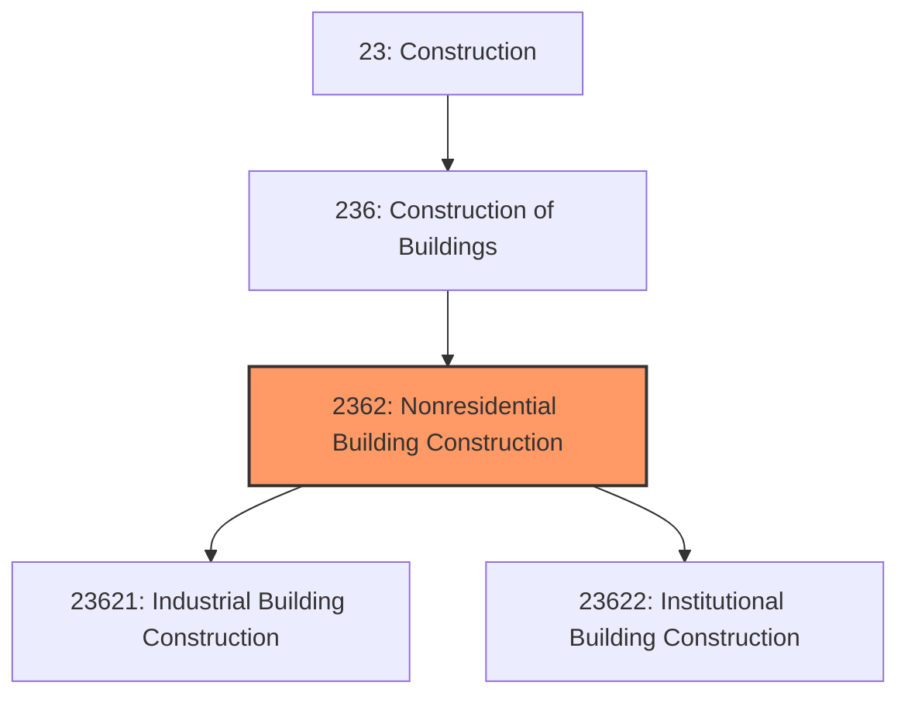
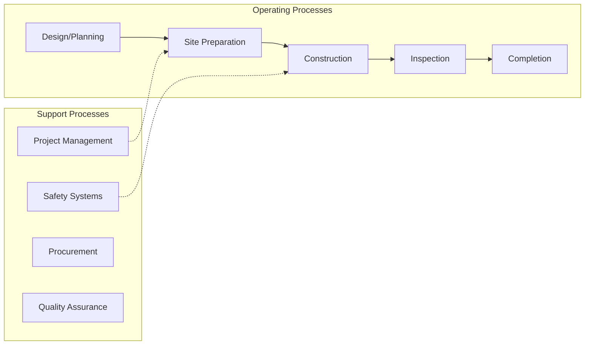

# Nonresidential Building Construction

> This industry group comprises establishments primarily responsible for the construction (including new work, additions, alterations, maintenance, and repairs) of nonresidential buildings.

## Overview

Nonresidential Building Construction represents an important category within the Construction sector (NAICS 23). This industry group encompasses establishments primarily engaged in nonresidential building construction.

This industry group comprises establishments primarily responsible for the construction (including new work, additions, alterations, maintenance, and repairs) of nonresidential buildings. This industry group includes nonresidential general contractors, nonresidential for-sale builders, nonresidential design-build firms, and nonresidential project construction management firms.

## Industry Hierarchy

## Key Statistics

| Metric | Value |
|--------|-------|
| NAICS Code | 2362 |
| Level | Industry Group |
| Parent | [Construction of Buildings](../) |
| Child Industries | 2 |

## Sub-Industries

| Industry | Code | Description |
|----------|------|-------------|
| [Industrial Building Construction](./IndustrialBuildingConstruction/) | 23621 | See industry description for 236210 |
| [Institutional Building Construction](./InstitutionalBuildingConstruction/) | 23622 | See industry description for 236220 |

## Core Business Processes

## Industry Value Chain

```mermaid
graph LR
    subgraph Inputs["Inputs"]
        I1["Materials"]
        I2["Equipment"]
        I3["Labor"]
        I4["Plans"]
    end

    subgraph Primary["Primary Activities"]
        A1["Inbound Logistics"]
        A2["Core Operations"]
        A3["Quality Assurance"]
        A4["Outbound/Delivery"]
    end

    subgraph Outputs["Products/Services"]
        O1["Buildings"]
        O2["Infrastructure"]
        O3["Renovations"]
    end

    subgraph Customers["Markets"]
        C1["Property Owners"]
        C2["Government"]
        C3["Developers"]
        C4["Businesses"]
    end

    Inputs --> Primary --> Outputs --> Customers
```

---

*Source: NAICS 2362 - Nonresidential Building Construction*
