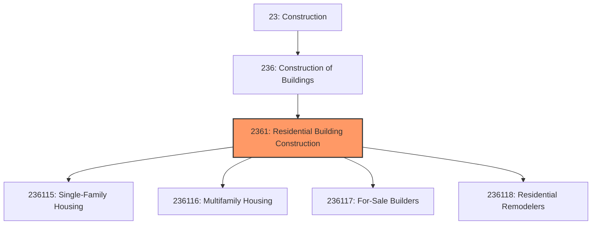

# Residential Building Construction

> This industry group comprises establishments primarily responsible for the construction of residential buildings, including single-family homes, multifamily buildings, and residential remodeling.

## Overview

Residential Building Construction encompasses establishments engaged in constructing buildings designed primarily for residential occupancy. This includes single-family detached homes, townhouses, condominiums, apartment buildings, and manufactured housing. The industry also includes residential remodelers who perform major renovation work on existing homes.

Establishments operate as general contractors, custom home builders, production (tract) builders, multifamily developers, or residential remodelers. The industry is characterized by diverse firm sizes, from sole proprietors building a few custom homes annually to large national homebuilders producing thousands of units across multiple markets.

## Market Context

The U.S. residential construction market represents approximately $400 billion in annual spending, divided among:

| Segment | Annual Spending | Key Characteristics |
|---------|----------------|---------------------|
| Single-Family New Construction | $200 billion | Largest segment, tied to housing starts |
| Multifamily New Construction | $75 billion | Driven by rental demand, urban development |
| Residential Remodeling | $125 billion | Less cyclical, driven by home equity |

The market is highly sensitive to interest rates, mortgage availability, household formation rates, and regional economic conditions. Housing starts serve as a leading economic indicator, typically ranging from 1.0 to 1.5 million units annually in normal market conditions.

## Industry Hierarchy

## Key Statistics

| Metric | Value |
|--------|-------|
| NAICS Code | 2361 |
| Level | Industry Group |
| Parent | [Construction of Buildings](../) |
| Child Industries | 4 |
| U.S. Establishments | ~185,000 |
| Annual Revenue | ~$400 billion |
| Housing Starts (2024) | ~1.4 million units |
| Employment | ~900,000 |

## Industry Segments

| Segment | Code | Description |
|---------|------|-------------|
| New Single-Family General Contractors | 236115 | Custom and contract single-family home construction |
| New Multifamily General Contractors | 236116 | Apartment buildings, condominiums, townhouse projects |
| New Housing For-Sale Builders | 236117 | Production homebuilders constructing on owned land |
| Residential Remodelers | 236118 | Major renovation, addition, and reconstruction |

## Related Occupations

- [Construction Managers](/occupations/Management/ConstructionManagers) - Oversee residential construction projects and subcontractors
- [Carpenters](/occupations/Construction/Carpenters) - Frame structures and install finish carpentry
- [Electricians](/occupations/Construction/Electricians) - Install residential electrical systems
- [Plumbers](/occupations/Construction/Plumbers) - Install plumbing and water systems
- [HVAC Technicians](/occupations/Installation/HVACTechnicians) - Install heating and cooling systems
- [Roofers](/occupations/Construction/Roofers) - Install and repair residential roofing
- [Painters](/occupations/Construction/Painters) - Apply paint and finishes
- [Concrete Finishers](/occupations/Construction/ConcreteFinishers) - Pour and finish foundations and flatwork
- [Home Inspectors](/occupations/Construction/HomeInspectors) - Inspect homes for code compliance and defects

## Core Business Processes

```mermaid
flowchart LR
    subgraph PreDevelopment["Pre-Development"]
        D1["Land Acquisition"]
        D2["Entitlements"]
        D3["Design/Engineering"]
        D4["Permitting"]
    end

    subgraph Construction["Construction"]
        C1["Site Work"]
        C2["Foundation"]
        C3["Framing"]
        C4["MEP Rough-In"]
        C5["Insulation/Drywall"]
        C6["Finishes"]
    end

    subgraph Closeout["Closeout"]
        O1["Final Inspection"]
        O2["Punch List"]
        O3["Certificate of Occupancy"]
        O4["Warranty"]
    end

    D1 --> D2 --> D3 --> D4
    D4 --> C1 --> C2 --> C3 --> C4 --> C5 --> C6
    C6 --> O1 --> O2 --> O3 --> O4
```

### Land Development and Entitlement

For-sale builders and developers must secure land and necessary approvals before construction.

**Key Activities:**
- Evaluate land acquisition opportunities and pricing
- Conduct due diligence on zoning and site constraints
- Navigate entitlement process with local jurisdictions
- Design subdivisions and obtain plat approval
- Install site infrastructure (roads, utilities)
- Secure building permits for individual lots

### Home Construction

The construction process follows a predictable sequence of trade activities.

**Key Activities:**
- Prepare site and install foundation systems
- Erect structural framing and roof system
- Install windows, exterior doors, and roofing
- Rough-in electrical, plumbing, and HVAC systems
- Insulate and install drywall
- Complete interior finishes and trim
- Install flooring, cabinets, and fixtures
- Final grading and landscaping

### Sales and Customer Service

Homebuilders must effectively market and sell homes while managing customer relationships.

**Key Activities:**
- Operate model homes and sales centers
- Qualify buyers and manage contracts
- Coordinate buyer selections and upgrades
- Conduct pre-settlement walkthroughs
- Process closing and title transfer
- Manage warranty claims and service requests

## Industry Value Chain

```mermaid
graph LR
    subgraph Inputs["Inputs & Resources"]
        I1["Building Materials"]
        I2["Developed Lots"]
        I3["Skilled Labor"]
        I4["Plans/Designs"]
        I5["Financing"]
    end

    subgraph Primary["Primary Activities"]
        A1["Land Development"]
        A2["Home Construction"]
        A3["Sales/Marketing"]
        A4["Customer Service"]
    end

    subgraph Outputs["Products"]
        O1["Single-Family Homes"]
        O2["Townhouses"]
        O3["Condominiums"]
        O4["Apartments"]
        O5["Renovated Homes"]
    end

    subgraph Customers["Customer Segments"]
        C1["First-Time Buyers"]
        C2["Move-Up Buyers"]
        C3["Luxury Buyers"]
        C4["Active Adults"]
        C5["Rental Investors"]
    end

    Inputs --> Primary --> Outputs --> Customers
```

## Regulatory Environment

Residential construction operates under specific regulatory frameworks:

### Building Codes
- **International Residential Code (IRC)** - Primary code for one- and two-family dwellings
- **International Building Code (IBC)** - Applies to multifamily buildings over three stories
- **National Electrical Code (NEC)** - Residential electrical requirements
- **Uniform Plumbing Code** - Plumbing system requirements

### Energy Standards
- **International Energy Conservation Code (IECC)** - Energy efficiency requirements
- **ENERGY STAR Certification** - Voluntary program for energy-efficient homes
- **Title 24 (California)** - Stringent state energy standards
- **Net-Zero Ready Standards** - Emerging requirements for zero-energy homes

### Safety and Consumer Protection
- **OSHA Construction Standards** - Workplace safety requirements
- **Lead-Safe Work Practices** - Requirements for renovation of pre-1978 homes
- **State Contractor Licensing** - Licensing requirements vary by state
- **Home Warranty Laws** - State-mandated warranty requirements

### Land Use and Environmental
- **Zoning Ordinances** - Local land use regulations
- **Subdivision Regulations** - Requirements for land development
- **Stormwater Management** - Erosion control and drainage requirements
- **Wetlands and Environmental Review** - Permits for sensitive areas

## Technology & Innovation

### Design and Sales Technology
- **Virtual Home Tours** - 3D visualization and virtual reality for home sales
- **Online Design Centers** - Digital selection of finishes and options
- **BIM for Residential** - Building information modeling for production builders
- **Generative Design** - AI-assisted floor plan optimization

### Construction Technology
- **Prefabricated Components** - Factory-built wall panels, trusses, and modules
- **Modular Construction** - Complete home modules manufactured off-site
- **3D Printed Homes** - Emerging technology for affordable housing
- **Drone Surveying** - Aerial photography for site documentation

### Building Performance
- **Smart Home Systems** - Integrated home automation and energy management
- **High-Performance Building Envelopes** - Advanced insulation and air sealing
- **Solar-Ready Construction** - Prewiring and structural preparation for solar
- **Heat Pump HVAC** - Efficient heating and cooling systems

### Business Operations
- **Construction Management Software** - Scheduling, purchasing, and project tracking
- **Customer Relationship Management** - Sales tracking and buyer communication
- **Warranty Management Systems** - Service request tracking and resolution
- **Trade Partner Portals** - Subcontractor communication and scheduling

## Major Industry Players

The residential construction industry includes several large national builders:

| Builder | Annual Closings | Markets |
|---------|----------------|---------|
| D.R. Horton | ~90,000 homes | Nationwide |
| Lennar | ~70,000 homes | Nationwide |
| PulteGroup | ~30,000 homes | Nationwide |
| NVR Inc. | ~25,000 homes | East Coast |
| Toll Brothers | ~10,000 homes | Luxury segment |

The market also includes thousands of regional and local builders, custom home builders, and residential remodelers.

## Industry Trends and Outlook

Key trends shaping residential construction:

- **Affordability Crisis** - Rising costs and land scarcity limiting first-time buyer access
- **Build-to-Rent** - Institutional investors building single-family rentals
- **Aging in Place** - Design features for multigenerational and accessible housing
- **Sustainability** - Growing demand for energy-efficient and green homes
- **Labor Shortage** - Skilled trades shortage driving offsite construction adoption
- **Supply Chain** - Material availability and cost volatility affecting operations
- **Technology Adoption** - Increasing use of prefab, automation, and digital tools

The outlook depends heavily on interest rate environment and housing affordability. Demographic demand remains strong with millennials and Gen Z entering peak homebuying years, but supply constraints and affordability challenges may limit production growth.

---

*Source: NAICS 2361 - Residential Building Construction*
