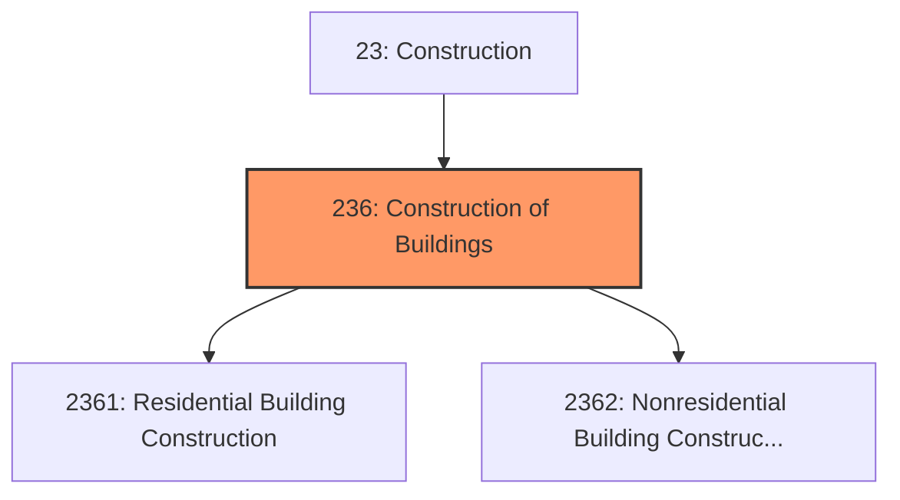
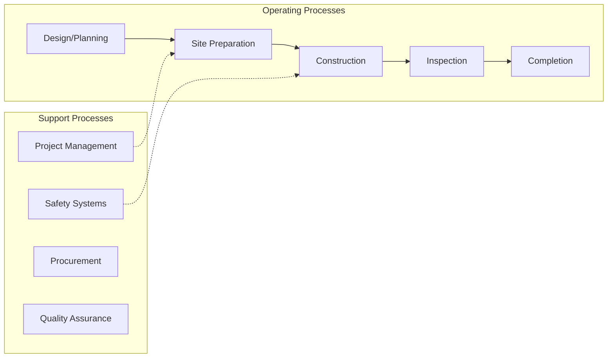

# Construction of Buildings

> The Construction of Buildings subsector comprises establishments primarily responsible for the construction of buildings.

## Overview

Construction of Buildings represents an important category within the Construction sector (NAICS 23). This subsector encompasses establishments primarily engaged in construction of buildings.

The Construction of Buildings subsector comprises establishments primarily responsible for the construction of buildings. The work performed may include new work, additions, alterations, or maintenance and repairs. The on-site assembly of precut, panelized, and prefabricated buildings and construction of temporary buildings are included in this subsector. Part or all of the production work for which the establishments in this subsector have responsibility may be subcontracted to other construction establishments--usually specialty trade contractors. Establishments in this subsector are classified based on the types of buildings they construct. This classification reflects variations in the requirements of the underlying production processes.

## Industry Hierarchy

## Key Statistics

| Metric | Value |
|--------|-------|
| NAICS Code | 236 |
| Level | Subsector |
| Parent | [Construction](../) |
| Child Industries | 2 |

## Sub-Industries

| Industry | Code | Description |
|----------|------|-------------|
| [Residential Building Construction](./ResidentialBuildingConstruction/) | 2361 | Residential Building Construction |
| [Nonresidential Building Construction](./NonresidentialBuildingConstruction/) | 2362 | This industry group comprises establishments primarily responsible for the const |

## Core Business Processes

## Industry Value Chain

```mermaid
graph LR
    subgraph Inputs["Inputs"]
        I1["Materials"]
        I2["Equipment"]
        I3["Labor"]
        I4["Plans"]
    end

    subgraph Primary["Primary Activities"]
        A1["Inbound Logistics"]
        A2["Core Operations"]
        A3["Quality Assurance"]
        A4["Outbound/Delivery"]
    end

    subgraph Outputs["Products/Services"]
        O1["Buildings"]
        O2["Infrastructure"]
        O3["Renovations"]
    end

    subgraph Customers["Markets"]
        C1["Property Owners"]
        C2["Government"]
        C3["Developers"]
        C4["Businesses"]
    end

    Inputs --> Primary --> Outputs --> Customers
```

---

*Source: NAICS 236 - Construction of Buildings*
