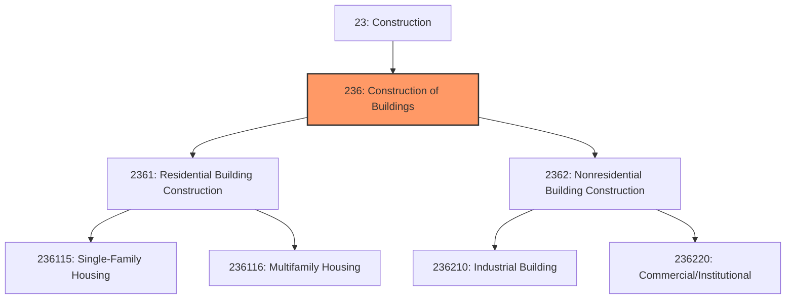

# Construction of Buildings

> The Construction of Buildings subsector comprises establishments primarily responsible for the construction of buildings, including new work, additions, alterations, maintenance, and repairs.

## Overview

Construction of Buildings represents a foundational subsector within the Construction sector (NAICS 23), encompassing all establishments engaged in erecting residential and nonresidential structures. This subsector includes general contractors, operative builders, design-build firms, and construction management companies that assume overall responsibility for building projects.

The subsector is distinguished by its focus on enclosed structures intended for human occupancy or use, differentiating it from heavy and civil engineering construction. Establishments may perform work with their own workforce or subcontract specialized activities to trade contractors. The classification reflects the distinct production requirements, workforce skills, and capital investments associated with different building types.

## Market Context

The U.S. building construction market represents one of the largest segments of the construction industry, with annual spending exceeding $800 billion. The market divides roughly 60/40 between residential and nonresidential construction, though this ratio fluctuates with economic cycles and interest rate environments.

Key market drivers include:
- **Population growth and household formation** driving residential demand
- **Commercial real estate development** responding to business expansion
- **Institutional construction** funded by government and nonprofit entities
- **Renovation and remodeling** extending building lifecycles

## Industry Hierarchy

## Key Statistics

| Metric | Value |
|--------|-------|
| NAICS Code | 236 |
| Level | Subsector |
| Parent | [Construction](../) |
| Child Industry Groups | 2 |
| U.S. Establishments | ~230,000 |
| Annual Revenue | ~$850 billion |
| Employment | ~1.8 million |

## Sub-Industries

| Industry | Code | Description |
|----------|------|-------------|
| [Residential Building Construction](./ResidentialBuildingConstruction/) | 2361 | Single-family homes, multifamily buildings, residential remodeling |
| [Nonresidential Building Construction](./NonresidentialBuildingConstruction/) | 2362 | Commercial, industrial, and institutional buildings |

## Related Occupations

- [Construction Managers](/occupations/Management/ConstructionManagers) - Plan, coordinate, and oversee building projects from conception to completion
- [Civil Engineers](/occupations/Architecture/CivilEngineers) - Design structural systems and ensure code compliance
- [Architects](/occupations/Architecture/Architects) - Design buildings and prepare construction documents
- [Cost Estimators](/occupations/Business/CostEstimators) - Calculate project costs for bidding and budgeting
- [Carpenters](/occupations/Construction/Carpenters) - Construct and install building frameworks and structures
- [Electricians](/occupations/Construction/Electricians) - Install and maintain electrical systems
- [Plumbers](/occupations/Construction/Plumbers) - Install and repair plumbing systems
- [Construction Laborers](/occupations/Construction/ConstructionLaborers) - Perform physical labor and support skilled trades

## Core Business Processes

### Pre-Construction Phase

The pre-construction phase establishes project feasibility, cost parameters, and contractual relationships essential for successful execution.

**Key Activities:**
- Analyze project specifications and drawings
- Develop detailed cost estimates and schedules
- Negotiate contract terms and conditions
- Coordinate with architects and engineers on constructability
- Obtain building permits and regulatory approvals
- Establish subcontractor and supplier agreements

### Construction Execution

The construction phase transforms design documents into physical structures through coordinated trade activities.

**Key Activities:**
- Mobilize workforce and equipment to site
- Execute work according to construction schedule
- Coordinate multiple trades and subcontractors
- Manage material deliveries and inventory
- Conduct quality inspections at milestone points
- Process change orders and maintain documentation

### Project Closeout

The closeout phase ensures the completed building meets specifications and is ready for occupancy.

**Key Activities:**
- Complete punch list items and deficiency corrections
- Coordinate final inspections with authorities
- Compile operation and maintenance documentation
- Transfer warranties and guarantees to owner
- Conduct final walkthrough and acceptance

## Industry Value Chain

## Regulatory Environment

The building construction industry operates under comprehensive regulatory oversight at federal, state, and local levels:

### Building Codes and Standards
- **International Building Code (IBC)** - Model code adopted by most jurisdictions for commercial and multifamily construction
- **International Residential Code (IRC)** - Standards for one- and two-family dwellings
- **Energy Codes (IECC)** - Requirements for building energy efficiency
- **Accessibility Standards (ADA/ANSI)** - Requirements for accessible design

### Safety Regulations
- **OSHA Construction Standards (29 CFR 1926)** - Comprehensive workplace safety requirements
- **Fall Protection Requirements** - Specific standards for working at heights
- **Confined Space Entry** - Protocols for excavations and enclosed areas
- **Hazard Communication** - Requirements for chemical safety and labeling

### Environmental Compliance
- **NEPA Review** - Environmental impact assessment for federal projects
- **Stormwater Management (NPDES)** - Erosion and sediment control requirements
- **Wetlands Protection** - Permits for construction near waterways
- **Lead and Asbestos Regulations** - Requirements for renovation of older buildings

### Licensing and Bonding
- State contractor licensing requirements
- Performance and payment bond requirements
- Workers' compensation and liability insurance
- Prevailing wage requirements on public projects

## Technology & Innovation

The building construction industry is undergoing significant digital transformation:

### Design and Planning Technology
- **Building Information Modeling (BIM)** - 3D digital models enabling design coordination, clash detection, and quantity takeoffs
- **Virtual Design and Construction (VDC)** - Simulation of construction sequences before work begins
- **Generative Design** - AI-assisted optimization of building layouts and systems

### Construction Technology
- **Prefabrication and Modular Construction** - Off-site manufacturing of building components for faster, higher-quality assembly
- **3D Printing** - Additive manufacturing of building components and structures
- **Robotics and Automation** - Automated bricklaying, rebar tying, and material handling
- **Drones and Aerial Surveying** - Site documentation, progress monitoring, and inspection

### Project Management Systems
- **Cloud-based Collaboration** - Real-time document sharing and communication
- **Mobile Field Applications** - Digital daily reports, punch lists, and inspection documentation
- **Integrated Project Delivery (IPD)** - Collaborative contracting models aligning stakeholder interests

### Sustainable Building
- **Green Building Certification** - LEED, WELL, and Living Building Challenge programs
- **Net-Zero Energy Design** - Buildings that produce as much energy as they consume
- **Mass Timber Construction** - Engineered wood products as alternatives to steel and concrete
- **Circular Economy Practices** - Design for disassembly and material reuse

## Industry Trends and Outlook

The building construction sector faces several transformative trends:

- **Labor Shortage** - Aging workforce and insufficient new entrants driving adoption of prefabrication and automation
- **Material Cost Volatility** - Supply chain disruptions affecting project budgets and schedules
- **Sustainability Mandates** - Increasing requirements for energy efficiency and carbon reduction
- **Technology Adoption** - Growing investment in digital tools despite industry's traditional resistance to change
- **Consolidation** - Larger firms acquiring smaller contractors to gain market share and capabilities

The outlook remains positive with sustained demand from housing needs, infrastructure investment, and commercial development, though firms must adapt to changing workforce dynamics and technology requirements.

---

*Source: NAICS 236 - Construction of Buildings*
