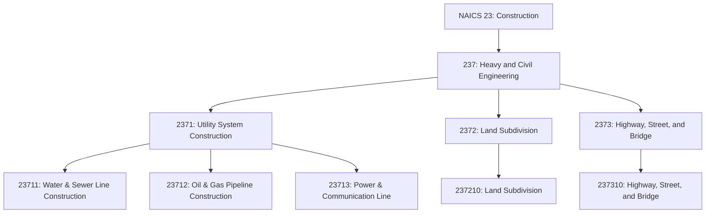
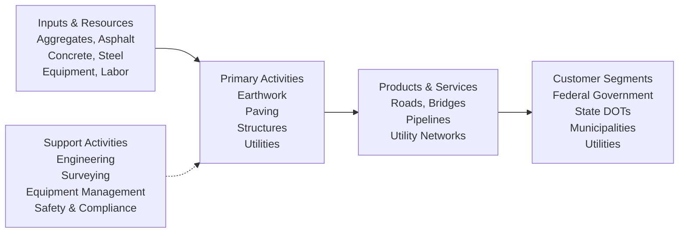

# Heavy and Civil Engineering Construction

> The Heavy and Civil Engineering Construction subsector comprises establishments whose primary activity is the construction of entire engineering projects (e.g., highways and dams), and specialty trade contractors whose primary activity is the production of a specific component for such projects.

## Overview

The Heavy and Civil Engineering Construction subsector (NAICS 237) encompasses establishments engaged in constructing infrastructure projects including highways, bridges, utility systems, and other engineering works. This subsector includes both general contractors responsible for entire projects and specialty contractors who produce specific components.

Specialty trade contractors in this subsector perform activities specific to heavy and civil engineering construction that are not normally performed on buildings. The work may include new construction, additions, alterations, or maintenance and repairs. This subsector also includes establishments engaged in land subdivision and site improvement activities.

## Industry Hierarchy

## Key Statistics

| Metric | Value |
|--------|-------|
| NAICS Code | 237 |
| Level | Subsector |
| Parent Sector | [Construction](../) (23) |
| Industry Groups | 3 |
| Primary Focus | Infrastructure & Engineering Projects |

## Sub-Industries

| Industry Group | Code | Description |
|----------------|------|-------------|
| Utility System Construction | 2371 | Construction of distribution lines and related structures for utilities |
| Land Subdivision | 2372 | Subdivision of land into lots for sale, including site improvements |
| Highway, Street, and Bridge Construction | 2373 | Construction of highways, streets, roads, bridges, and tunnels |

### Utility System Construction (2371)

| Industry | Code | Description |
|----------|------|-------------|
| Water and Sewer Line Construction | 23711 | Water mains, sewers, drains, and related structures |
| Oil and Gas Pipeline Construction | 23712 | Long-distance pipelines, pumping stations, and storage |
| Power and Communication Line Construction | 23713 | Electric power lines, telecommunications, and transmission towers |

### Land Subdivision (2372)

| Industry | Code | Description |
|----------|------|-------------|
| Land Subdivision | 237210 | Subdivision of land and related site improvements (roads, utilities) |

### Highway, Street, and Bridge Construction (2373)

| Industry | Code | Description |
|----------|------|-------------|
| Highway, Street, and Bridge Construction | 237310 | Highways, streets, roads, runways, bridges, overpasses, and tunnels |

## Related Occupations

- [Civil Engineers](/occupations/Architecture/CivilEngineers) - Design and supervise infrastructure projects
- [Construction Managers](/occupations/Management/ConstructionManagers) - Manage heavy construction projects
- [Operating Engineers](/occupations/Construction/OperatingEngineers) - Operate heavy construction equipment
- [Highway Maintenance Workers](/occupations/Construction/HighwayMaintenanceWorkers) - Maintain roads and highways
- [Pipelayers](/occupations/Construction/Pipelayers) - Install pipes for water, sewer, and utilities
- [Surveying and Mapping Technicians](/occupations/SurveyingTechnicians) - Conduct land surveys

## Core Business Processes

### Project Planning and Design

Managing the pre-construction phase for infrastructure projects including feasibility, environmental compliance, and design.

**Key Activities:**
- Conduct feasibility and alternatives analysis
- Complete environmental impact assessments
- Develop engineering design and specifications
- Obtain permits and regulatory approvals
- Acquire rights-of-way and easements

### Infrastructure Construction

Executing heavy civil construction activities including earthwork, utilities, and structural elements.

**Key Activities:**
- Perform earthwork, excavation, and grading
- Install underground utilities and pipelines
- Construct bridges, retaining walls, and drainage
- Pave roads, highways, and runways
- Coordinate traffic control and public safety

### Quality Assurance and Commissioning

Ensuring infrastructure meets specifications and is ready for service.

**Key Activities:**
- Conduct material testing and quality control
- Perform system testing and commissioning
- Complete final inspections and punch list
- Prepare as-built documentation
- Transition to operations and maintenance

## Industry Value Chain

## Project Types

### Transportation Infrastructure
- **Highways**: Interstate highways, expressways, and arterial roads
- **Bridges**: Highway bridges, railroad bridges, and pedestrian structures
- **Airports**: Runways, taxiways, and aprons
- **Rail**: Track work, stations, and rail yards

### Utility Systems
- **Water Systems**: Treatment plants, distribution lines, and storage
- **Sewer Systems**: Collection systems and treatment facilities
- **Pipelines**: Oil, gas, and product pipelines
- **Power**: Transmission lines, substations, and renewable energy

### Site Development
- **Land Subdivision**: Residential and commercial developments
- **Site Preparation**: Grading, drainage, and infrastructure
- **Environmental**: Wetland mitigation, stream restoration

## Regulatory Environment

Heavy and Civil Engineering Construction operates under extensive regulatory requirements:

- **Federal Oversight**: FHWA, EPA, FERC, PHMSA, Army Corps of Engineers
- **Environmental Compliance**: NEPA, Clean Water Act, Endangered Species Act
- **Safety Regulations**: OSHA construction standards, MSHA for mining-related work
- **Quality Standards**: DOT specifications, ASTM standards, ACI/AISC codes
- **Permitting**: Environmental permits, utility permits, encroachment permits
- **Prevailing Wage**: Davis-Bacon Act for federal projects, state prevailing wage laws
- **DBE Requirements**: Disadvantaged Business Enterprise participation goals

## Technology & Innovation

The Heavy and Civil Engineering sector is adopting advanced technologies:

- **GPS Machine Control**: Automated grading and paving with GPS guidance
- **Drones and LiDAR**: Aerial surveying, progress monitoring, and inspection
- **Telematics**: Equipment tracking, utilization, and predictive maintenance
- **BIM for Infrastructure**: Civil 3D, InfraWorks, and digital twin models
- **Intelligent Transportation Systems**: Smart highways, connected vehicles
- **Sustainable Infrastructure**: Recycled materials, permeable pavements, green infrastructure
- **Trenchless Technology**: Horizontal directional drilling, pipe bursting
- **Autonomous Equipment**: Self-driving haul trucks and automated compactors

## Related Industries

- [Construction of Buildings](../Buildings/) - Building construction
- [Specialty Trade Contractors](../SpecialtyTradeContractors/) - Specialized construction activities
- [Engineering Services](/industries/EngineeringServices/) - Civil engineering and design
- [Mining](/industries/Mining/) - Aggregate and material supply
- [Utilities](/industries/Utilities/) - End users of utility construction

---

*Source: NAICS 237 - Heavy and Civil Engineering Construction*
