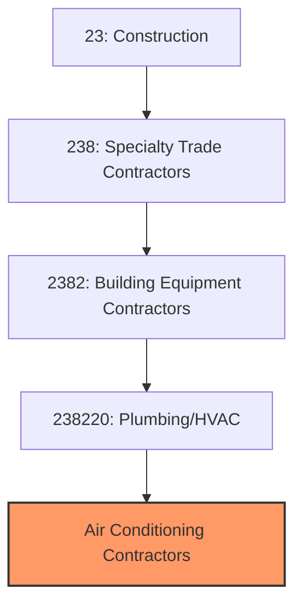

# Air Conditioning Contractors

> This industry comprises establishments primarily engaged in installing, maintaining, and repairing air conditioning and refrigeration systems, including central air, split systems, chillers, and commercial refrigeration.

## Overview

Air Conditioning Contractors are a specialized segment within the broader HVAC industry (NAICS 238220), focusing on the installation and service of cooling systems for residential, commercial, and industrial buildings. This includes central air conditioning, ductless mini-splits, chillers, cooling towers, and commercial refrigeration systems.

The air conditioning segment is driven by climate conditions, with strong markets in southern and coastal regions. The industry has seen significant growth as air conditioning has become standard in virtually all commercial buildings and most homes. The transition to new refrigerants with lower global warming potential is driving equipment replacement and requiring technician retraining.

## Market Context

The U.S. air conditioning contractor market represents approximately $65 billion in annual spending:

| Segment | Market Size | Key Drivers |
|---------|-------------|-------------|
| Residential A/C | $25 billion | Replacement, new construction, mini-splits |
| Commercial A/C | $20 billion | Building construction, chiller replacement |
| Service and Maintenance | $12 billion | Annual maintenance, emergency repairs |
| Commercial Refrigeration | $5 billion | Supermarket, food service, cold storage |
| Industrial Cooling | $3 billion | Process cooling, data centers |

The market is driven by equipment replacement cycles, new construction, rising temperatures, and refrigerant transition requirements.

## Industry Hierarchy

## Key Statistics

| Metric | Value |
|--------|-------|
| NAICS Code | 238220 |
| Specialty Focus | Air Conditioning and Refrigeration |
| Parent | [Building Equipment Contractors](./) |
| U.S. Establishments | ~50,000 |
| Annual Revenue | ~$65 billion |
| Employment | ~250,000 |

## Related Occupations

- [HVAC Technicians](/occupations/Installation/HVACTechnicians) - Install and service A/C systems
- [Refrigeration Mechanics](/occupations/Installation/RefrigerationMechanics) - Service refrigeration systems
- [Sheet Metal Workers](/occupations/Construction/SheetMetalWorkers) - Fabricate and install ductwork
- [Pipefitters](/occupations/Construction/Pipefitters) - Install chilled water piping
- [Electricians](/occupations/Construction/Electricians) - Connect power to A/C equipment
- [Construction Managers](/occupations/Management/ConstructionManagers) - Oversee mechanical projects

## Core Business Processes

```mermaid
flowchart LR
    subgraph Design["Design Phase"]
        D1["Load Calculation"]
        D2["Equipment Selection"]
        D3["System Design"]
        D4["Proposal"]
    end

    subgraph Installation["Installation"]
        I1["Equipment Placement"]
        I2["Ductwork/Piping"]
        I3["Electrical Connection"]
        I4["Refrigerant Charge"]
    end

    subgraph Commissioning["Commissioning"]
        C1["Startup"]
        C2["Testing"]
        C3["Balancing"]
        C4["Training"]
    end

    D1 --> D2 --> D3 --> D4
    D4 --> I1 --> I2 --> I3 --> I4
    I4 --> C1 --> C2 --> C3 --> C4
```

### Load Calculation and System Design

Proper sizing ensures comfort and efficiency.

**Key Activities:**
- Perform Manual J cooling load calculations
- Account for solar gain, occupancy, and equipment loads
- Select appropriate equipment capacity and efficiency
- Design duct layouts and airflow distribution
- Specify controls and thermostats
- Prepare installation proposals

### Equipment Installation

Quality installation ensures system performance.

**Key Activities:**
- Install outdoor condensing units
- Set indoor air handlers or coils
- Connect refrigerant lines with proper brazing
- Install ductwork and registers
- Make electrical connections
- Evacuate and charge refrigerant

### Testing and Commissioning

Proper commissioning ensures efficient operation.

**Key Activities:**
- Verify refrigerant charge and superheat/subcooling
- Measure airflow and static pressure
- Test temperature differential across coil
- Commission controls and thermostats
- Balance air distribution
- Provide owner training

## Industry Value Chain

```mermaid
graph LR
    subgraph Inputs["Inputs & Resources"]
        I1["A/C Equipment"]
        I2["Refrigerants"]
        I3["Ductwork"]
        I4["Controls"]
        I5["EPA-Certified Techs"]
    end

    subgraph Primary["Primary Activities"]
        A1["System Design"]
        A2["Installation"]
        A3["Commissioning"]
        A4["Service/Maintenance"]
    end

    subgraph Outputs["Deliverables"]
        O1["Central A/C Systems"]
        O2["Split Systems"]
        O3["VRF Systems"]
        O4["Chiller Plants"]
    end

    subgraph Customers["Customer Segments"]
        C1["Homeowners"]
        C2["Building Owners"]
        C3["General Contractors"]
        C4["Property Managers"]
    end

    Inputs --> Primary --> Outputs --> Customers
```

## Regulatory Environment

### EPA Refrigerant Regulations
- **Section 608 Certification** - Required for refrigerant handling
- **Refrigerant Recovery** - Mandatory recovery before disposal
- **Leak Repair Requirements** - Large system leak limits
- **Refrigerant Sales Restrictions** - Sales only to certified technicians

### Equipment Standards
- **DOE Efficiency Standards** - Minimum SEER2 and EER2 requirements
- **Energy Star** - High-efficiency certification program
- **AHRI Certification** - Equipment performance verification
- **UL/ETL Listings** - Safety certifications

### Installation Codes
- **International Mechanical Code** - A/C system requirements
- **International Energy Conservation Code** - Efficiency requirements
- **Local Building Codes** - Permit and inspection requirements
- **ASHRAE Standards** - Design and installation practices

### Refrigerant Transition
- **AIM Act** - HFC phase-down schedule
- **A2L Refrigerants** - Mildly flammable refrigerant handling
- **R-410A Phase-Down** - Transition to lower-GWP alternatives
- **Training Requirements** - New refrigerant certifications

## Technology & Innovation

### High-Efficiency Systems
- **Variable Speed Compressors** - Inverter-driven efficiency
- **SEER2 25+ Equipment** - Ultra-high-efficiency systems
- **VRF/VRV Systems** - Multi-zone commercial systems
- **Ductless Mini-Splits** - High-efficiency zoned cooling

### Smart Technology
- **WiFi Thermostats** - Remote monitoring and control
- **Fault Detection** - IoT-enabled diagnostics
- **Predictive Maintenance** - AI-based service scheduling
- **Utility Integration** - Demand response programs

### Refrigerant Technology
- **Low-GWP Refrigerants** - R-32, R-454B, R-466A
- **CO2 Systems** - Transcritical refrigeration
- **Propane Systems** - Hydrocarbon refrigerants
- **Hybrid Approaches** - Cascade systems

### Installation Tools
- **Recovery Machines** - High-efficiency refrigerant recovery
- **Vacuum Pumps** - Fast, deep evacuation
- **Digital Manifolds** - Precision charging and diagnostics
- **Leak Detectors** - Electronic and ultrasonic detection

## Project Types

### Residential Cooling
- Central A/C installation
- Split system replacement
- Ductless mini-split systems
- Zoned comfort systems
- Indoor air quality additions

### Commercial Cooling
- Rooftop unit installation
- Split system commercial
- VRF/VRV multi-zone systems
- Chiller and cooling tower systems
- Data center cooling

### Refrigeration
- Walk-in coolers and freezers
- Supermarket refrigeration
- Food service equipment
- Cold storage facilities
- Medical and laboratory

## Industry Trends and Outlook

Key trends shaping air conditioning contractors:

- **Refrigerant Transition** - Phase-down of HFCs to lower-GWP alternatives
- **Electrification** - Heat pumps replacing gas heating add A/C capability
- **Efficiency Standards** - Rising SEER2 minimums and efficiency incentives
- **Ductless Growth** - Mini-splits gaining market share
- **VRF Adoption** - Variable refrigerant flow in commercial buildings
- **Smart Controls** - Connected thermostats and building automation
- **Indoor Air Quality** - Integration with ventilation and filtration
- **Workforce Training** - Need for new refrigerant certifications

The outlook is strong with rising temperatures, building construction, and equipment replacement driving demand. The refrigerant transition requires significant investment in training and equipment but also drives replacement of older systems.

---

*Source: NAICS 238220 - Plumbing, Heating, and Air-Conditioning Contractors (Air Conditioning Specialty)*
