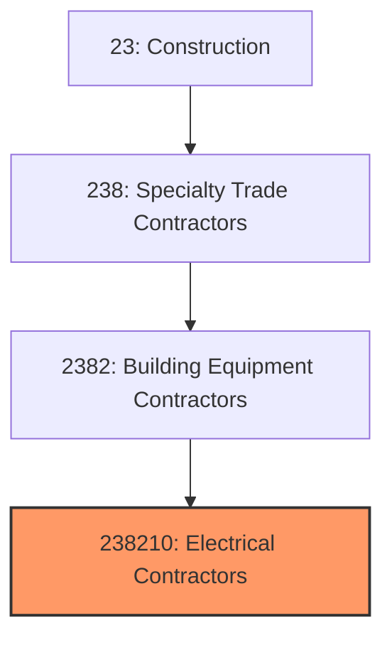

# Electrical Contractors and Other Wiring Installation Contractors

> This industry comprises establishments primarily engaged in installing and servicing electrical wiring and equipment, including power systems, lighting systems, fire alarms, and communications wiring.

## Overview

Electrical Contractors (NAICS 238210) encompasses establishments that install, maintain, and repair electrical systems in buildings and other structures. This includes power distribution systems, lighting, fire alarm systems, voice/data/video wiring, and increasingly, renewable energy systems and electric vehicle charging infrastructure.

The industry is central to all construction activity, as virtually every building requires electrical systems. Electrical contractors work on new construction, renovations, tenant improvements, and ongoing maintenance. The industry is highly regulated, with licensing requirements in all states and work governed by the National Electrical Code (NEC).

## Market Context

The U.S. electrical contracting market represents approximately $180 billion in annual spending:

| Segment | Market Size | Key Drivers |
|---------|-------------|-------------|
| Commercial Construction | $75 billion | Office, retail, hospitality construction |
| Residential Construction | $45 billion | Single-family, multi-family, renovations |
| Industrial/Manufacturing | $30 billion | Factory automation, process control |
| Specialty Systems | $20 billion | Fire alarm, security, low-voltage |
| Service/Maintenance | $10 billion | Repairs, upgrades, energy retrofits |

The market is driven by construction activity, electrical system upgrades, renewable energy installations, EV charging infrastructure, and data center construction.

## Industry Hierarchy

## Key Statistics

| Metric | Value |
|--------|-------|
| NAICS Code | 238210 |
| Level | National Industry |
| Parent | [Building Equipment Contractors](./) |
| U.S. Establishments | ~80,000 |
| Annual Revenue | ~$180 billion |
| Employment | ~900,000 |

## Related Occupations

- [Electricians](/occupations/Construction/Electricians) - Install and maintain electrical power and control systems
- [Electrical Helpers](/occupations/Construction/ElectricalHelpers) - Assist electricians with installations
- [Line Installers](/occupations/Installation/LineInstallers) - Install and repair power lines
- [Security System Installers](/occupations/Installation/SecuritySystemInstallers) - Install fire alarm and security systems
- [Solar Installers](/occupations/Installation/SolarInstallers) - Install photovoltaic systems
- [Construction Managers](/occupations/Management/ConstructionManagers) - Oversee electrical construction projects
- [Estimators](/occupations/Business/CostEstimators) - Prepare electrical construction bids

## Core Business Processes

```mermaid
flowchart LR
    subgraph Preconstruction["Pre-Construction"]
        P1["Takeoff/Estimating"]
        P2["Value Engineering"]
        P3["Shop Drawings"]
        P4["Material Procurement"]
    end

    subgraph Rough["Rough-In Phase"]
        R1["Layout/Marking"]
        R2["Conduit/Cable Tray"]
        R3["Wire Pulling"]
        R4["Box/Panel Setting"]
    end

    subgraph Trim["Trim-Out Phase"]
        T1["Devices/Fixtures"]
        T2["Connections"]
        T3["Testing"]
        T4["Inspection"]
    end

    P1 --> P2 --> P3 --> P4
    P4 --> R1 --> R2 --> R3 --> R4
    R4 --> T1 --> T2 --> T3 --> T4
```

### Estimating and Bidding

Accurate estimating is critical for profitability in competitive markets.

**Key Activities:**
- Review plans and specifications
- Perform material and labor takeoffs
- Coordinate with other trades for scope clarity
- Develop bid pricing and schedule
- Submit proposals and negotiate contracts
- Identify value engineering opportunities

### Rough-In Installation

The rough-in phase installs infrastructure before walls are closed.

**Key Activities:**
- Lay out electrical locations from drawings
- Install conduit, cable tray, and raceways
- Set electrical panels and boxes
- Pull wire and make rough connections
- Coordinate with HVAC and plumbing trades
- Complete rough inspection requirements

### Trim and Commissioning

Trim work completes visible components after finishes are applied.

**Key Activities:**
- Install devices, switches, and receptacles
- Install light fixtures and controls
- Make final connections at panels
- Test circuits and systems
- Complete code inspections
- Commission building automation interfaces

## Industry Value Chain

```mermaid
graph LR
    subgraph Inputs["Inputs & Resources"]
        I1["Wire/Cable"]
        I2["Conduit/Fittings"]
        I3["Panels/Equipment"]
        I4["Fixtures/Devices"]
        I5["Licensed Electricians"]
    end

    subgraph Primary["Primary Activities"]
        A1["Design Coordination"]
        A2["Rough Installation"]
        A3["Trim Installation"]
        A4["Testing/Commissioning"]
    end

    subgraph Outputs["Deliverables"]
        O1["Power Systems"]
        O2["Lighting Systems"]
        O3["Fire Alarm Systems"]
        O4["Low-Voltage Systems"]
    end

    subgraph Customers["Customer Segments"]
        C1["General Contractors"]
        C2["Building Owners"]
        C3["Property Managers"]
        C4["Homeowners"]
    end

    Inputs --> Primary --> Outputs --> Customers
```

## Regulatory Environment

### Electrical Codes
- **National Electrical Code (NEC/NFPA 70)** - Comprehensive electrical installation standards
- **NFPA 70E** - Electrical safety in the workplace
- **NFPA 72** - National Fire Alarm and Signaling Code
- **State Electrical Codes** - State-specific amendments to NEC

### Licensing Requirements
- **Journeyman License** - Required for independent electrical work
- **Master Electrician License** - Required to pull permits and supervise
- **Contractor License** - Business licensing for electrical contracting
- **Continuing Education** - Code update training requirements

### Safety Standards
- **OSHA Electrical Standards** - 29 CFR 1926 Subpart K
- **Lockout/Tagout** - Energy control procedures
- **Arc Flash Protection** - PPE and labeling requirements
- **GFCI Requirements** - Ground fault protection standards

### Industry Standards
- **UL Listings** - Equipment safety certifications
- **IEEE Standards** - Electrical engineering practices
- **BICSI Standards** - Low-voltage and telecommunications
- **NECA Standards** - Electrical construction best practices

## Technology & Innovation

### Installation Technology
- **Prefabrication** - Pre-assembled electrical assemblies
- **Modular Electrical Rooms** - Factory-built switchgear rooms
- **BIM Coordination** - 3D clash detection and routing
- **Laser Layout** - GPS-guided installation positioning

### Electrical Systems
- **LED Lighting** - High-efficiency lighting systems
- **Networked Controls** - IoT-enabled lighting and power
- **EV Charging** - Electric vehicle infrastructure
- **Energy Storage** - Battery systems and microgrids

### Renewable Energy
- **Solar PV Systems** - Rooftop and ground-mount installations
- **Battery Storage** - Integrated energy storage
- **Grid Integration** - Smart inverters and interconnection
- **Microgrid Controls** - Distributed energy management

### Service Tools
- **Thermal Imaging** - Infrared inspection for hot spots
- **Power Quality Analysis** - Voltage and harmonics monitoring
- **Cable Fault Location** - Underground fault detection
- **Arc Flash Analysis** - Safety labeling and PPE determination

## Project Types

### New Construction
- Commercial office buildings
- Industrial and manufacturing facilities
- Healthcare and education institutions
- Multi-family residential developments
- Retail and hospitality projects

### Renovation and Retrofit
- Electrical system upgrades
- Energy efficiency improvements
- Technology infrastructure upgrades
- Code compliance renovations
- Tenant improvement work

### Specialty Work
- Data center electrical systems
- Solar and renewable installations
- EV charging infrastructure
- Fire alarm and life safety
- Industrial process control

## Industry Trends and Outlook

Key trends shaping electrical contractors:

- **Electrification** - Shift from gas to electric for heating and transportation
- **EV Infrastructure** - Rapid growth in charging station installations
- **Data Centers** - High-power data center construction boom
- **Solar Integration** - Distributed solar and storage systems
- **Smart Buildings** - IoT-enabled electrical systems and controls
- **Workforce Shortage** - Critical shortage of licensed electricians
- **Prefabrication** - Off-site assembly to improve productivity
- **Safety Focus** - Arc flash awareness and electrical safety culture

The outlook is strong with electrification trends, renewable energy, and EV infrastructure driving demand. The industry faces significant workforce challenges as experienced electricians retire faster than new workers enter the trade, driving wages higher and accelerating technology adoption.

---

*Source: NAICS 238210 - Electrical Contractors and Other Wiring Installation Contractors*
