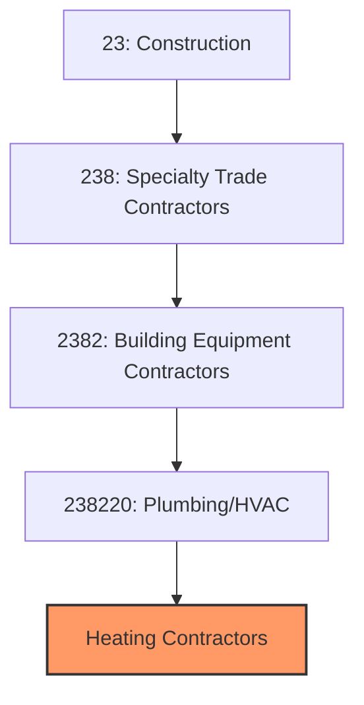

# Heating Contractors

> This industry comprises establishments primarily engaged in installing, maintaining, and repairing heating systems including furnaces, boilers, heat pumps, radiant systems, and related equipment.

## Overview

Heating Contractors are a specialized segment within the broader HVAC industry (NAICS 238220), focusing on the installation and service of heating systems for residential, commercial, and industrial buildings. This includes forced-air furnaces, boilers, heat pumps, radiant heating systems, and specialized industrial heating equipment.

The heating segment is particularly strong in northern climates where space heating represents the largest building energy use. The industry is undergoing significant transformation as electrification policies and heat pump technology drive a shift from gas and oil heating to electric systems. Service and replacement work provides steady revenue, as heating equipment typically requires replacement every 15-25 years.

## Market Context

The U.S. heating contractor market represents approximately $45 billion in annual spending:

| Segment | Market Size | Key Drivers |
|---------|-------------|-------------|
| Residential Furnace/Boiler | $18 billion | Replacement, new construction |
| Commercial Heating | $12 billion | Building construction, retrofits |
| Heat Pump Installation | $8 billion | Electrification, efficiency incentives |
| Service and Maintenance | $5 billion | Annual maintenance, emergency repairs |
| Industrial Heating | $2 billion | Process heating, facility heating |

The market is driven by equipment replacement cycles, new construction, energy efficiency incentives, and the growing transition to heat pump technology.

## Industry Hierarchy

## Key Statistics

| Metric | Value |
|--------|-------|
| NAICS Code | 238220 |
| Specialty Focus | Heating Systems |
| Parent | [Building Equipment Contractors](./) |
| U.S. Establishments | ~40,000 |
| Annual Revenue | ~$45 billion |
| Employment | ~200,000 |

## Related Occupations

- [HVAC Technicians](/occupations/Installation/HVACTechnicians) - Install and service heating systems
- [Sheet Metal Workers](/occupations/Construction/SheetMetalWorkers) - Fabricate and install ductwork
- [Boiler Operators](/occupations/Production/BoilerOperators) - Operate and maintain boiler systems
- [Pipefitters](/occupations/Construction/Pipefitters) - Install hydronic piping systems
- [Plumbers](/occupations/Construction/Plumbers) - Install gas piping and hydronic systems
- [Construction Managers](/occupations/Management/ConstructionManagers) - Oversee heating projects

## Core Business Processes

```mermaid
flowchart LR
    subgraph Assessment["Assessment"]
        A1["Load Calculation"]
        A2["System Evaluation"]
        A3["Equipment Selection"]
        A4["Proposal"]
    end

    subgraph Installation["Installation"]
        I1["Equipment Delivery"]
        I2["Old Equipment Removal"]
        I3["System Installation"]
        I4["Ductwork/Piping"]
    end

    subgraph Startup["Startup"]
        S1["Connections"]
        S2["Testing"]
        S3["Commissioning"]
        S4["Owner Training"]
    end

    A1 --> A2 --> A3 --> A4
    A4 --> I1 --> I2 --> I3 --> I4
    I4 --> S1 --> S2 --> S3 --> S4
```

### Load Calculation and System Design

Proper sizing ensures comfort and efficiency.

**Key Activities:**
- Perform Manual J heat loss calculations
- Evaluate existing system performance
- Recommend equipment size and type
- Select high-efficiency equipment
- Design duct or piping layouts
- Prepare installation proposals

### Equipment Installation

Quality installation ensures performance and longevity.

**Key Activities:**
- Remove existing heating equipment
- Install new furnace, boiler, or heat pump
- Connect ductwork or hydronic piping
- Install gas, oil, or electrical connections
- Install thermostats and controls
- Ensure proper combustion air supply

### Testing and Commissioning

Proper startup ensures safe, efficient operation.

**Key Activities:**
- Test combustion and adjust burners
- Check refrigerant charge (heat pumps)
- Verify airflow and temperature rise
- Test safety controls and limits
- Configure programmable thermostats
- Provide owner operation training

## Industry Value Chain

```mermaid
graph LR
    subgraph Inputs["Inputs & Resources"]
        I1["Heating Equipment"]
        I2["Ductwork/Piping"]
        I3["Controls"]
        I4["Fuel/Power"]
        I5["Trained Technicians"]
    end

    subgraph Primary["Primary Activities"]
        A1["System Design"]
        A2["Installation"]
        A3["Commissioning"]
        A4["Service/Maintenance"]
    end

    subgraph Outputs["Deliverables"]
        O1["Forced Air Systems"]
        O2["Hydronic Systems"]
        O3["Heat Pump Systems"]
        O4["Radiant Systems"]
    end

    subgraph Customers["Customer Segments"]
        C1["Homeowners"]
        C2["Property Managers"]
        C3["Building Owners"]
        C4["General Contractors"]
    end

    Inputs --> Primary --> Outputs --> Customers
```

## Regulatory Environment

### Equipment Standards
- **DOE Efficiency Standards** - Minimum AFUE and HSPF requirements
- **Energy Star** - High-efficiency certification program
- **AHRI Certification** - Equipment performance verification
- **UL/CSA Listings** - Safety certifications

### Installation Codes
- **International Fuel Gas Code** - Gas appliance installation
- **National Fuel Gas Code (NFPA 54)** - Gas piping and venting
- **International Mechanical Code** - Mechanical system requirements
- **Local Building Codes** - Permit and inspection requirements

### Safety Standards
- **Carbon Monoxide Requirements** - Detector installation mandates
- **Combustion Air** - Minimum requirements for fuel-burning equipment
- **Venting Requirements** - Proper exhaust of combustion products
- **Gas Leak Detection** - Testing and safety procedures

### Licensing Requirements
- **HVAC Contractor License** - State licensing requirements
- **Gas Fitter License** - Required for gas appliance work
- **EPA Section 608** - Certification for refrigerants (heat pumps)
- **Continuing Education** - Code update and safety training

## Technology & Innovation

### Heat Pump Technology
- **Air-Source Heat Pumps** - Efficient electric heating
- **Cold-Climate Heat Pumps** - Operation to -15F or below
- **Ground-Source Heat Pumps** - Geothermal systems
- **Hybrid Systems** - Heat pump with gas backup

### High-Efficiency Equipment
- **Condensing Furnaces** - 95-98% AFUE efficiency
- **Modulating Burners** - Variable-capacity operation
- **ECM Motors** - Efficient variable-speed blowers
- **Condensing Boilers** - High-efficiency hydronic heat

### Smart Controls
- **WiFi Thermostats** - Remote monitoring and control
- **Zoning Systems** - Room-by-room temperature control
- **Learning Thermostats** - AI-optimized scheduling
- **Utility Integration** - Demand response programs

### Radiant Systems
- **Radiant Floor Heating** - Hydronic and electric systems
- **Radiant Panels** - Wall and ceiling heating
- **Snow Melt Systems** - Driveway and walkway heating
- **Infrared Heating** - Industrial and outdoor applications

## Project Types

### Residential Heating
- Furnace replacement
- Boiler installation
- Heat pump systems
- Ductless mini-splits
- Radiant floor heating

### Commercial Heating
- Rooftop unit installation
- Boiler systems
- Make-up air units
- Warehouse heating
- Retail and office HVAC

### Specialty Applications
- Industrial process heating
- Snow melt systems
- Pool and spa heating
- Greenhouse heating
- Temporary construction heat

## Industry Trends and Outlook

Key trends shaping heating contractors:

- **Electrification** - Building decarbonization driving heat pump adoption
- **Heat Pump Growth** - Cold-climate technology enabling northern adoption
- **Efficiency Incentives** - Federal and utility rebate programs
- **Workforce Shortage** - Need for trained heat pump technicians
- **Gas Restrictions** - Municipal natural gas bans in new construction
- **Smart Integration** - Connected thermostats and home automation
- **Hybrid Systems** - Combined heat pump and gas backup
- **Indoor Air Quality** - Integration with ventilation and filtration

The outlook is transforming rapidly with electrification policies and incentives driving adoption of heat pump technology. Traditional gas furnace and boiler work remains strong in replacement markets, but contractors are increasingly adding heat pump capabilities to serve the growing market.

---

*Source: NAICS 238220 - Plumbing, Heating, and Air-Conditioning Contractors (Heating Specialty)*
