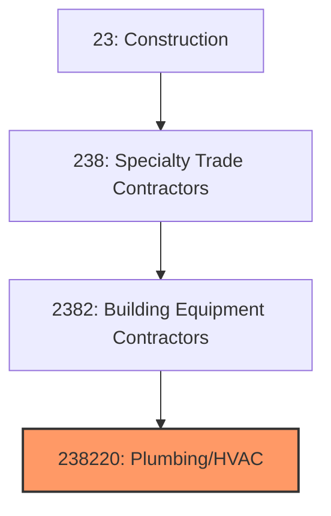

# Plumbing, Heating, and Air-Conditioning Contractors

> This industry comprises establishments primarily engaged in installing and servicing plumbing, heating, and air-conditioning equipment, including water supply, drainage, gas piping, HVAC systems, and related equipment.

## Overview

Plumbing, Heating, and Air-Conditioning Contractors (NAICS 238220) encompasses establishments that install, maintain, and repair plumbing systems (water supply, drainage, gas piping) and HVAC systems (heating, ventilation, air conditioning, refrigeration). This is the largest segment of the building equipment contractors industry, essential to making buildings functional and comfortable.

The industry serves both new construction and the substantial service/replacement market. Plumbing and HVAC systems require ongoing maintenance, repair, and eventual replacement, creating recurring revenue opportunities. The industry is highly regulated, with licensing requirements in all states and extensive code compliance obligations.

## Market Context

The U.S. plumbing, heating, and A/C contractor market represents approximately $200 billion in annual spending:

| Segment | Market Size | Key Drivers |
|---------|-------------|-------------|
| HVAC Installation | $70 billion | New construction, system replacement |
| HVAC Service/Repair | $40 billion | Maintenance, emergency repairs, upgrades |
| Plumbing Installation | $45 billion | New construction, renovation |
| Plumbing Service/Repair | $25 billion | Repairs, water heater replacement |
| Industrial/Process | $20 billion | Manufacturing, food processing, healthcare |

The market is driven by construction activity, equipment replacement cycles (15-20 years for HVAC), energy efficiency mandates, and the growing complexity of building systems.

## Industry Hierarchy

## Key Statistics

| Metric | Value |
|--------|-------|
| NAICS Code | 238220 |
| Level | National Industry |
| Parent | [Building Equipment Contractors](./) |
| U.S. Establishments | ~120,000 |
| Annual Revenue | ~$200 billion |
| Employment | ~750,000 |

## Related Occupations

- [Plumbers](/occupations/Construction/Plumbers) - Install and repair plumbing systems
- [Pipefitters](/occupations/Construction/Pipefitters) - Install high-pressure piping systems
- [HVAC Technicians](/occupations/Installation/HVACTechnicians) - Install and service heating and cooling
- [Refrigeration Mechanics](/occupations/Installation/RefrigerationMechanics) - Service refrigeration systems
- [Sheet Metal Workers](/occupations/Construction/SheetMetalWorkers) - Fabricate and install ductwork
- [Construction Managers](/occupations/Management/ConstructionManagers) - Oversee mechanical projects
- [Plumber Helpers](/occupations/Construction/PlumberHelpers) - Assist plumbers with installations

## Core Business Processes

```mermaid
flowchart LR
    subgraph Design["Design Phase"]
        D1["Load Calculations"]
        D2["System Design"]
        D3["Shop Drawings"]
        D4["Coordination"]
    end

    subgraph Rough["Rough-In Phase"]
        R1["Sleeves/Hangers"]
        R2["Underground"]
        R3["Above-Ceiling"]
        R4["In-Wall"]
    end

    subgraph Finish["Finish Phase"]
        F1["Equipment Setting"]
        F2["Fixture Installation"]
        F3["Testing/Balancing"]
        F4["Commissioning"]
    end

    D1 --> D2 --> D3 --> D4
    D4 --> R1 --> R2 --> R3 --> R4
    R4 --> F1 --> F2 --> F3 --> F4
```

### Design and Coordination

Proper design ensures system performance and efficient installation.

**Key Activities:**
- Perform heating and cooling load calculations
- Design piping and ductwork layouts
- Prepare shop drawings and submittals
- Coordinate with other MEP trades
- Select equipment and materials
- Plan installation sequence

### Rough-In Installation

The rough-in phase installs infrastructure before finishes are applied.

**Key Activities:**
- Install sleeves, hangers, and supports
- Complete underground plumbing and piping
- Install piping and ductwork above ceilings
- Run piping in walls and chases
- Install equipment pads and supports
- Complete rough inspections

### Trim and Commissioning

The finish phase completes visible components and starts systems.

**Key Activities:**
- Set HVAC equipment (furnaces, condensers, air handlers)
- Install plumbing fixtures (sinks, toilets, water heaters)
- Connect control systems and thermostats
- Test and balance HVAC systems
- Commission building automation interfaces
- Provide owner training and documentation

## Industry Value Chain

```mermaid
graph LR
    subgraph Inputs["Inputs & Resources"]
        I1["Pipe/Fittings"]
        I2["HVAC Equipment"]
        I3["Ductwork"]
        I4["Fixtures"]
        I5["Licensed Trades"]
    end

    subgraph Primary["Primary Activities"]
        A1["Design/Engineering"]
        A2["Installation"]
        A3["Testing/Balancing"]
        A4["Service/Maintenance"]
    end

    subgraph Outputs["Deliverables"]
        O1["Plumbing Systems"]
        O2["HVAC Systems"]
        O3["Gas Systems"]
        O4["Process Piping"]
    end

    subgraph Customers["Customer Segments"]
        C1["General Contractors"]
        C2["Building Owners"]
        C3["Property Managers"]
        C4["Homeowners"]
    end

    Inputs --> Primary --> Outputs --> Customers
```

## Regulatory Environment

### Plumbing Codes
- **Uniform Plumbing Code (UPC)** - Plumbing system requirements
- **International Plumbing Code (IPC)** - Alternative plumbing code
- **National Fuel Gas Code** - Gas piping requirements
- **State Plumbing Codes** - Jurisdiction-specific requirements

### Mechanical Codes
- **International Mechanical Code (IMC)** - HVAC system standards
- **ASHRAE Standards** - Design and efficiency requirements
- **EPA Refrigerant Regulations** - Section 608 certification
- **Energy Codes** - IECC and ASHRAE 90.1 efficiency

### Licensing Requirements
- **Journeyman Plumber License** - Required for independent work
- **Master Plumber License** - Required for permits and supervision
- **HVAC License** - State requirements vary
- **EPA 608 Certification** - Required for refrigerant handling

### Safety Standards
- **OSHA Construction Standards** - General safety requirements
- **Confined Space Entry** - Mechanical room access
- **Lockout/Tagout** - Energy control procedures
- **Fall Protection** - Elevated work requirements

## Technology & Innovation

### HVAC Systems
- **Variable Refrigerant Flow (VRF)** - High-efficiency multi-zone systems
- **Heat Pump Technology** - Air and ground-source heat pumps
- **Smart Controls** - WiFi thermostats and building automation
- **High-Efficiency Equipment** - SEER2 and AFUE improvements

### Plumbing Technology
- **PEX Piping** - Flexible, corrosion-resistant tubing
- **Tankless Water Heaters** - On-demand hot water
- **Smart Fixtures** - Touchless and water-saving devices
- **Leak Detection** - Smart water monitoring systems

### Installation Methods
- **Prefabrication** - Pre-assembled mechanical modules
- **BIM Coordination** - 3D clash detection and routing
- **Press-Fit Connections** - Flameless pipe joining
- **Modular Mechanical Rooms** - Factory-built utility systems

### Service Technology
- **Mobile Service Apps** - Digital work orders and invoicing
- **Diagnostic Tools** - Electronic testing and analysis
- **Fleet Management** - GPS tracking and optimization
- **Customer Portals** - Online scheduling and history

## Project Types

### New Construction
- Commercial office buildings
- Healthcare facilities
- Educational institutions
- Multi-family residential
- Industrial and manufacturing

### Renovation and Retrofit
- HVAC system replacement
- Plumbing renovations
- Energy efficiency upgrades
- Tenant improvement work
- Building modernization

### Service and Maintenance
- Preventive maintenance contracts
- Emergency repair services
- Equipment replacement
- System optimization
- Building commissioning

## Industry Trends and Outlook

Key trends shaping plumbing and HVAC contractors:

- **Electrification** - Shift from gas to electric heating (heat pumps)
- **Indoor Air Quality** - Increased focus post-pandemic
- **Smart Buildings** - IoT-enabled controls and monitoring
- **Refrigerant Transition** - Phase-down of high-GWP refrigerants
- **Labor Shortage** - Critical need for licensed trades
- **Service Revenue** - Growing emphasis on recurring revenue
- **Prefabrication** - Off-site assembly to improve productivity
- **Decarbonization** - Building emissions reduction mandates

The outlook is strong with construction activity, equipment replacement, and energy efficiency driving demand. The industry faces significant workforce challenges as experienced tradespeople retire faster than new workers complete apprenticeships.

---

*Source: NAICS 238220 - Plumbing, Heating, and Air-Conditioning Contractors*
