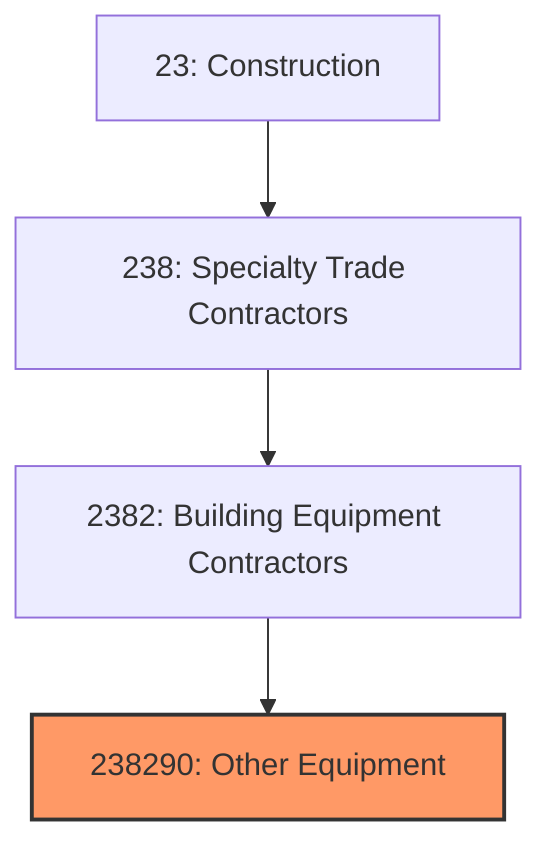
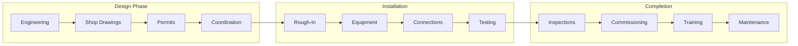

# Other Building Equipment Contractors

> This industry comprises establishments primarily engaged in installing and servicing building equipment not classified elsewhere, including elevators, escalators, fire protection systems, and specialty equipment.

## Overview

Other Building Equipment Contractors (NAICS 238290) encompasses establishments that install and maintain specialized building equipment not covered by electrical or plumbing/HVAC contractors. This includes elevator and escalator installation, fire suppression systems, security systems, pneumatic tube systems, and other specialized building equipment.

This category includes some of the most specialized and regulated work in construction. Elevator installation requires extensive training and licensing, while fire protection work is governed by strict codes and inspection requirements. These systems are critical to building safety, accessibility, and functionality.

## Market Context

The U.S. other building equipment contractor market represents approximately $25 billion in annual spending:

| Segment | Market Size | Key Drivers |
|---------|-------------|-------------|
| Fire Protection | $12 billion | Code requirements, new construction, retrofits |
| Elevator/Escalator | $8 billion | High-rise construction, modernization, accessibility |
| Security Systems | $3 billion | Commercial, institutional, residential security |
| Specialty Systems | $2 billion | Pneumatic tubes, specialty equipment |

The market is driven by building construction, code requirements, modernization of aging equipment, and increasing security and accessibility needs.

## Industry Hierarchy

## Key Statistics

| Metric | Value |
|--------|-------|
| NAICS Code | 238290 |
| Level | National Industry |
| Parent | [Building Equipment Contractors](./) |
| U.S. Establishments | ~15,000 |
| Annual Revenue | ~$25 billion |
| Employment | ~100,000 |

## Related Occupations

- [Elevator Installers](/occupations/Construction/ElevatorInstallers) - Install and repair elevators
- [Sprinkler Fitters](/occupations/Construction/SprinklerFitters) - Install fire suppression systems
- [Security Technicians](/occupations/Installation/SecurityTechnicians) - Install security systems
- [Fire Alarm Technicians](/occupations/Installation/FireAlarmTechnicians) - Install fire detection systems
- [Construction Managers](/occupations/Management/ConstructionManagers) - Oversee specialty installations
- [Pipefitters](/occupations/Construction/Pipefitters) - Install fire protection piping

## Core Business Processes

### Fire Protection Systems

Life safety systems require specialized expertise.

**Key Activities:**
- Design sprinkler systems per NFPA 13
- Install fire sprinkler piping and heads
- Install fire pumps and tanks
- Connect to fire alarm systems
- Complete hydrostatic testing
- Obtain fire marshal approval

### Elevator Installation

Vertical transportation requires specialized skills.

**Key Activities:**
- Install hoistway and machine room equipment
- Set guide rails and car assemblies
- Install hydraulic or traction systems
- Complete electrical and control wiring
- Test and certify all safety systems
- Obtain state elevator certification

### Security Systems

Integrated security protects people and property.

**Key Activities:**
- Install access control systems
- Set up surveillance cameras and recording
- Install intrusion detection systems
- Integrate with building automation
- Program and commission systems
- Provide user training

## Industry Value Chain

```mermaid
graph LR
    subgraph Inputs["Inputs & Resources"]
        I1["Specialty Equipment"]
        I2["Piping/Wiring"]
        I3["Controls"]
        I4["Licensed Techs"]
        I5["Tools/Equipment"]
    end

    subgraph Primary["Primary Activities"]
        A1["Design"]
        A2["Installation"]
        A3["Testing"]
        A4["Service"]
    end

    subgraph Outputs["Deliverables"]
        O1["Fire Protection"]
        O2["Elevators"]
        O3["Security Systems"]
        O4["Specialty Equipment"]
    end

    subgraph Customers["Customer Segments"]
        C1["General Contractors"]
        C2["Building Owners"]
        C3["Property Managers"]
        C4["Government"]
    end

    Inputs --> Primary --> Outputs --> Customers
```

## Regulatory Environment

### Fire Protection Codes
- **NFPA 13** - Sprinkler system installation
- **NFPA 14** - Standpipe systems
- **NFPA 20** - Fire pump installation
- **NFPA 25** - Inspection, testing, maintenance

### Elevator Codes
- **ASME A17.1** - Safety Code for Elevators
- **ADA Standards** - Accessibility requirements
- **State Elevator Codes** - Licensing and inspection
- **OSHA** - Construction and maintenance safety

### Security Standards
- **UL Standards** - Equipment listing and certification
- **Local Alarm Codes** - False alarm prevention
- **Privacy Regulations** - Video surveillance requirements
- **Fire Alarm Codes** - NFPA 72 requirements

### Licensing Requirements
- **Elevator Mechanic License** - State licensing required
- **Fire Protection License** - NICET certification, state licenses
- **Low-Voltage License** - Security system installation
- **Continuing Education** - Code update requirements

## Technology & Innovation

### Fire Protection
- **Pre-Action Systems** - Data center and clean room protection
- **Water Mist** - High-pressure low-water systems
- **Clean Agent Systems** - Gaseous fire suppression
- **Smart Sprinklers** - Connected monitoring systems

### Elevator Technology
- **Destination Dispatch** - Intelligent elevator dispatching
- **Regenerative Drives** - Energy recovery systems
- **Machine-Room-Less** - Compact elevator systems
- **Smart Monitoring** - IoT-enabled maintenance

### Security Technology
- **IP Cameras** - Network-based surveillance
- **Facial Recognition** - Biometric access control
- **Cloud Services** - Remote monitoring and management
- **AI Analytics** - Intelligent video analysis

### Integration
- **Building Automation** - Integrated building systems
- **Emergency Management** - Coordinated life safety
- **Mobile Access** - Smartphone-based credentials
- **Remote Monitoring** - 24/7 system supervision

## Project Types

### Fire Protection
- Commercial sprinkler systems
- Industrial fire suppression
- Residential fire sprinklers
- Special hazard systems
- Retrofit and upgrades

### Vertical Transportation
- New elevator installation
- Elevator modernization
- Escalator installation
- Accessibility lifts
- Maintenance contracts

### Security Systems
- Access control systems
- Video surveillance
- Intrusion detection
- Integrated systems
- Healthcare security

### Specialty Systems
- Pneumatic tube systems
- Material handling
- Clean room equipment
- Healthcare equipment
- Industrial specialty

## Industry Trends and Outlook

Key trends shaping other building equipment contractors:

- **Modernization** - Aging elevators requiring upgrades
- **Fire Code Changes** - Residential sprinkler requirements
- **Smart Buildings** - Integrated building systems
- **Workforce Aging** - Elevator mechanic retirement wave
- **Security Focus** - Increased security investment
- **IoT Integration** - Connected monitoring systems
- **Sustainability** - Energy-efficient equipment
- **Service Revenue** - Maintenance contract growth

The outlook is strong with building construction, modernization, and code requirements driving demand. These specialized trades face significant workforce challenges due to extensive training requirements and licensing.

---

*Source: NAICS 238290 - Other Building Equipment Contractors*
