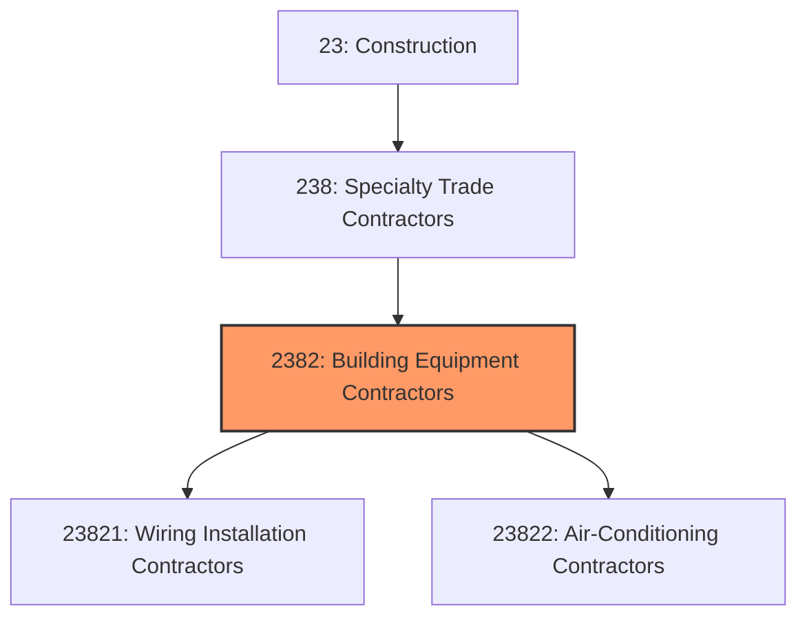
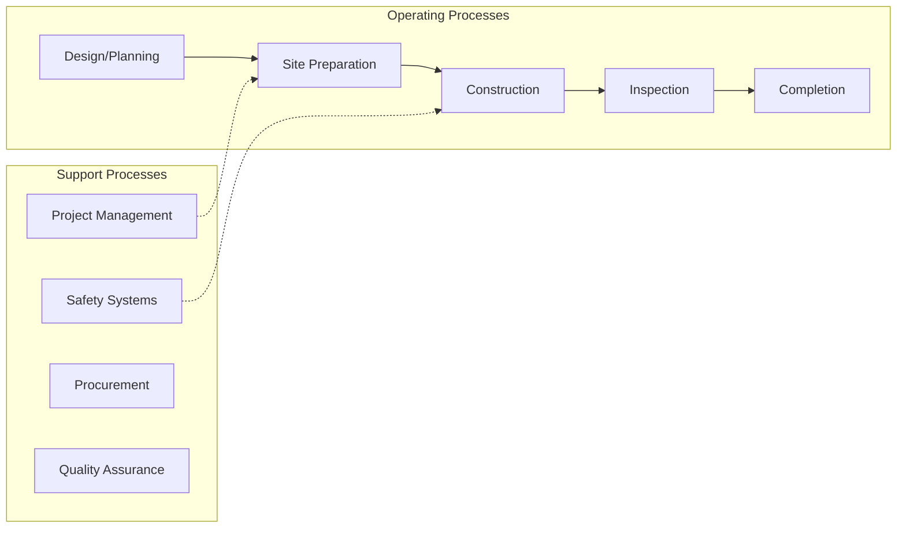

# Building Equipment Contractors

> This industry group comprises establishments primarily engaged in installing or servicing equipment that forms part of a building mechanical system (e.

## Overview

Building Equipment Contractors represents an important category within the Construction sector (NAICS 23). This industry group encompasses establishments primarily engaged in building equipment contractors.

This industry group comprises establishments primarily engaged in installing or servicing equipment that forms part of a building mechanical system (e.g., electricity, water, heating, and cooling). The work performed may include new work, additions, alterations, maintenance, and repairs. Contractors installing specialized building equipment, such as elevators, escalators, service station equipment, and central vacuum cleaning systems, are also included.

## Industry Hierarchy

## Key Statistics

| Metric | Value |
|--------|-------|
| NAICS Code | 2382 |
| Level | Industry Group |
| Parent | [Specialty Trade Contractors](../) |
| Child Industries | 2 |

## Sub-Industries

| Industry | Code | Description |
|----------|------|-------------|
| [Wiring Installation Contractors](./WiringInstallationContractors/) | 23821 | See industry description for 238210 |
| [Air-Conditioning Contractors](./AirconditioningContractors/) | 23822 | See industry description for 238220 |

## Core Business Processes

## Industry Value Chain

```mermaid
graph LR
    subgraph Inputs["Inputs"]
        I1["Materials"]
        I2["Equipment"]
        I3["Labor"]
        I4["Plans"]
    end

    subgraph Primary["Primary Activities"]
        A1["Inbound Logistics"]
        A2["Core Operations"]
        A3["Quality Assurance"]
        A4["Outbound/Delivery"]
    end

    subgraph Outputs["Products/Services"]
        O1["Buildings"]
        O2["Infrastructure"]
        O3["Renovations"]
    end

    subgraph Customers["Markets"]
        C1["Property Owners"]
        C2["Government"]
        C3["Developers"]
        C4["Businesses"]
    end

    Inputs --> Primary --> Outputs --> Customers
```

---

*Source: NAICS 2382 - Building Equipment Contractors*
