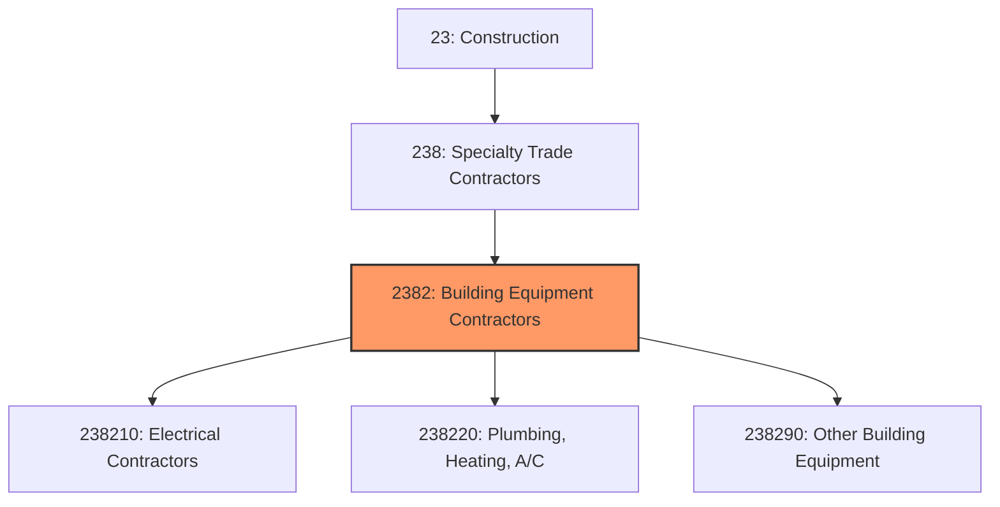

# Building Equipment Contractors

> This industry group comprises establishments primarily engaged in installing or servicing equipment that forms part of a building mechanical system, including electrical, plumbing, HVAC, and specialized equipment.

## Overview

Building Equipment Contractors represents a major category within the Specialty Trade Contractors subsector (NAICS 238), encompassing establishments that install and service the mechanical, electrical, and plumbing (MEP) systems that make buildings functional. This includes electrical wiring and fixtures, plumbing systems, heating and air conditioning, fire protection, and specialized equipment like elevators and escalators.

The industry group is essential to building construction and maintenance, with MEP systems typically representing 30-40% of total building construction costs. Work includes new construction, additions, alterations, and ongoing maintenance and repair services. Contractors may work as subcontractors to general contractors or directly for building owners.

## Market Context

The U.S. building equipment contractors market represents approximately $350 billion in annual spending:

| Segment | Market Size | Key Drivers |
|---------|-------------|-------------|
| Electrical Contractors | $180 billion | Commercial construction, EV charging, solar |
| HVAC Contractors | $100 billion | New construction, replacement, efficiency upgrades |
| Plumbing Contractors | $60 billion | New construction, renovation, water conservation |
| Fire Protection | $10 billion | Code compliance, life safety requirements |

The market is driven by commercial and residential construction activity, building renovation and tenant improvement work, energy efficiency mandates, electrification trends, and ongoing maintenance requirements.

## Industry Hierarchy

## Key Statistics

| Metric | Value |
|--------|-------|
| NAICS Code | 2382 |
| Level | Industry Group |
| Parent | [Specialty Trade Contractors](../) |
| Child Industries | 3 |
| U.S. Establishments | ~175,000 |
| Annual Revenue | ~$350 billion |
| Employment | ~2.2 million |

## Sub-Industries

| Industry | Code | Description |
|----------|------|-------------|
| [Electrical Contractors](./ElectricalContractors/) | 238210 | Electrical system installation and service |
| [Plumbing, Heating, A/C Contractors](./Plumbing/) | 238220 | Plumbing, HVAC, and mechanical systems |
| [Other Building Equipment](./WiringInstallationContractors/) | 238290 | Elevators, fire protection, specialized systems |

## Related Occupations

- [Electricians](/occupations/Construction/Electricians) - Install and maintain electrical systems
- [Plumbers](/occupations/Construction/Plumbers) - Install and repair plumbing systems
- [HVAC Technicians](/occupations/Installation/HVACTechnicians) - Install and service heating and cooling systems
- [Pipefitters](/occupations/Construction/Pipefitters) - Install high-pressure piping systems
- [Sprinkler Fitters](/occupations/Construction/SprinklerFitters) - Install fire protection systems
- [Elevator Installers](/occupations/Construction/ElevatorInstallers) - Install and maintain elevator systems
- [Construction Managers](/occupations/Management/ConstructionManagers) - Oversee MEP installation projects

## Core Business Processes

```mermaid
flowchart LR
    subgraph Preconstruction["Pre-Construction"]
        P1["Estimating"]
        P2["Coordination"]
        P3["Shop Drawings"]
        P4["Material Procurement"]
    end

    subgraph Rough["Rough-In"]
        R1["Layout"]
        R2["Sleeves/Hangers"]
        R3["Rough Installation"]
        R4["Inspection"]
    end

    subgraph Finish["Finish/Trim"]
        F1["Equipment Setting"]
        F2["Connections"]
        F3["Testing"]
        F4["Commissioning"]
    end

    P1 --> P2 --> P3 --> P4
    P4 --> R1 --> R2 --> R3 --> R4
    R4 --> F1 --> F2 --> F3 --> F4
```

### Pre-Construction and Coordination

Building equipment contractors must coordinate complex systems with other trades before installation begins.

**Key Activities:**
- Review plans and specifications for scope
- Develop detailed cost estimates
- Coordinate with other MEP trades and general contractor
- Prepare shop drawings and submittals
- Procure materials and equipment
- Plan installation sequence and staffing

### Rough-In Installation

The rough-in phase installs systems behind walls and above ceilings before finishes are applied.

**Key Activities:**
- Lay out system locations from coordinated drawings
- Install sleeves, hangers, and supports
- Run conduit, piping, and ductwork
- Make connections between systems
- Complete required inspections
- Prepare for insulation and coverings

### Finish Work and Commissioning

The finish phase completes visible components and brings systems into operation.

**Key Activities:**
- Install fixtures, devices, and equipment
- Make final connections and terminations
- Test systems for proper operation
- Commission building automation systems
- Complete punch list items
- Provide owner training and documentation

## Industry Value Chain

```mermaid
graph LR
    subgraph Inputs["Inputs & Resources"]
        I1["Wire/Conduit"]
        I2["Pipe/Fittings"]
        I3["HVAC Equipment"]
        I4["Skilled Trades"]
        I5["Tools/Equipment"]
    end

    subgraph Primary["Primary Activities"]
        A1["Design Coordination"]
        A2["Rough-In Work"]
        A3["Finish Installation"]
        A4["Service/Maintenance"]
    end

    subgraph Outputs["Deliverables"]
        O1["Electrical Systems"]
        O2["Plumbing Systems"]
        O3["HVAC Systems"]
        O4["Fire Protection"]
    end

    subgraph Customers["Customer Segments"]
        C1["General Contractors"]
        C2["Building Owners"]
        C3["Developers"]
        C4["Property Managers"]
    end

    Inputs --> Primary --> Outputs --> Customers
```

## Regulatory Environment

Building equipment contractors operate under extensive code and licensing requirements:

### Electrical Codes and Standards
- **National Electrical Code (NEC)** - Electrical installation requirements
- **NFPA 70E** - Electrical safety in the workplace
- **State Electrical Licensing** - Journeyman and master electrician licenses
- **UL Listings** - Equipment safety certifications

### Plumbing and Mechanical Codes
- **Uniform Plumbing Code (UPC)** - Plumbing system requirements
- **International Mechanical Code (IMC)** - HVAC system standards
- **ASHRAE Standards** - HVAC design and efficiency
- **State Plumbing Licensing** - Journeyman and master plumber licenses

### Fire Protection
- **NFPA 13** - Sprinkler system installation
- **NFPA 72** - Fire alarm systems
- **State Fire Marshal** - Fire protection system approval
- **Local Fire Department** - Inspection and testing requirements

### Safety Requirements
- **OSHA Construction Standards** - General safety requirements
- **Lockout/Tagout** - Energy control procedures
- **Confined Space** - Permit-required entry procedures
- **Fall Protection** - Requirements for elevated work

## Technology & Innovation

### Design Technology
- **Building Information Modeling (BIM)** - 3D coordination and clash detection
- **Prefabrication** - Off-site assembly of MEP systems
- **Automated Estimating** - Takeoff and pricing software
- **Mobile Field Apps** - Digital documentation and productivity

### Installation Technology
- **Prefabricated Racks** - Pre-assembled MEP assemblies
- **Modular Systems** - Factory-built mechanical rooms
- **Laser Layout** - Precision installation positioning
- **Augmented Reality** - Installation guidance and verification

### Building Systems Technology
- **Building Automation** - Integrated control systems
- **Smart Buildings** - IoT-enabled monitoring and control
- **Energy Management** - Real-time energy optimization
- **Predictive Maintenance** - Data-driven service scheduling

### Sustainable Systems
- **Heat Pump Technology** - High-efficiency heating and cooling
- **Solar Integration** - PV and solar thermal systems
- **EV Charging** - Electric vehicle infrastructure
- **Water Conservation** - Low-flow fixtures and graywater systems

## Industry Trends and Outlook

Key trends shaping building equipment contractors:

- **Electrification** - Transition from gas to electric heating systems
- **EV Infrastructure** - Growing demand for charging installations
- **Energy Efficiency** - Stricter codes and retrofit demand
- **Prefabrication** - Off-site assembly to address labor shortages
- **Smart Buildings** - Integration of building automation and IoT
- **Workforce Development** - Critical shortage of skilled trades
- **Service Growth** - Maintenance contracts and recurring revenue
- **Technology Adoption** - BIM, mobile apps, and automation

The outlook is strong with construction activity, building renovations, and energy efficiency mandates driving demand. The industry faces significant workforce challenges as experienced tradespeople retire faster than new workers enter the field.

---

*Source: NAICS 2382 - Building Equipment Contractors*
