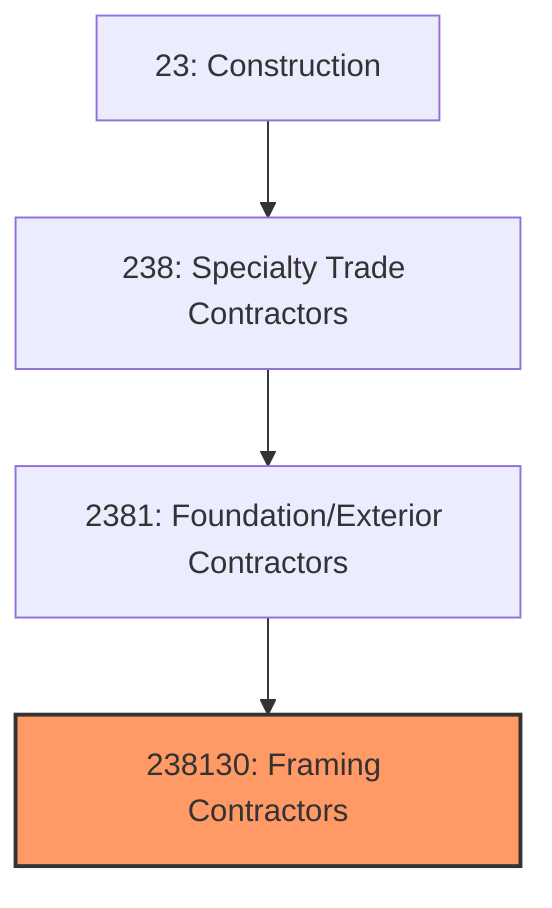

# Framing Contractors

> This industry comprises establishments primarily engaged in structural framing and sheathing using wood or metal studs, including residential and commercial framing, rough carpentry, and panelized wall systems.

## Overview

Framing Contractors (NAICS 238130) encompasses establishments that construct the structural skeleton of buildings using wood or light-gauge metal framing. This includes floor systems, wall framing, roof framing, and sheathing installation. Framing creates the structural framework upon which all other building systems are installed.

The industry serves both residential and commercial construction, with wood framing dominant in single-family homes and light commercial, while metal stud framing is standard in commercial and multi-family construction. Framing is critical path work that sets the pace for all subsequent construction activities.

## Market Context

The U.S. framing contractor market represents approximately $50 billion in annual spending:

| Segment | Market Size | Key Drivers |
|---------|-------------|-------------|
| Residential Wood Framing | $25 billion | Single-family, townhome construction |
| Commercial Metal Stud | $12 billion | Office, retail, healthcare, multi-family |
| Multi-Family Framing | $8 billion | Apartment and condo construction |
| Industrial/Warehouse | $3 billion | Distribution centers, manufacturing |
| Renovation/Remodel | $2 billion | Additions, tenant improvements |

The market is driven by residential and commercial construction activity, with housing starts being the primary indicator of residential framing demand.

## Industry Hierarchy

## Key Statistics

| Metric | Value |
|--------|-------|
| NAICS Code | 238130 |
| Level | National Industry |
| Parent | [Building Exterior Contractors](./) |
| U.S. Establishments | ~25,000 |
| Annual Revenue | ~$50 billion |
| Employment | ~300,000 |

## Related Occupations

- [Carpenters](/occupations/Construction/Carpenters) - Frame buildings with wood and metal
- [Framing Laborers](/occupations/Construction/ConstructionLaborers) - Assist framing crews
- [Construction Managers](/occupations/Management/ConstructionManagers) - Oversee framing projects
- [Estimators](/occupations/Business/CostEstimators) - Prepare framing bids
- [Metal Stud Framers](/occupations/Construction/MetalStudFramers) - Install light-gauge metal framing
- [Structural Carpenters](/occupations/Construction/StructuralCarpenters) - Heavy timber and trusses

## Core Business Processes

```mermaid
flowchart LR
    subgraph Layout["Layout Phase"]
        L1["Foundation Survey"]
        L2["Plate Layout"]
        L3["Material Staging"]
        L4["Crew Assignment"]
    end

    subgraph Framing["Framing Phase"]
        F1["Floor System"]
        F2["Wall Framing"]
        F3["Roof System"]
        F4["Sheathing"]
    end

    subgraph Completion["Completion"]
        C1["Blocking/Backing"]
        C2["Hardware"]
        C3["Inspection"]
        C4["Punch List"]
    end

    L1 --> L2 --> L3 --> L4
    L4 --> F1 --> F2 --> F3 --> F4
    F4 --> C1 --> C2 --> C3 --> C4
```

### Layout and Planning

Accurate layout ensures square, level construction.

**Key Activities:**
- Verify foundation dimensions and squareness
- Lay out wall plate locations
- Plan material delivery and staging
- Coordinate with trusses and engineered lumber
- Schedule crews and equipment
- Review architectural and structural plans

### Structural Framing

Quality framing creates a solid building structure.

**Key Activities:**
- Install floor joists and subfloor
- Build and erect wall sections
- Set roof trusses or frame rafters
- Install blocking for fixtures and cabinets
- Install sheathing (OSB, plywood)
- Complete rough openings for windows and doors

### Hardware and Completion

Proper completion ensures code compliance.

**Key Activities:**
- Install hold-downs and tie straps
- Complete fire blocking requirements
- Install backing for drywall and fixtures
- Address framing inspection corrections
- Complete punch list items
- Prepare for mechanical rough-in

## Industry Value Chain

```mermaid
graph LR
    subgraph Inputs["Inputs & Resources"]
        I1["Lumber/Metal Studs"]
        I2["Sheathing"]
        I3["Engineered Lumber"]
        I4["Trusses"]
        I5["Skilled Framers"]
    end

    subgraph Primary["Primary Activities"]
        A1["Layout"]
        A2["Floor Framing"]
        A3["Wall Framing"]
        A4["Roof Framing"]
    end

    subgraph Outputs["Deliverables"]
        O1["Framed Buildings"]
        O2["Sheathed Structures"]
        O3["Panelized Walls"]
        O4["Renovation Framing"]
    end

    subgraph Customers["Customer Segments"]
        C1["Home Builders"]
        C2["General Contractors"]
        C3["Developers"]
        C4["Remodelers"]
    end

    Inputs --> Primary --> Outputs --> Customers
```

## Regulatory Environment

### Building Codes
- **International Residential Code (IRC)** - Residential framing requirements
- **International Building Code (IBC)** - Commercial framing standards
- **American Wood Council (AWC)** - Wood construction provisions
- **Local Building Codes** - Jurisdiction-specific requirements

### Structural Standards
- **AISI S240** - Light-gauge steel framing standard
- **AWC Wood Frame Construction Manual** - Prescriptive wood framing
- **Engineered Lumber Specifications** - LVL, I-joist, glulam requirements
- **Truss Design Standards** - Manufactured truss requirements

### Safety Standards
- **OSHA Fall Protection** - Requirements above 6 feet
- **OSHA Scaffolding** - Temporary platform requirements
- **Power Tool Safety** - Nail gun and saw requirements
- **Truss Handling** - Proper lifting and bracing

### Quality Standards
- **Framing Tolerances** - Plumb, level, and square requirements
- **Fastening Schedules** - Nail patterns and spacing
- **Structural Connections** - Hold-downs, straps, and clips
- **Fire Blocking** - Concealed space protection

## Technology & Innovation

### Materials Technology
- **Engineered Lumber** - LVL, LSL, I-joists for long spans
- **Cross-Laminated Timber (CLT)** - Mass timber construction
- **Structural Composite Lumber** - High-strength engineered products
- **Pre-Cut Packages** - Factory-cut lumber packages

### Prefabrication
- **Panelized Wall Systems** - Factory-built wall panels
- **Floor Cassettes** - Pre-assembled floor sections
- **Modular Components** - Complete room modules
- **Roof Trusses** - Engineered, factory-built trusses

### Installation Tools
- **Pneumatic Nailers** - Framing and sheathing guns
- **Cordless Power Tools** - Battery-powered saws and drills
- **Laser Levels** - Precision layout and alignment
- **Material Handling** - Boom trucks and telehandlers

### Design Technology
- **BIM for Framing** - 3D modeling and prefab coordination
- **Framing Software** - Layout and cut list generation
- **Estimating Systems** - Automated takeoff and pricing
- **Mobile Apps** - Digital punch lists and documentation

## Project Types

### Residential Framing
- Single-family homes
- Townhomes and duplexes
- Custom homes
- Additions and remodels
- Accessory dwelling units (ADUs)

### Commercial Framing
- Office buildings
- Retail and restaurant
- Healthcare facilities
- Educational buildings
- Hotels and hospitality

### Multi-Family Framing
- Apartments and condos
- Senior living
- Student housing
- Mixed-use buildings
- Affordable housing

### Specialty Framing
- Mass timber/CLT buildings
- Curved and custom walls
- High-wind and seismic areas
- Historic renovation
- Heavy timber

## Industry Trends and Outlook

Key trends shaping framing contractors:

- **Labor Shortage** - Critical need for skilled framers
- **Prefabrication Growth** - Panelized and modular systems
- **Mass Timber** - CLT and heavy timber acceptance
- **Lumber Price Volatility** - Material cost fluctuations
- **Advanced Framing** - Optimized Value Engineering (OVE)
- **Metal Stud Growth** - Commercial preference for non-combustible
- **Technology Adoption** - Prefab, BIM, and automation
- **Energy Codes** - Advanced framing for insulation

The outlook is tied to housing starts and commercial construction activity. Labor availability remains the primary constraint, driving prefabrication adoption and interest in automated framing systems. Mass timber is creating new opportunities in mid-rise construction.

---

*Source: NAICS 238130 - Framing Contractors*
