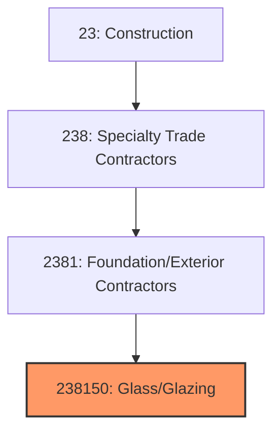

# Glass and Glazing Contractors

> This industry comprises establishments primarily engaged in installing glass, mirrors, windows, curtain walls, storefronts, and other glass products in buildings.

## Overview

Glass and Glazing Contractors (NAICS 238150) encompasses establishments that install glass and glazing systems in buildings. This includes windows, curtain walls, storefronts, skylights, mirrors, shower enclosures, and specialty glass applications. The industry spans from residential window installation to complex high-rise curtain wall systems.

The glazing industry has grown in importance as buildings increasingly feature expansive glass facades for daylighting, views, and architectural expression. Modern glazing systems must balance transparency with thermal performance, requiring sophisticated engineering and installation expertise. The industry serves both new construction and the significant replacement and retrofit market.

## Market Context

The U.S. glass and glazing contractor market represents approximately $20 billion in annual spending:

| Segment | Market Size | Key Drivers |
|---------|-------------|-------------|
| Commercial Curtain Wall | $8 billion | Office, mixed-use, high-rise construction |
| Storefronts/Entrances | $4 billion | Retail, hospitality, commercial buildings |
| Residential Windows | $4 billion | Replacement windows, new construction |
| Specialty Glazing | $2 billion | Skylights, mirrors, fire-rated glass |
| Industrial/Institutional | $2 billion | Healthcare, education, manufacturing |

The market is driven by commercial construction, energy efficiency mandates, architectural trends favoring transparency, and the residential replacement window market.

## Industry Hierarchy

## Key Statistics

| Metric | Value |
|--------|-------|
| NAICS Code | 238150 |
| Level | National Industry |
| Parent | [Building Exterior Contractors](./) |
| U.S. Establishments | ~8,000 |
| Annual Revenue | ~$20 billion |
| Employment | ~75,000 |

## Related Occupations

- [Glaziers](/occupations/Construction/Glaziers) - Install glass and window systems
- [Glazing Helpers](/occupations/Construction/GlazingHelpers) - Assist glaziers with installations
- [Ironworkers](/occupations/Construction/Ironworkers) - Erect curtain wall structural supports
- [Construction Managers](/occupations/Management/ConstructionManagers) - Oversee glazing projects
- [Estimators](/occupations/Business/CostEstimators) - Prepare glazing bids
- [CAD Technicians](/occupations/Architecture/CADTechnicians) - Prepare shop drawings

## Core Business Processes

### Engineering and Shop Drawings

Proper engineering ensures performance and fit.

**Key Activities:**
- Develop shop drawings from architectural documents
- Perform structural analysis for wind and seismic loads
- Calculate thermal performance and condensation resistance
- Coordinate with other building systems
- Submit for architect/engineer approval
- Finalize fabrication drawings

### Fabrication and Assembly

Quality fabrication ensures proper fit and performance.

**Key Activities:**
- Fabricate aluminum or steel frames
- Cut and process glass to specifications
- Assemble insulated glass units
- Apply coatings and treatments
- Install hardware and operators
- Package for shipping and protection

### Field Installation

Skilled installation ensures weathertight performance.

**Key Activities:**
- Install anchors and structural attachments
- Set and level frames and mullions
- Install glass and gaskets
- Apply sealants and weatherstripping
- Test for water infiltration
- Complete punch list and final adjustments

## Industry Value Chain

```mermaid
graph LR
    subgraph Inputs["Inputs & Resources"]
        I1["Glass"]
        I2["Aluminum/Steel"]
        I3["Sealants"]
        I4["Hardware"]
        I5["Skilled Glaziers"]
    end

    subgraph Primary["Primary Activities"]
        A1["Engineering"]
        A2["Fabrication"]
        A3["Installation"]
        A4["Service"]
    end

    subgraph Outputs["Deliverables"]
        O1["Curtain Walls"]
        O2["Storefronts"]
        O3["Windows"]
        O4["Specialty Glass"]
    end

    subgraph Customers["Customer Segments"]
        C1["General Contractors"]
        C2["Building Owners"]
        C3["Architects"]
        C4["Developers"]
    end

    Inputs --> Primary --> Outputs --> Customers
```

## Regulatory Environment

### Building Codes
- **International Building Code (IBC)** - Fenestration requirements
- **ASCE 7** - Wind load and seismic requirements
- **International Energy Conservation Code (IECC)** - Thermal performance
- **NFPA 80** - Fire-rated glazing requirements

### Safety Standards
- **OSHA Fall Protection** - Working at heights
- **Glass Handling Safety** - Proper lifting and handling
- **Crane and Rigging** - Large glass panel installation
- **Power Tool Safety** - Cutting and drilling operations

### Industry Standards
- **AAMA Standards** - Window and curtain wall performance
- **ASTM Standards** - Glass and glazing specifications
- **NFRC** - National Fenestration Rating Council certifications
- **IGCC** - Insulated Glass Certification Council

### Performance Standards
- **Air Infiltration** - Maximum leakage rates
- **Water Resistance** - Water penetration testing
- **Structural Performance** - Wind load resistance
- **Thermal Performance** - U-factor and SHGC requirements

## Technology & Innovation

### Glass Technology
- **Low-E Coatings** - Spectrally selective coatings
- **Triple Glazing** - High-performance insulated units
- **Dynamic Glass** - Electrochromic and thermochromic
- **Vacuum Insulated Glass (VIG)** - Ultra-thin high-performance

### Framing Systems
- **Unitized Curtain Wall** - Factory-assembled units
- **Structural Glazing** - Silicone-attached glass
- **Point-Supported Glass** - Spider fittings and cables
- **Thermal Break Frames** - Improved thermal performance

### Installation Technology
- **Robotic Setting** - Automated glass handling
- **3D Scanning** - Field verification and coordination
- **BIM Integration** - Model-based fabrication
- **Modular Lifts** - Specialized glazing equipment

### Smart Glass
- **Electrochromic Glass** - Switchable tinting
- **PDLC Glass** - Privacy glass
- **SPD Glass** - Suspended particle devices
- **Integrated Photovoltaics** - BIPV glass systems

## Project Types

### Commercial Glazing
- High-rise curtain walls
- Office building facades
- Storefronts and entrances
- Retail and hospitality
- Healthcare and education

### Residential Glazing
- Replacement windows
- New construction windows
- Patio and sliding doors
- Skylights and roof windows
- Shower enclosures

### Specialty Glazing
- Point-supported systems
- Cable-net walls
- Fire-rated assemblies
- Blast-resistant glazing
- Hurricane-impact systems

### Interior Glazing
- Partitions and office fronts
- Mirrors and decorative glass
- Railings and balustrades
- Display cases
- Glass floors and stairs

## Industry Trends and Outlook

Key trends shaping glass and glazing contractors:

- **Energy Performance** - Stricter thermal requirements
- **Dynamic Glass** - Electrochromic and smart glass growth
- **Unitized Systems** - Prefabrication for quality and speed
- **Larger Glass** - Jumbo-size glass for expansive views
- **Labor Challenges** - Skilled glazier shortage
- **BIM Integration** - Digital fabrication and coordination
- **Safety Glazing** - Impact-resistant and security applications
- **BIPV Integration** - Building-integrated photovoltaics

The outlook is positive with commercial construction and energy retrofit driving demand. The industry is becoming more specialized as glass systems become more complex and performance requirements increase.

---

*Source: NAICS 238150 - Glass and Glazing Contractors*
