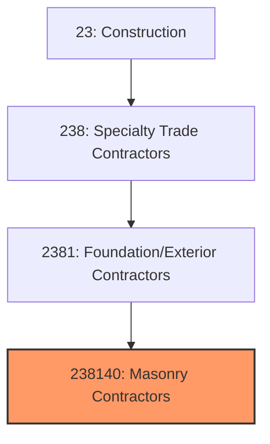

# Masonry Contractors

> This industry comprises establishments primarily engaged in masonry work, including brick, block, stone, and concrete masonry unit installation for structural and decorative applications.

## Overview

Masonry Contractors (NAICS 238140) encompasses establishments that install brick, block, stone, and concrete masonry units for building construction. This includes structural masonry walls, veneer systems, stone facades, pavers, fireplaces, and decorative masonry. Masonry is one of the oldest construction trades, combining structural capability with aesthetic appeal.

The industry serves commercial, institutional, and residential construction markets. Masonry construction offers durability, fire resistance, and thermal mass benefits that make it preferred for schools, hospitals, retail, and multi-family residential. The craft nature of masonry work requires skilled tradespeople, making labor availability a significant industry factor.

## Market Context

The U.S. masonry contractor market represents approximately $30 billion in annual spending:

| Segment | Market Size | Key Drivers |
|---------|-------------|-------------|
| Commercial Masonry | $12 billion | Retail, office, industrial, multi-family |
| Institutional | $8 billion | Schools, healthcare, government buildings |
| Residential | $6 billion | Custom homes, fireplaces, hardscape |
| Infrastructure | $2 billion | Retaining walls, bridges, tunnels |
| Restoration | $2 billion | Historic preservation, repairs |

The market is driven by commercial construction, institutional building programs, and the continued demand for masonry's durability and aesthetic qualities.

## Industry Hierarchy

## Key Statistics

| Metric | Value |
|--------|-------|
| NAICS Code | 238140 |
| Level | National Industry |
| Parent | [Building Exterior Contractors](./) |
| U.S. Establishments | ~15,000 |
| Annual Revenue | ~$30 billion |
| Employment | ~150,000 |

## Related Occupations

- [Brickmasons](/occupations/Construction/Brickmasons) - Lay brick, block, and stone
- [Stonemasons](/occupations/Construction/Stonemasons) - Work with natural and cut stone
- [Mason Tenders](/occupations/Construction/MasonTenders) - Support masons with materials
- [Construction Laborers](/occupations/Construction/ConstructionLaborers) - Assist with scaffold and cleanup
- [Construction Managers](/occupations/Management/ConstructionManagers) - Oversee masonry projects
- [Estimators](/occupations/Business/CostEstimators) - Prepare masonry bids

## Core Business Processes

### Estimating and Planning

Accurate planning ensures profitable projects.

**Key Activities:**
- Perform quantity takeoffs from drawings
- Calculate labor production rates
- Plan scaffold and material handling
- Review structural and architectural details
- Coordinate with steel and concrete trades
- Prepare proposals and schedule

### Masonry Construction

Skilled craftsmanship creates quality structures.

**Key Activities:**
- Layout wall lines and control joints
- Install base course with proper alignment
- Build walls with level, plumb, and true coursing
- Install reinforcement and grout as required
- Complete lintels, sills, and opening details
- Install flashing and weep holes

### Finishing and Protection

Proper finishing ensures long-term performance.

**Key Activities:**
- Point mortar joints to specification
- Clean masonry surfaces
- Apply water repellents if required
- Install sealants at interfaces
- Protect completed work from damage
- Complete punch list items

## Industry Value Chain

## Regulatory Environment

### Building Codes
- **TMS 402/602** - Building Code Requirements for Masonry Structures
- **International Building Code (IBC)** - Structural and fire requirements
- **ACI 530** - Specifications for masonry structures
- **Local Building Codes** - Jurisdiction-specific requirements

### Safety Standards
- **OSHA Scaffold Standards** - 29 CFR 1926.450-454
- **OSHA Fall Protection** - Requirements for elevated work
- **Silica Exposure Rule** - Respirable silica limits
- **Bracing Requirements** - Temporary wall bracing standards

### Industry Standards
- **ASTM Standards** - Material specifications for masonry units, mortar, grout
- **BIA Technical Notes** - Brick Industry Association best practices
- **NCMA TEK Notes** - Concrete masonry guidance
- **Natural Stone Institute** - Stone installation standards

### Quality Standards
- **Masonry Joint Finishes** - Concave, V, raked, flush specifications
- **Movement Joints** - Control and expansion joint requirements
- **Mortar Types** - Type S, N, M specifications
- **Structural Requirements** - Reinforcement and grouting specifications

## Technology & Innovation

### Materials
- **Architectural Concrete Masonry** - Colored, split-face, polished units
- **Thin Brick** - Adhered veneer systems
- **Large Format Units** - Bigger blocks for faster construction
- **Lightweight Block** - Easier handling, improved insulation

### Installation Methods
- **Modular Scaffolding** - Efficient, safe work platforms
- **Mortar Delivery Systems** - Pumped and conveyed mortar
- **Laser Leveling** - Precision layout tools
- **Prefabricated Panels** - Factory-built masonry sections

### Insulation Systems
- **Insulated Concrete Masonry** - Foam-filled cores
- **Continuous Insulation** - Exterior insulation systems
- **Cavity Wall Insulation** - Foam board and spray foam
- **Air Barrier Integration** - Weather-resistive systems

### Design Tools
- **BIM for Masonry** - 3D modeling and coordination
- **Estimating Software** - Automated takeoff and pricing
- **Production Tracking** - Labor productivity monitoring
- **Project Management** - Digital documentation

## Project Types

### Commercial Masonry
- Retail and office buildings
- Industrial and warehouse
- Multi-family residential
- Hotels and hospitality
- Retail and restaurant

### Institutional Masonry
- K-12 schools and universities
- Healthcare facilities
- Government buildings
- Religious structures
- Museums and cultural centers

### Residential Masonry
- Custom home construction
- Fireplaces and chimneys
- Outdoor living spaces
- Retaining walls
- Driveways and patios

### Specialty Work
- Historic restoration
- Ornamental masonry
- Stone veneer
- Glass block
- Precast installation

## Industry Trends and Outlook

Key trends shaping masonry contractors:

- **Labor Shortage** - Critical need for skilled masons
- **Prefabrication** - Factory-built masonry panels
- **Thin Brick** - Adhered systems gaining share
- **Energy Efficiency** - Continuous insulation requirements
- **Productivity Focus** - Larger units and mechanization
- **Safety Emphasis** - Scaffold and silica compliance
- **Design Aesthetics** - Specialty finishes and patterns
- **Restoration Market** - Aging building stock repairs

The outlook is positive with institutional and commercial construction driving demand. Labor availability is the primary constraint, as the craft nature of masonry makes training intensive and recruits limited. Prefabrication and larger-format units help address labor challenges.

---

*Source: NAICS 238140 - Masonry Contractors*
