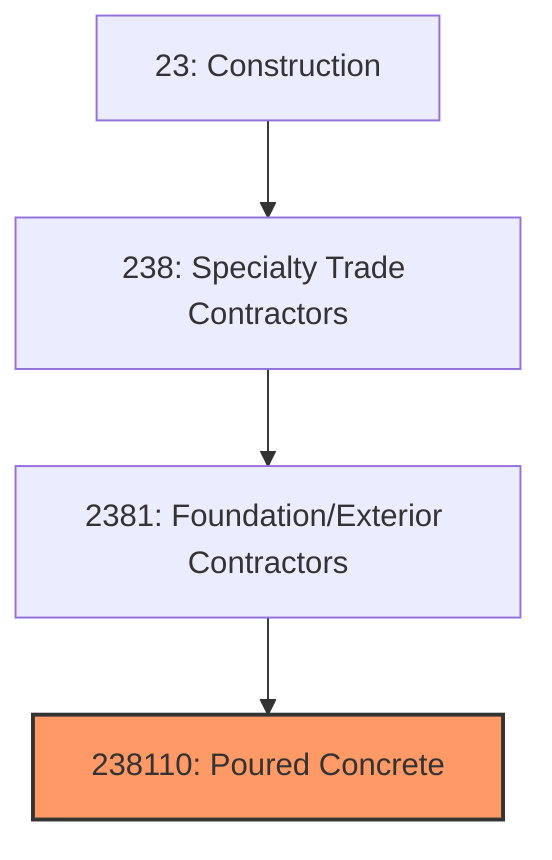

# Poured Concrete Foundation and Structure Contractors

> This industry comprises establishments primarily engaged in pouring and finishing concrete foundations, retaining walls, and other concrete structures, including slabs, footings, and flatwork.

## Overview

Poured Concrete Foundation and Structure Contractors (NAICS 238110) encompasses establishments that construct foundations, structural concrete, and flatwork using cast-in-place concrete. This includes residential foundations, commercial footings, slabs on grade, elevated slabs, retaining walls, and decorative concrete work.

Concrete foundation work is essential to virtually all construction, providing the structural base upon which buildings are constructed. The industry requires expertise in formwork, reinforcement placement, concrete placement, and finishing. Work is highly weather-dependent in cold climates, creating seasonal patterns in northern regions.

## Market Context

The U.S. poured concrete contractor market represents approximately $70 billion in annual spending:

| Segment | Market Size | Key Drivers |
|---------|-------------|-------------|
| Commercial Foundations | $25 billion | Office, retail, industrial construction |
| Residential Foundations | $20 billion | Single-family, multi-family housing |
| Flatwork/Slabs | $12 billion | Warehouse, parking, driveways |
| Structural Concrete | $8 billion | Multi-story buildings, parking garages |
| Specialty Concrete | $5 billion | Decorative, stamped, polished |

The market is driven by construction activity, infrastructure needs, and the continued demand for durable, fire-resistant concrete structures.

## Industry Hierarchy

## Key Statistics

| Metric | Value |
|--------|-------|
| NAICS Code | 238110 |
| Level | National Industry |
| Parent | [Building Exterior Contractors](./) |
| U.S. Establishments | ~25,000 |
| Annual Revenue | ~$70 billion |
| Employment | ~350,000 |

## Related Occupations

- [Cement Masons](/occupations/Construction/CementMasons) - Place and finish concrete
- [Concrete Finishers](/occupations/Construction/ConcreteFinishers) - Apply surface finishes
- [Form Carpenters](/occupations/Construction/FormCarpenters) - Build concrete forms
- [Reinforcing Iron Workers](/occupations/Construction/ReinforcingIronWorkers) - Install rebar
- [Construction Laborers](/occupations/Construction/ConstructionLaborers) - Assist concrete crews
- [Construction Managers](/occupations/Management/ConstructionManagers) - Oversee concrete projects

## Core Business Processes

### Estimating and Planning

Accurate planning ensures profitable execution.

**Key Activities:**
- Perform concrete quantity takeoffs
- Calculate formwork requirements
- Estimate labor and equipment needs
- Plan concrete placement sequence
- Coordinate with ready-mix suppliers
- Review structural drawings and specifications

### Formwork and Reinforcement

Proper preparation ensures quality concrete.

**Key Activities:**
- Excavate and prepare subgrade
- Install formwork to design dimensions
- Place reinforcing steel per drawings
- Install embeds and sleeves
- Verify all elements before pour
- Complete pre-pour inspection

### Concrete Placement and Finishing

Quality placement creates durable structures.

**Key Activities:**
- Coordinate concrete delivery schedule
- Place concrete in forms
- Consolidate with vibrators
- Screed and level surfaces
- Apply finish as specified
- Implement proper curing procedures

## Industry Value Chain

## Regulatory Environment

### Building Codes
- **ACI 318** - Building Code Requirements for Structural Concrete
- **International Building Code (IBC)** - Structural requirements
- **International Residential Code (IRC)** - Residential foundation standards
- **Local Building Codes** - Jurisdiction-specific requirements

### Material Standards
- **ASTM C94** - Ready-mixed concrete specifications
- **ASTM A615** - Deformed reinforcing steel
- **ACI 301** - Specifications for structural concrete
- **ACI 117** - Concrete tolerances

### Safety Standards
- **OSHA Excavation Standards** - Trench and excavation safety
- **OSHA Fall Protection** - Working at heights
- **Concrete Truck Safety** - Safe delivery procedures
- **Silica Exposure Rule** - Respirable silica limits

### Quality Standards
- **Testing Requirements** - Slump, strength, air content
- **Placement Temperatures** - Cold and hot weather concreting
- **Curing Requirements** - Moisture retention procedures
- **Surface Tolerances** - Flatness and levelness requirements

## Technology & Innovation

### Concrete Technology
- **Self-Consolidating Concrete** - Flowable, self-leveling mixes
- **High-Performance Concrete** - Enhanced strength and durability
- **Fiber-Reinforced Concrete** - Secondary reinforcement
- **Rapid-Setting Concrete** - Accelerated strength gain

### Formwork Systems
- **Aluminum Forms** - Lightweight, reusable systems
- **Insulated Concrete Forms (ICF)** - Stay-in-place insulating forms
- **Modular Formwork** - Gang forms for efficiency
- **Self-Climbing Forms** - High-rise construction

### Finishing Technology
- **Power Trowels** - Mechanized finishing
- **Laser Screeds** - Precision flatness
- **Polished Concrete** - Decorative floor systems
- **Stamped Concrete** - Decorative patterning

### Equipment
- **Concrete Pumps** - Boom and line pumps for placement
- **GPS Machine Control** - Automated grading equipment
- **Mobile Batch Plants** - On-site concrete production
- **Heating Systems** - Cold weather concreting

## Project Types

### Foundation Work
- Residential foundations
- Commercial footings and walls
- Deep foundations and caissons
- Retaining walls
- Basement construction

### Slab Construction
- Slabs on grade
- Elevated slabs
- Post-tensioned slabs
- Industrial floors
- Parking structures

### Structural Concrete
- Concrete frame buildings
- Tilt-up construction
- Precast integration
- Bridge and infrastructure
- Tanks and containment

### Decorative Concrete
- Stamped patios and driveways
- Exposed aggregate
- Polished concrete floors
- Colored concrete
- Architectural finishes

## Industry Trends and Outlook

Key trends shaping poured concrete contractors:

- **Labor Shortage** - Critical need for skilled concrete workers
- **Prefabrication** - Precast and tilt-up growth
- **Technology Adoption** - GPS, laser screeds, automation
- **Sustainability** - Low-carbon cement, recycled aggregates
- **High-Performance Mixes** - Self-consolidating, fiber-reinforced
- **Formwork Innovation** - Aluminum, modular, reusable systems
- **Quality Focus** - Third-party inspection and testing
- **Weather Challenges** - Climate adaptation strategies

The outlook is tied to construction activity, with commercial and residential construction driving demand. The industry faces workforce challenges, particularly for skilled cement masons and form carpenters, driving interest in prefabrication and automation.

---

*Source: NAICS 238110 - Poured Concrete Foundation and Structure Contractors*
