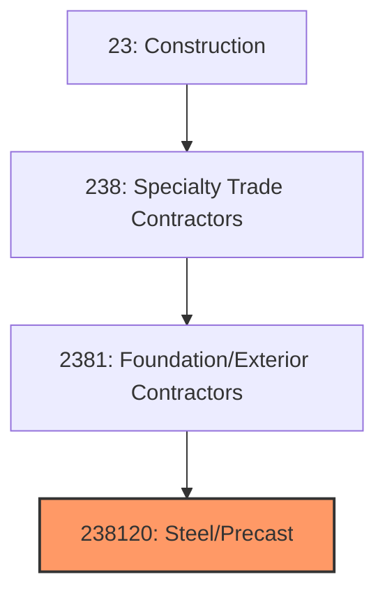

# Structural Steel and Precast Concrete Contractors

> This industry comprises establishments primarily engaged in erecting structural steel and precast concrete elements for buildings and other structures, including steel framing, precast panels, and heavy rigging.

## Overview

Structural Steel and Precast Concrete Contractors (NAICS 238120) encompasses establishments that erect structural steel frameworks, precast concrete elements, and other prefabricated structural components. This includes structural steel framing for buildings, precast concrete panels and structural elements, ornamental metal work, and specialized rigging and crane operations.

The industry is essential to commercial, industrial, and institutional construction, providing the primary structural systems for most non-residential buildings. Work requires specialized equipment, skilled ironworkers, and careful coordination of heavy lifting operations. The industry benefits from prefabrication trends as more structural work shifts to factory fabrication with field erection.

## Market Context

The U.S. structural steel and precast contractor market represents approximately $45 billion in annual spending:

| Segment | Market Size | Key Drivers |
|---------|-------------|-------------|
| Structural Steel Erection | $25 billion | Commercial, industrial, multi-family |
| Precast Concrete | $12 billion | Parking structures, tilt-up, architectural |
| Reinforcing Steel | $5 billion | Cast-in-place concrete structures |
| Ornamental Iron | $2 billion | Railings, stairs, specialty metal |
| Heavy Rigging | $1 billion | Equipment setting, specialty lifts |

The market is driven by commercial and industrial construction, infrastructure needs, and the growing adoption of prefabricated construction methods.

## Industry Hierarchy

## Key Statistics

| Metric | Value |
|--------|-------|
| NAICS Code | 238120 |
| Level | National Industry |
| Parent | [Building Exterior Contractors](./) |
| U.S. Establishments | ~8,000 |
| Annual Revenue | ~$45 billion |
| Employment | ~150,000 |

## Related Occupations

- [Structural Ironworkers](/occupations/Construction/StructuralIronworkers) - Erect structural steel
- [Reinforcing Ironworkers](/occupations/Construction/ReinforcingIronworkers) - Place reinforcing steel
- [Crane Operators](/occupations/Construction/CraneOperators) - Operate lifting equipment
- [Riggers](/occupations/Construction/Riggers) - Prepare and control loads
- [Welders](/occupations/Production/Welders) - Complete structural welding
- [Construction Managers](/occupations/Management/ConstructionManagers) - Oversee steel/precast projects

## Core Business Processes

```mermaid
flowchart LR
    subgraph Detailing["Detailing"]
        D1["Shop Drawings"]
        D2["Connection Design"]
        D3["Erection Drawings"]
        D4["Approval"]
    end

    subgraph Fabrication["Fabrication"]
        F1["Material Procurement"]
        F2["Cutting/Fitting"]
        F3["Welding"]
        F4["Coatings"]
    end

    subgraph Erection["Erection"]
        E1["Anchor Setting"]
        E2["Steel Erection"]
        E3["Bolting/Welding"]
        E4["Plumbing/Leveling"]
    end

    D1 --> D2 --> D3 --> D4
    D4 --> F1 --> F2 --> F3 --> F4
    F4 --> E1 --> E2 --> E3 --> E4
```

### Detailing and Engineering

Accurate detailing ensures proper fit and efficient erection.

**Key Activities:**
- Develop shop drawings from structural documents
- Design connections per engineer specifications
- Create erection drawings and sequences
- Coordinate with other trades for embeds and openings
- Submit for engineer approval
- Plan lifting and erection sequence

### Fabrication

Quality fabrication ensures accurate field assembly.

**Key Activities:**
- Procure steel per project specifications
- Cut, drill, and fit structural members
- Complete shop welding
- Apply primer and protective coatings
- Mark and organize for shipping
- Coordinate delivery schedule

### Field Erection

Skilled erection creates safe, stable structures.

**Key Activities:**
- Set anchor bolts and embeds in concrete
- Erect columns and beams per sequence
- Make bolted and welded connections
- Plumb, level, and align structure
- Install temporary bracing as required
- Complete inspections and final adjustments

## Industry Value Chain

```mermaid
graph LR
    subgraph Inputs["Inputs & Resources"]
        I1["Steel/Precast"]
        I2["Bolts/Fasteners"]
        I3["Cranes/Equipment"]
        I4["Welding Supplies"]
        I5["Skilled Ironworkers"]
    end

    subgraph Primary["Primary Activities"]
        A1["Detailing"]
        A2["Fabrication"]
        A3["Erection"]
        A4["Inspections"]
    end

    subgraph Outputs["Deliverables"]
        O1["Steel Frames"]
        O2["Precast Structures"]
        O3["Metal Decking"]
        O4["Specialty Metal"]
    end

    subgraph Customers["Customer Segments"]
        C1["General Contractors"]
        C2["Developers"]
        C3["Building Owners"]
        C4["Industrial Clients"]
    end

    Inputs --> Primary --> Outputs --> Customers
```

## Regulatory Environment

### Design Standards
- **AISC 360** - Specification for Structural Steel Buildings
- **AISC 341** - Seismic Provisions for Structural Steel
- **PCI Standards** - Precast concrete design and connections
- **AWS D1.1** - Structural Welding Code

### Erection Standards
- **AISC Code of Standard Practice** - Steel erection requirements
- **OSHA Steel Erection Standards** - 29 CFR 1926 Subpart R
- **Crane Standards** - ASME B30 and OSHA requirements
- **Rigging Standards** - Load handling and safety

### Quality Standards
- **AISC Certification** - Fabricator and erector certification
- **Weld Quality** - AWS and AISC requirements
- **Bolt Tensioning** - Turn-of-nut and tension-control methods
- **Inspection Requirements** - Third-party and special inspections

### Safety Standards
- **OSHA Fall Protection** - Connector fall protection requirements
- **OSHA Steel Erection** - Column stability and safety cables
- **Crane Safety** - Lift planning and critical lifts
- **Welding Safety** - Fire prevention and protection

## Technology & Innovation

### Fabrication Technology
- **CNC Equipment** - Automated cutting and drilling
- **Robotic Welding** - Automated weld processes
- **3D Modeling** - Tekla and similar steel detailing
- **Automated Material Handling** - Robotic sorting and stacking

### Erection Technology
- **Tower Cranes** - High-rise construction
- **GPS Positioning** - Real-time member location
- **Automated Surveying** - Robotic total stations
- **BIM Coordination** - Model-based erection planning

### Connection Technology
- **Tension-Control Bolts** - Reliable bolt tensioning
- **Moment Connections** - Seismic-resistant connections
- **Friction-Grip Bolting** - Slip-critical connections
- **Advanced Welding** - High-strength, low-hydrogen processes

### Precast Technology
- **Architectural Precast** - Complex shapes and finishes
- **Insulated Panels** - Precast with integral insulation
- **Ultra-High Performance Concrete** - High-strength thin panels
- **Prefabricated Connections** - Cast-in hardware systems

## Project Types

### Commercial Construction
- High-rise office buildings
- Multi-story parking structures
- Retail and shopping centers
- Hotels and hospitality
- Healthcare facilities

### Industrial Construction
- Manufacturing plants
- Warehouse and distribution
- Food processing facilities
- Energy and power plants
- Data centers

### Infrastructure
- Bridges and overpasses
- Transit stations
- Sports stadiums
- Convention centers
- Airport terminals

### Specialty Work
- Architectural steel
- Ornamental metals
- Heavy industrial equipment
- Tank and vessel erection
- Retrofit and renovation

## Industry Trends and Outlook

Key trends shaping structural steel and precast contractors:

- **Prefabrication Growth** - More shop work, less field labor
- **BIM Integration** - Model-based detailing and coordination
- **Labor Challenges** - Ironworker shortage in many markets
- **Steel Pricing** - Volatility in material costs
- **Modular Construction** - Complete structural modules
- **Seismic Design** - Advanced connection systems
- **Sustainability** - Recycled steel and efficient structures
- **Automation** - Robotic fabrication advances

The outlook is positive with commercial and industrial construction driving demand. The industry benefits from prefabrication trends while facing workforce challenges. Steel's speed of construction and recyclability support continued strong market position.

---

*Source: NAICS 238120 - Structural Steel and Precast Concrete Contractors*
