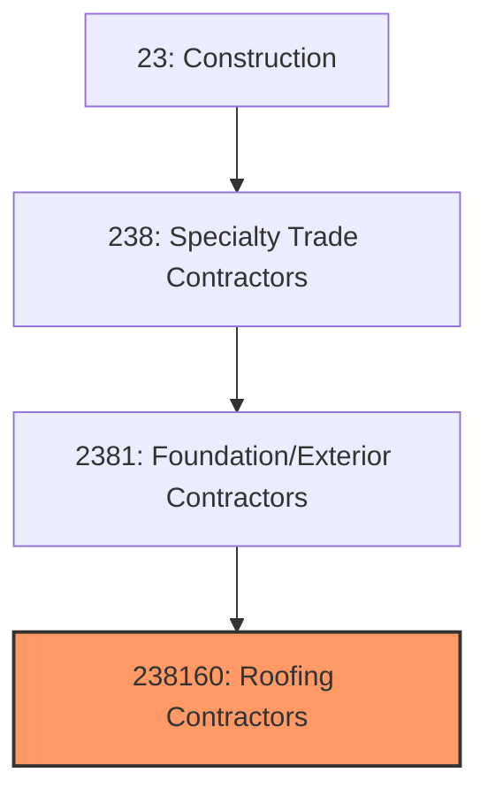

# Roofing Contractors

> This industry comprises establishments primarily engaged in roofing, including installation, repair, and replacement of roofing materials such as shingles, tile, metal, and single-ply membranes.

## Overview

Roofing Contractors (NAICS 238160) encompasses establishments that install, repair, and replace roof systems on residential, commercial, and industrial buildings. This includes steep-slope roofing (shingles, tile, metal) for residential and light commercial buildings, and low-slope roofing (built-up, modified bitumen, single-ply membranes) for commercial and industrial structures.

The roofing industry is driven by both new construction and the substantial re-roofing market, as roofs have finite lifespans and require periodic replacement. Weather events, particularly hail and wind storms, create significant demand for repair and replacement work. Roofing is one of the most hazardous construction trades due to fall risks and weather exposure.

## Market Context

The U.S. roofing contractor market represents approximately $55 billion in annual spending:

| Segment | Market Size | Key Drivers |
|---------|-------------|-------------|
| Residential Re-Roofing | $22 billion | Aging roofs, storm damage, home sales |
| Commercial Roofing | $15 billion | New construction, re-roofing, maintenance |
| Residential New Construction | $10 billion | Single-family and multi-family housing |
| Industrial Roofing | $5 billion | Manufacturing, warehousing, distribution |
| Specialty/Metal Roofing | $3 billion | Architectural, energy-efficient systems |

The market is driven by storm activity, aging building stock, new construction, and growing demand for energy-efficient and sustainable roofing systems.

## Industry Hierarchy

## Key Statistics

| Metric | Value |
|--------|-------|
| NAICS Code | 238160 |
| Level | National Industry |
| Parent | [Building Exterior Contractors](./) |
| U.S. Establishments | ~35,000 |
| Annual Revenue | ~$55 billion |
| Employment | ~175,000 |

## Related Occupations

- [Roofers](/occupations/Construction/Roofers) - Install and repair roofing systems
- [Roofing Helpers](/occupations/Construction/RoofingHelpers) - Assist roofers with materials and cleanup
- [Sheet Metal Workers](/occupations/Construction/SheetMetalWorkers) - Fabricate and install metal roofing and flashings
- [Construction Laborers](/occupations/Construction/ConstructionLaborers) - Support roofing crews with material handling
- [Construction Managers](/occupations/Management/ConstructionManagers) - Oversee roofing projects
- [Estimators](/occupations/Business/CostEstimators) - Prepare roofing bids and proposals

## Core Business Processes

```mermaid
flowchart LR
    subgraph Assessment["Assessment"]
        A1["Roof Inspection"]
        A2["Damage Evaluation"]
        A3["Measurement"]
        A4["Proposal/Bid"]
    end

    subgraph Preparation["Preparation"]
        P1["Material Ordering"]
        P2["Crew Scheduling"]
        P3["Tear-Off"]
        P4["Deck Repair"]
    end

    subgraph Installation["Installation"]
        I1["Underlayment"]
        I2["Roofing Material"]
        I3["Flashings"]
        I4["Final Inspection"]
    end

    A1 --> A2 --> A3 --> A4
    A4 --> P1 --> P2 --> P3 --> P4
    P4 --> I1 --> I2 --> I3 --> I4
```

### Roof Assessment and Estimating

Accurate assessment is critical for proper scope and profitable bidding.

**Key Activities:**
- Inspect existing roof condition
- Document damage for insurance claims
- Measure roof area and features
- Identify access and safety requirements
- Calculate material quantities
- Prepare proposals and negotiate contracts

### Tear-Off and Preparation

Proper preparation ensures quality installation and long roof life.

**Key Activities:**
- Set up safety systems and fall protection
- Remove existing roofing materials
- Inspect and repair roof deck
- Address structural issues
- Install vapor barriers as required
- Dispose of debris properly

### Roofing Installation

Installation requires skill to ensure weathertight performance.

**Key Activities:**
- Install underlayment and ice/water shield
- Apply roofing materials per manufacturer specs
- Install flashings at penetrations and edges
- Complete ridge, hip, and valley details
- Install ventilation components
- Perform quality inspection and cleanup

## Industry Value Chain

## Regulatory Environment

### Building Codes
- **International Building Code (IBC)** - Commercial roofing requirements
- **International Residential Code (IRC)** - Residential roofing standards
- **ASCE 7** - Wind and snow load requirements
- **Local Amendments** - Jurisdiction-specific requirements

### Safety Standards
- **OSHA Fall Protection** - 29 CFR 1926.501-503
- **OSHA Scaffolding** - Requirements for roof access
- **Heat Illness Prevention** - Protection for outdoor workers
- **Ladder Safety** - Proper access requirements

### Industry Standards
- **NRCA Standards** - Roofing construction best practices
- **FM Approvals** - Fire and wind resistance ratings
- **UL Listings** - Fire classification testing
- **ASTM Standards** - Material specifications

### Licensing and Insurance
- **Contractor Licensing** - State requirements vary
- **General Liability Insurance** - Coverage for property damage
- **Workers Compensation** - Required coverage for employees
- **Manufacturer Certification** - Warranty eligibility requirements

## Technology & Innovation

### Roofing Materials
- **Cool Roofing** - Reflective materials reducing heat gain
- **Solar-Ready Roofing** - Integrated solar mounting systems
- **Impact-Resistant Shingles** - Hail-resistant products
- **Self-Adhered Membranes** - Torch-free installation

### Installation Technology
- **Drone Inspection** - Aerial roof assessment and measurement
- **Satellite Measurement** - Remote area calculation
- **Roofing Software** - Estimating and project management
- **Equipment Advances** - Powered material hoists and conveyors

### Safety Equipment
- **Fall Protection Systems** - Horizontal lifelines and anchors
- **Personal Fall Limiters** - Self-retracting devices
- **Warning Line Systems** - Low-slope roof safety zones
- **Guardrail Systems** - Perimeter protection

### Sustainable Roofing
- **Green Roofs** - Vegetated roofing systems
- **Solar Integration** - BIPV roofing products
- **Recycled Materials** - Sustainable roofing products
- **Energy Star Rated** - Reflective and insulated systems

## Project Types

### Residential Roofing
- Shingle replacement and repair
- Tile and slate roofing
- Metal roofing systems
- Storm damage restoration
- Gutter and flashing work

### Commercial Roofing
- Single-ply membrane systems (TPO, EPDM, PVC)
- Modified bitumen roofing
- Built-up roofing (BUR)
- Metal roof systems
- Roof maintenance programs

### Specialty Roofing
- Green/vegetated roofs
- Solar-integrated systems
- Historical restoration
- Steep-slope commercial
- Industrial process areas

## Industry Trends and Outlook

Key trends shaping roofing contractors:

- **Storm Activity** - Increasing severe weather driving demand
- **Cool Roofing** - Energy efficiency requirements and incentives
- **Solar Integration** - Rooftop solar and BIPV systems
- **Labor Shortage** - Difficulty attracting workers to demanding trade
- **Safety Focus** - Emphasis on fall protection and training
- **Technology Adoption** - Drones, satellite measurement, software
- **Material Innovation** - Longer-lasting, more durable products
- **Insurance Dynamics** - Changing claims processes and requirements

The outlook is positive with aging building stock, storm activity, and new construction driving demand. The industry faces persistent workforce challenges, with roofing's physical demands and seasonal nature making recruitment difficult.

---

*Source: NAICS 238160 - Roofing Contractors*
