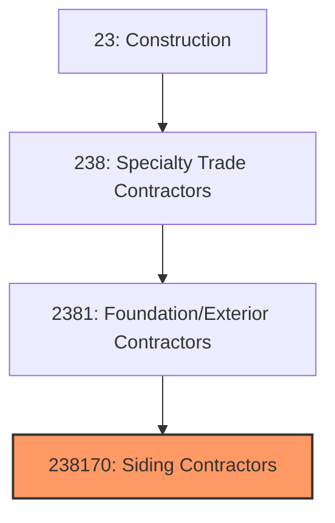

# Siding Contractors

> This industry comprises establishments primarily engaged in installing siding of all types, including vinyl, aluminum, wood, fiber cement, and specialty cladding materials on residential and commercial buildings.

## Overview

Siding Contractors (NAICS 238170) encompasses establishments that install exterior cladding and siding materials on buildings. This includes vinyl siding, fiber cement siding, aluminum and metal siding, wood siding, stucco, and specialty cladding systems. Siding provides weather protection, insulation, and aesthetic appeal to building exteriors.

The industry serves primarily the residential market, with re-siding representing a major portion of work as homeowners update aging exteriors. The industry has evolved with new materials like fiber cement and engineered wood, offering improved durability and aesthetics. Proper installation is critical for weather protection and moisture management.

## Market Context

The U.S. siding contractor market represents approximately $20 billion in annual spending:

| Segment | Market Size | Key Drivers |
|---------|-------------|-------------|
| Residential Re-Siding | $10 billion | Aging homes, curb appeal, maintenance |
| Residential New Construction | $5 billion | Single-family, townhome construction |
| Commercial/Multi-Family | $3 billion | Apartment, retail, office exteriors |
| Storm Damage | $1.5 billion | Wind, hail, and storm restoration |
| Specialty Cladding | $0.5 billion | Architectural panels, rainscreen |

The market is driven by the aging housing stock, new construction, storm damage, and homeowner preferences for low-maintenance materials.

## Industry Hierarchy

## Key Statistics

| Metric | Value |
|--------|-------|
| NAICS Code | 238170 |
| Level | National Industry |
| Parent | [Building Exterior Contractors](./) |
| U.S. Establishments | ~12,000 |
| Annual Revenue | ~$20 billion |
| Employment | ~80,000 |

## Related Occupations

- [Siding Installers](/occupations/Construction/SidingInstallers) - Install siding and cladding materials
- [Carpenters](/occupations/Construction/Carpenters) - Install wood siding and trim
- [Stucco Masons](/occupations/Construction/StuccoMasons) - Apply stucco finishes
- [Construction Laborers](/occupations/Construction/ConstructionLaborers) - Support siding crews
- [Construction Managers](/occupations/Management/ConstructionManagers) - Oversee siding projects
- [Estimators](/occupations/Business/CostEstimators) - Prepare siding bids

## Core Business Processes

### Assessment and Estimating

Accurate assessment ensures proper scope and pricing.

**Key Activities:**
- Inspect existing siding condition
- Measure all wall areas and openings
- Assess sheathing and structural conditions
- Recommend appropriate siding materials
- Calculate material quantities
- Prepare detailed proposals

### Surface Preparation

Proper preparation ensures long-lasting installation.

**Key Activities:**
- Remove existing siding materials
- Inspect and repair sheathing
- Install or repair weather-resistive barrier
- Install starter strips and flashings
- Prepare window and door trim
- Ensure proper drainage and ventilation

### Siding Installation

Quality installation ensures weather protection.

**Key Activities:**
- Install starter course and J-channel
- Apply field siding per manufacturer specs
- Install corners, soffits, and trim
- Complete window and door surrounds
- Seal penetrations and transitions
- Perform final inspection and cleanup

## Industry Value Chain

## Regulatory Environment

### Building Codes
- **International Residential Code (IRC)** - Residential siding requirements
- **International Building Code (IBC)** - Commercial cladding standards
- **Fire Rating Requirements** - Combustibility and fire spread
- **Wind Resistance Codes** - High-wind zone requirements

### Moisture Management
- **IRC Water-Resistive Barriers** - WRB requirements
- **Flashing Requirements** - Window and door integration
- **Ventilation Standards** - Rainscreen and drainage
- **Energy Codes** - Continuous insulation integration

### Industry Standards
- **ASTM Standards** - Material specifications
- **Vinyl Siding Institute (VSI)** - Installation guidelines
- **Fiber Cement Manufacturers** - Product-specific requirements
- **EIFS Industry Members Association (EIMA)** - EIFS standards

### Manufacturer Requirements
- **Product Warranties** - Installation requirements for warranty
- **Certification Programs** - Installer training and certification
- **Testing Standards** - Impact, wind, and fire testing
- **Approved Fasteners** - Specified fastening systems

## Technology & Innovation

### Siding Materials
- **Fiber Cement** - Durable, low-maintenance, fire-resistant
- **Engineered Wood** - LP SmartSide, composite products
- **Insulated Vinyl** - Foam-backed for thermal performance
- **Metal Panels** - Steel and aluminum architectural panels

### Installation Systems
- **Rainscreen Systems** - Drained and ventilated cavities
- **Continuous Insulation** - Integrated insulation products
- **Clip Systems** - Concealed fastening for clean looks
- **Pre-Finished Materials** - Factory-applied coatings

### Weather Protection
- **House Wraps** - Advanced water-resistive barriers
- **Fluid-Applied WRB** - Spray or roll-on barriers
- **Peel-and-Stick Flashings** - Self-adhered membrane flashings
- **Integrated Systems** - Complete weather barrier assemblies

### Design Tools
- **Visualization Software** - Virtual siding selection
- **Estimating Software** - Automated takeoff and pricing
- **Measurement Apps** - Photo-based measurement
- **Project Management** - Digital documentation

## Project Types

### Residential Re-Siding
- Vinyl siding replacement
- Fiber cement upgrades
- Wood siding restoration
- Trim and accent work
- Storm damage repair

### New Construction
- Single-family homes
- Townhomes and duplexes
- Custom home exteriors
- Accessory dwelling units
- Mixed materials

### Commercial Siding
- Multi-family buildings
- Retail and office exteriors
- Industrial facilities
- Hotels and hospitality
- Healthcare and education

### Specialty Cladding
- Metal wall panels
- EIFS and stucco
- Natural wood siding
- Composite materials
- Rainscreen systems

## Industry Trends and Outlook

Key trends shaping siding contractors:

- **Fiber Cement Growth** - Premium material gaining market share
- **Low Maintenance** - Homeowner preference driving material selection
- **Energy Integration** - Continuous insulation requirements
- **Sustainability** - Recycled and sustainable materials
- **Labor Challenges** - Skilled installer shortage
- **Storm Hardening** - Impact-resistant siding in storm zones
- **Design Trends** - Mixed materials and bold colors
- **Technology Adoption** - Digital estimating and visualization

The outlook is positive with aging housing stock and new construction driving demand. The market is shifting toward premium materials like fiber cement and engineered wood, requiring additional installer training and skills.

---

*Source: NAICS 238170 - Siding Contractors*
