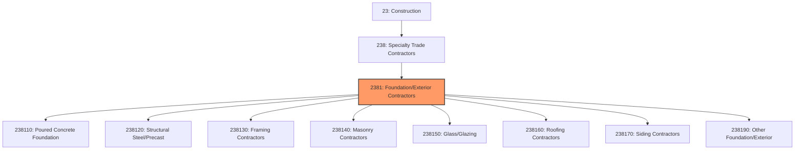
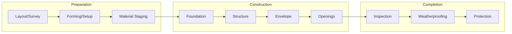

# Foundation, Structure, and Building Exterior Contractors

> This industry group comprises establishments primarily engaged in activities associated with building foundations, structures, and exteriors, including masonry, concrete, roofing, siding, and framing.

## Overview

Foundation, Structure, and Building Exterior Contractors represents a major category within the Specialty Trade Contractors subsector (NAICS 238), encompassing establishments that construct the structural elements and exterior envelope of buildings. This includes foundation work, concrete construction, structural steel erection, framing, roofing, siding, and masonry work.

These contractors build the structural skeleton and weatherproof shell that protect building occupants and contents. Work ranges from residential foundation and framing to complex commercial structural steel and curtain wall systems. The quality of this work directly impacts building safety, durability, and energy efficiency.

## Market Context

The U.S. foundation, structure, and exterior contractors market represents approximately $200 billion in annual spending:

| Segment | Market Size | Key Drivers |
|---------|-------------|-------------|
| Concrete/Foundation | $60 billion | Commercial, infrastructure, residential |
| Framing/Structural | $50 billion | Residential, commercial construction |
| Roofing | $45 billion | New construction, re-roofing, storm damage |
| Masonry | $25 billion | Commercial, institutional, residential |
| Siding/Exterior | $20 billion | Residential new, remodel, re-siding |

The market is driven by new construction activity, building renovation, storm damage repairs, and energy efficiency upgrades requiring improved building envelopes.

## Industry Hierarchy

## Key Statistics

| Metric | Value |
|--------|-------|
| NAICS Code | 2381 |
| Level | Industry Group |
| Parent | [Specialty Trade Contractors](../) |
| Child Industries | 8 |
| U.S. Establishments | ~150,000 |
| Annual Revenue | ~$200 billion |
| Employment | ~1.2 million |

## Sub-Industries

| Industry | Code | Description |
|----------|------|-------------|
| [Poured Concrete Foundation](./PouredConcreteFoundation/) | 238110 | Foundation walls, slabs, and flatwork |
| [Structural Steel/Precast](./PrecastConcreteContractors/) | 238120 | Steel erection and precast concrete |
| [Framing Contractors](./FramingContractors/) | 238130 | Wood and metal framing |
| [Masonry Contractors](./MasonryContractors/) | 238140 | Brick, block, and stone masonry |
| [Glass/Glazing](./GlazingContractors/) | 238150 | Windows, curtain wall, and glazing |
| [Roofing Contractors](./RoofingContractors/) | 238160 | Roof installation and repair |
| [Siding Contractors](./SidingContractors/) | 238170 | Exterior siding and trim |
| [Other Exterior](./index/) | 238190 | Waterproofing, caulking, specialty |

## Related Occupations

- [Cement Masons](/occupations/Construction/CementMasons) - Pour and finish concrete flatwork
- [Structural Ironworkers](/occupations/Construction/Ironworkers) - Erect structural steel frameworks
- [Carpenters](/occupations/Construction/Carpenters) - Frame buildings with wood and metal
- [Bricklayers](/occupations/Construction/Bricklayers) - Lay brick, block, and stone masonry
- [Roofers](/occupations/Construction/Roofers) - Install and repair roofing systems
- [Glaziers](/occupations/Construction/Glaziers) - Install glass and window systems
- [Construction Laborers](/occupations/Construction/ConstructionLaborers) - Support skilled trades

## Core Business Processes

### Foundation Work

Foundation work establishes the base upon which buildings are constructed.

**Key Activities:**
- Excavate and prepare subgrade
- Install formwork for foundations
- Place reinforcing steel
- Pour and finish concrete
- Strip forms and waterproof
- Backfill and compact

### Structural Framework

The structural frame provides the load-bearing skeleton of the building.

**Key Activities:**
- Erect structural steel or precast elements
- Frame walls, floors, and roofs
- Install sheathing and decking
- Complete structural connections
- Coordinate with MEP trades for penetrations

### Building Envelope

The envelope separates interior and exterior environments.

**Key Activities:**
- Install roofing systems
- Apply exterior cladding and siding
- Install windows and curtain wall
- Complete flashings and sealants
- Apply waterproofing and coatings

## Industry Value Chain

## Regulatory Environment

### Building Codes
- **International Building Code (IBC)** - Structural and fire requirements
- **International Residential Code (IRC)** - Residential construction standards
- **ACI Standards** - Concrete construction requirements
- **AISC Standards** - Structural steel construction

### Safety Requirements
- **OSHA Fall Protection** - Requirements for elevated work
- **OSHA Scaffolding Standards** - Scaffold construction and use
- **OSHA Steel Erection Standards** - Structural steel safety
- **OSHA Excavation Standards** - Foundation excavation safety

### Industry Standards
- **NRCA Standards** - Roofing installation best practices
- **ASHRAE 90.1** - Building envelope energy efficiency
- **ASTM Standards** - Material and testing specifications
- **AAMA Standards** - Window and door installation

## Technology & Innovation

### Materials Technology
- **Mass Timber** - Cross-laminated timber (CLT) construction
- **High-Performance Concrete** - Self-consolidating, fiber-reinforced
- **Advanced Insulation** - Continuous insulation systems
- **Cool Roofing** - Reflective roofing materials

### Construction Methods
- **Prefabrication** - Panelized wall and roof systems
- **Tilt-Up Construction** - Site-cast concrete panels
- **Modular Construction** - Factory-built structural modules
- **3D Printing** - Additive manufacturing of structures

### Design Technology
- **Building Information Modeling (BIM)** - 3D coordination and clash detection
- **Structural Analysis Software** - Computer-aided engineering
- **Thermal Modeling** - Building envelope performance analysis
- **Drone Surveying** - Roof and facade inspection

## Industry Trends and Outlook

Key trends shaping foundation, structure, and exterior contractors:

- **Labor Shortages** - Difficulty finding skilled structural trades
- **Prefabrication Growth** - Off-site manufacturing of components
- **Energy Efficiency** - Higher-performance building envelopes
- **Mass Timber** - Cross-laminated timber gaining acceptance
- **Storm Resilience** - Impact-resistant materials and systems
- **Material Costs** - Volatility in lumber, steel, and concrete
- **Technology Adoption** - BIM, prefab, and automation

The outlook is positive with construction activity driving demand. The industry faces workforce challenges driving adoption of prefabrication and more efficient construction methods. Energy code requirements are increasing focus on building envelope performance.

---

*Source: NAICS 2381 - Foundation, Structure, and Building Exterior Contractors*
