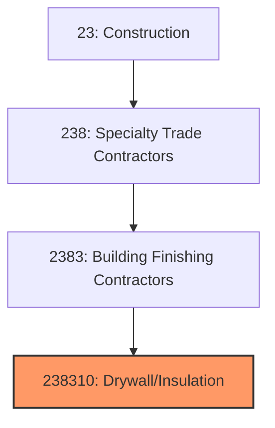
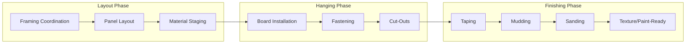

# Drywall and Insulation Contractors

> This industry comprises establishments primarily engaged in drywall, plaster, and insulation work, including hanging drywall, taping and finishing, spray-on insulation, and acoustical ceiling installation.

## Overview

Drywall and Insulation Contractors (NAICS 238310) encompasses establishments that install interior wall and ceiling systems. This includes hanging and finishing drywall (gypsum board), installing insulation for thermal and acoustic performance, applying plaster finishes, and installing acoustical ceiling systems. These contractors create the interior surfaces that define building spaces.

The industry is essential to virtually all building construction, as drywall has become the dominant interior wall finish in North America. Work includes new construction, renovations, tenant improvements, and specialty applications like fire-rated assemblies and sound-rated partitions. The industry requires skilled craftspeople, particularly for finishing work that demands a high degree of manual dexterity.

## Market Context

The U.S. drywall and insulation contractor market represents approximately $35 billion in annual spending:

| Segment | Market Size | Key Drivers |
|---------|-------------|-------------|
| Commercial Drywall | $15 billion | Office, retail, hospitality, healthcare |
| Residential Drywall | $10 billion | Single-family, multi-family construction |
| Insulation | $6 billion | Energy codes, retrofits, new construction |
| Acoustical Ceilings | $3 billion | Commercial construction, renovation |
| Specialty Systems | $1 billion | Fire-rated, sound-rated, curved assemblies |

The market is driven by construction activity, energy code requirements for insulation, renovation work, and increasing demand for high-performance building envelopes.

## Industry Hierarchy

## Key Statistics

| Metric | Value |
|--------|-------|
| NAICS Code | 238310 |
| Level | National Industry |
| Parent | [Building Finishing Contractors](./) |
| U.S. Establishments | ~20,000 |
| Annual Revenue | ~$35 billion |
| Employment | ~200,000 |

## Related Occupations

- [Drywall Installers](/occupations/Construction/DrywallInstallers) - Hang and finish drywall panels
- [Drywall Tapers](/occupations/Construction/DrywallTapers) - Finish drywall joints and surfaces
- [Insulation Workers](/occupations/Construction/InsulationWorkers) - Install thermal and acoustic insulation
- [Plasterers](/occupations/Construction/Plasterers) - Apply plaster and stucco finishes
- [Ceiling Tile Installers](/occupations/Construction/CeilingTileInstallers) - Install acoustical ceilings
- [Construction Laborers](/occupations/Construction/ConstructionLaborers) - Support finishing crews

## Core Business Processes

### Layout and Coordination

Proper coordination ensures efficient installation and quality results.

**Key Activities:**
- Review framing for proper blocking and backing
- Plan panel layout to minimize waste and joints
- Coordinate with electrical and mechanical trades
- Stage materials for efficient workflow
- Verify fire-rating and sound-rating requirements
- Plan lift and scaffold access

### Drywall Hanging

Hanging requires efficiency and attention to proper fastening.

**Key Activities:**
- Install drywall panels on walls and ceilings
- Apply proper fastener patterns and spacing
- Cut openings for electrical and mechanical
- Install corner bead and edge trim
- Handle specialty products (moisture-resistant, fire-rated)
- Maintain panel orientation and joint staggering

### Taping and Finishing

Finishing requires skill to achieve smooth, paint-ready surfaces.

**Key Activities:**
- Apply joint tape and first coat of compound
- Apply multiple coats of joint compound
- Sand between coats for smooth finish
- Achieve specified finish level (3, 4, or 5)
- Apply texture finishes as required
- Touch up and prepare for painting

## Industry Value Chain

```mermaid
graph LR
    subgraph Inputs["Inputs & Resources"]
        I1["Drywall Panels"]
        I2["Joint Compound"]
        I3["Insulation"]
        I4["Ceiling Systems"]
        I5["Skilled Workers"]
    end

    subgraph Primary["Primary Activities"]
        A1["Layout/Planning"]
        A2["Board Hanging"]
        A3["Taping/Finishing"]
        A4["Insulation"]
    end

    subgraph Outputs["Deliverables"]
        O1["Finished Walls"]
        O2["Finished Ceilings"]
        O3["Fire-Rated Assemblies"]
        O4["Insulated Enclosures"]
    end

    subgraph Customers["Customer Segments"]
        C1["General Contractors"]
        C2["Developers"]
        C3["Building Owners"]
        C4["Renovation Contractors"]
    end

    Inputs --> Primary --> Outputs --> Customers
```

## Regulatory Environment

### Building Codes
- **International Building Code (IBC)** - Fire rating and assembly requirements
- **International Energy Conservation Code (IECC)** - Insulation requirements
- **Fire-Rated Assemblies** - UL-listed wall and ceiling assemblies
- **Sound Transmission Class (STC)** - Acoustic performance requirements

### Safety Standards
- **OSHA Silica Rule** - Respirable silica exposure limits
- **OSHA Scaffold Standards** - Requirements for elevated work
- **Fall Protection** - Requirements for ceiling installation
- **Respiratory Protection** - Dust control and PPE

### Industry Standards
- **ASTM Standards** - Material specifications for gypsum and insulation
- **Gypsum Association Guidelines** - Installation best practices
- **GA-216** - Recommended levels of gypsum board finish
- **NAIMA Standards** - Insulation installation guidelines

### Quality Standards
- **Level 0-5 Finishes** - Industry-standard finish specifications
- **Fire Test Ratings** - Hourly fire resistance requirements
- **Moisture Control** - Proper application in wet areas
- **Acoustic Performance** - Sound isolation requirements

## Technology & Innovation

### Materials Technology
- **Lightweight Drywall** - Easier handling, reduced labor
- **Mold-Resistant Board** - Paperless and treated products
- **Flexible Drywall** - Products for curved surfaces
- **High-Performance Insulation** - Spray foam and rigid board

### Installation Technology
- **Mechanical Taping Tools** - Automatic tapers and finishers
- **Drywall Lifts** - Ceiling installation equipment
- **Spray-Applied Texture** - Automated texture application
- **Dust Collection** - Vacuum sanding systems

### Prefabrication
- **Pre-Finished Panels** - Factory-applied surface finishes
- **Modular Partitions** - Demountable wall systems
- **Panelized Assemblies** - Pre-framed and boarded panels

### Digital Tools
- **Estimating Software** - Material and labor takeoff
- **BIM Coordination** - Clash detection and layout
- **Project Management** - Scheduling and productivity tracking
- **Quality Documentation** - Digital punch lists and photos

## Project Types

### Commercial Construction
- Office tenant improvements
- Healthcare facilities
- Educational buildings
- Hospitality properties
- Retail spaces

### Residential Construction
- Single-family homes
- Multi-family apartments
- Custom homes
- Renovation and remodeling

### Specialty Applications
- Fire-rated assemblies
- Sound-rated partitions
- Curved walls and ceilings
- High-humidity areas
- Clean room construction

## Industry Trends and Outlook

Key trends shaping drywall and insulation contractors:

- **Labor Shortages** - Difficulty finding skilled finishers
- **Prefabrication** - Pre-panelized and modular systems
- **Silica Compliance** - Dust control requirements
- **Energy Codes** - Increasing insulation requirements
- **Material Innovation** - Lighter, more durable products
- **Mechanization** - Automated taping and finishing tools
- **Quality Standards** - Demand for higher finish levels
- **Sustainability** - Recycled content and low-VOC products

The outlook is positive with construction activity driving demand. The industry faces significant workforce challenges, particularly for skilled tapers and finishers whose work requires years of training. Prefabrication and mechanization are growing to address labor constraints.

---

*Source: NAICS 238310 - Drywall and Insulation Contractors*
