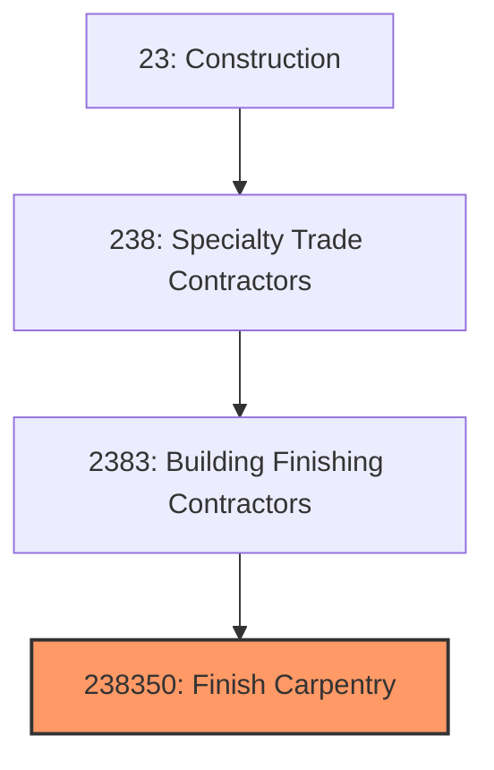

# Finish Carpentry Contractors

> This industry comprises establishments primarily engaged in finish carpentry work, including installing trim, moldings, cabinets, doors, windows, stairs, and other architectural woodwork.

## Overview

Finish Carpentry Contractors (NAICS 238350) encompasses establishments that install interior trim, moldings, doors, windows, cabinets, countertops, stairs, and other architectural millwork. This work represents the final visible carpentry in a building, requiring precision craftsmanship to achieve quality aesthetic results.

The industry serves commercial, institutional, and residential construction with both new construction and renovation work. Finish carpentry is one of the most skill-intensive construction trades, requiring expertise in layout, fitting, and installation of wood and composite materials. Quality finish work significantly impacts the perceived quality and value of buildings.

## Market Context

The U.S. finish carpentry contractor market represents approximately $20 billion in annual spending:

| Segment | Market Size | Key Drivers |
|---------|-------------|-------------|
| Residential New Construction | $8 billion | Single-family, multi-family housing |
| Commercial/Institutional | $5 billion | Office, retail, healthcare, hospitality |
| Residential Renovation | $4 billion | Kitchen/bath remodels, renovations |
| Custom Millwork | $2 billion | High-end residential, commercial specialty |
| Door/Window Installation | $1 billion | Replacement and new construction |

The market is driven by construction activity, home renovation, and demand for quality interiors in commercial and residential buildings.

## Industry Hierarchy

## Key Statistics

| Metric | Value |
|--------|-------|
| NAICS Code | 238350 |
| Level | National Industry |
| Parent | [Building Finishing Contractors](./) |
| U.S. Establishments | ~20,000 |
| Annual Revenue | ~$20 billion |
| Employment | ~120,000 |

## Related Occupations

- [Finish Carpenters](/occupations/Construction/FinishCarpenters) - Install trim and millwork
- [Cabinetmakers](/occupations/Production/Cabinetmakers) - Build and install cabinets
- [Door Installers](/occupations/Construction/DoorInstallers) - Install interior and exterior doors
- [Stair Builders](/occupations/Construction/StairBuilders) - Construct and install stairs
- [Construction Laborers](/occupations/Construction/ConstructionLaborers) - Support finish crews
- [Construction Managers](/occupations/Management/ConstructionManagers) - Oversee finish projects

## Core Business Processes

### Field Measurement and Planning

Accurate measurement ensures proper fit.

**Key Activities:**
- Conduct field measurements and verification
- Prepare material takeoffs with waste factors
- Create shop drawings for custom items
- Coordinate with millwork manufacturers
- Plan installation sequence
- Order materials with proper lead time

### Installation

Skilled installation achieves quality results.

**Key Activities:**
- Install interior doors and hardware
- Set windows and trim
- Install base, crown, and casing
- Install cabinets and countertops
- Build and install stairs and railings
- Complete specialty millwork

### Completion and Punch List

Attention to detail completes the work.

**Key Activities:**
- Fill nail holes and sand smooth
- Touch up finishes and paint
- Install final hardware
- Adjust doors and drawers
- Complete punch list items
- Protect finished work

## Industry Value Chain

## Regulatory Environment

### Building Codes
- **International Building Code (IBC)** - Door and egress requirements
- **International Residential Code (IRC)** - Residential finish requirements
- **ADA Standards** - Accessible door and hardware requirements
- **Fire Codes** - Fire-rated door and frame requirements

### Industry Standards
- **AWI Standards** - Architectural Woodwork Institute quality grades
- **WI Standards** - Woodwork Institute specifications
- **WDMA Standards** - Window and Door Manufacturers Association
- **BHMA Standards** - Builders Hardware Manufacturers Association

### Safety Standards
- **OSHA Power Tool Safety** - Saw and nailer requirements
- **OSHA Fall Protection** - Stair and elevated work
- **Dust Collection** - Wood dust exposure controls
- **Ergonomic Standards** - Material handling requirements

### Quality Standards
- **AWI Quality Grades** - Economy, Custom, Premium levels
- **Finish Tolerances** - Gap and alignment specifications
- **Hardware Function** - Door and drawer operation standards
- **Material Specifications** - Wood species and finish requirements

## Technology & Innovation

### Materials
- **Engineered Wood Products** - MDF, plywood, composites
- **PVC and Composite Trim** - Low-maintenance exteriors
- **Pre-Finished Products** - Factory-applied finishes
- **Sustainable Materials** - FSC-certified and reclaimed wood

### Installation Systems
- **Pneumatic Nailers** - Finish and brad nailers
- **Cordless Tools** - Battery-powered saws and drills
- **Laser Levels** - Precision layout and alignment
- **Pocket Screw Systems** - Concealed fastening

### Manufacturing
- **CNC Machining** - Computer-controlled millwork production
- **CAD/CAM Integration** - Design to fabrication workflow
- **Prefabricated Components** - Pre-hung doors, assembled cabinets
- **Digital Templating** - Laser measurement for custom fits

### Business Technology
- **Estimating Software** - Material and labor takeoff
- **Project Management** - Scheduling and tracking
- **3D Visualization** - Design and customer approval
- **Mobile Documentation** - Digital punch lists

## Project Types

### Residential New Construction
- Production home trim packages
- Custom home millwork
- Multi-family common areas
- Kitchen and bath installation
- Stair and railing systems

### Commercial/Institutional
- Office tenant improvements
- Retail fixtures and millwork
- Healthcare casework
- Educational facilities
- Hospitality projects

### Renovation
- Kitchen and bath remodels
- Whole-house renovations
- Historic restoration
- Addition trim packages
- Accessibility modifications

### Custom Millwork
- Architectural paneling
- Custom cabinetry
- Built-in furniture
- Reception desks
- Library and study interiors

## Industry Trends and Outlook

Key trends shaping finish carpentry contractors:

- **Labor Shortage** - Critical need for skilled finish carpenters
- **Prefabrication** - Pre-hung doors, assembled cabinets
- **Material Innovation** - Composites and engineered products
- **Design Complexity** - Detailed custom millwork demand
- **Quality Expectations** - Premium grade specifications
- **Technology Adoption** - CNC, laser, digital tools
- **Sustainability** - Certified and reclaimed materials
- **Aging in Place** - Accessibility modifications

The outlook is positive with construction and renovation driving demand. The craft nature of finish carpentry makes skilled labor the primary constraint. Prefabrication helps address labor challenges while maintaining quality.

---

*Source: NAICS 238350 - Finish Carpentry Contractors*
