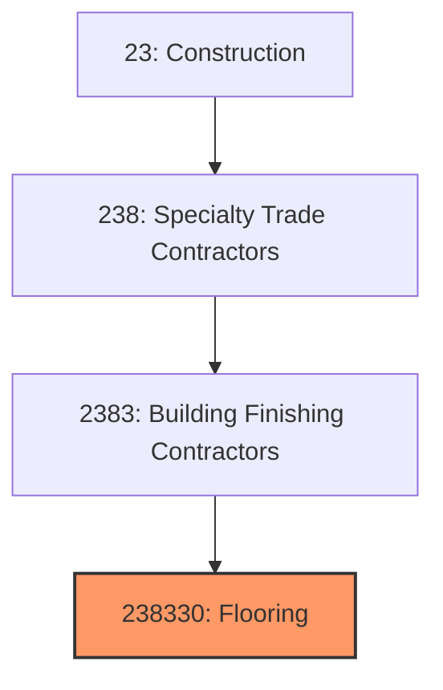

# Flooring Contractors

> This industry comprises establishments primarily engaged in installing and finishing flooring materials, including carpet, resilient flooring, wood flooring, and specialty floor coverings.

## Overview

Flooring Contractors (NAICS 238330) encompasses establishments that install carpet, resilient flooring (vinyl, linoleum, rubber), wood flooring (hardwood, laminate, engineered), and specialty floor coverings. This includes both commercial and residential installations, as well as floor refinishing and resurfacing services.

The flooring industry serves as the final finish for interior floors, with material selection driven by durability requirements, aesthetics, maintenance considerations, and budget. The industry has evolved significantly with the growth of luxury vinyl tile (LVT) and engineered products that offer improved performance and easier installation.

## Market Context

The U.S. flooring contractor market represents approximately $25 billion in annual spending:

| Segment | Market Size | Key Drivers |
|---------|-------------|-------------|
| Commercial Flooring | $10 billion | Office, retail, healthcare, hospitality |
| Residential Carpet | $6 billion | New homes, renovation, replacement |
| Residential Hard Surface | $5 billion | LVT, hardwood, laminate installations |
| Industrial Flooring | $2 billion | Warehouse, manufacturing, food processing |
| Specialty Flooring | $2 billion | Sports, healthcare, clean room |

The market is driven by construction activity, renovation projects, and the ongoing replacement of worn flooring in existing buildings.

## Industry Hierarchy

## Key Statistics

| Metric | Value |
|--------|-------|
| NAICS Code | 238330 |
| Level | National Industry |
| Parent | [Building Finishing Contractors](./) |
| U.S. Establishments | ~18,000 |
| Annual Revenue | ~$25 billion |
| Employment | ~100,000 |

## Related Occupations

- [Floor Layers](/occupations/Construction/FloorLayers) - Install carpet and resilient flooring
- [Floor Sanders](/occupations/Construction/FloorSanders) - Sand and finish wood floors
- [Carpet Installers](/occupations/Construction/CarpetInstallers) - Install carpet and padding
- [Wood Floor Installers](/occupations/Construction/WoodFloorInstallers) - Install hardwood flooring
- [Construction Laborers](/occupations/Construction/ConstructionLaborers) - Support flooring crews
- [Construction Managers](/occupations/Management/ConstructionManagers) - Oversee flooring projects

## Core Business Processes

### Measurement and Estimating

Accurate measurement ensures proper material quantities.

**Key Activities:**
- Conduct site survey and measurements
- Identify substrate conditions and challenges
- Perform takeoff with seam and waste calculations
- Recommend appropriate flooring materials
- Calculate installation labor requirements
- Prepare detailed proposals

### Substrate Preparation

Proper preparation ensures flooring performance.

**Key Activities:**
- Remove existing flooring materials
- Test concrete moisture levels
- Apply moisture barriers as needed
- Patch and level substrates
- Acclimate wood flooring materials
- Verify conditions meet manufacturer requirements

### Flooring Installation

Skilled installation creates quality, lasting floors.

**Key Activities:**
- Lay out flooring pattern and seam locations
- Install underlayment and padding
- Apply adhesives per manufacturer specs
- Install flooring materials
- Complete seaming and transitions
- Perform final inspection and cleanup

## Industry Value Chain

## Regulatory Environment

### Building Codes
- **International Building Code (IBC)** - Flooring fire ratings
- **ADA Standards** - Slip resistance and transitions
- **Fire Codes** - Flame spread and smoke development
- **Health Codes** - Food service and healthcare

### Industry Standards
- **ASTM Standards** - Material and installation specifications
- **CRI-104/105** - Carpet and Rug Institute standards
- **NWFA Guidelines** - National Wood Flooring Association
- **RFCI Guidelines** - Resilient Floor Covering Institute

### Environmental Standards
- **FloorScore Certification** - Indoor air quality
- **LEED Requirements** - Low-VOC adhesives and materials
- **California 01350** - Emissions testing standard
- **Red List Free** - Material health requirements

### Safety Standards
- **OSHA Ergonomics** - Knee protection and posture
- **Adhesive Safety** - Ventilation and respiratory
- **Tool Safety** - Power stretcher and cutting tools
- **Dust Control** - Wood floor sanding requirements

## Technology & Innovation

### Flooring Products
- **Luxury Vinyl Tile (LVT)** - Rigid core and flexible products
- **WPC/SPC Flooring** - Waterproof rigid core vinyl
- **Engineered Hardwood** - Dimensionally stable wood products
- **Modular Carpet** - Easy replacement and maintenance

### Installation Systems
- **Click-Lock Installation** - Floating floor systems
- **Pressure-Sensitive Adhesives** - Repositionable installation
- **Spray Adhesives** - Efficient large-area application
- **Magnetic Flooring** - Removable and recyclable systems

### Substrate Systems
- **Self-Leveling Compounds** - Efficient floor preparation
- **Moisture Mitigation** - Epoxy and topical treatments
- **Crack Isolation** - Membrane systems for problem substrates
- **Radiant Heat Integration** - Flooring over heated subfloors

### Business Technology
- **Measurement Software** - Digital floor planning
- **Estimating Systems** - Automated takeoff and pricing
- **Project Management** - Scheduling and tracking
- **Customer Visualization** - Virtual room design

## Project Types

### Commercial Flooring
- Office buildings
- Retail and restaurants
- Healthcare facilities
- Educational institutions
- Hotels and hospitality

### Residential Flooring
- New home construction
- Renovation and remodel
- Flooring replacement
- Wood floor refinishing
- Multi-family projects

### Industrial Flooring
- Warehouse and distribution
- Manufacturing facilities
- Food processing plants
- Clean rooms
- Laboratory and medical

### Specialty Flooring
- Sports and athletic facilities
- Dance and performance studios
- Access flooring
- Anti-static and ESD
- Seamless resinous floors

## Industry Trends and Outlook

Key trends shaping flooring contractors:

- **LVT/SPC Dominance** - Rigid core vinyl market growth
- **Click Installation** - Floating floors reducing labor
- **Labor Challenges** - Skilled installer shortage
- **Commercial Modular** - Carpet tile and LVT expansion
- **Sustainability Focus** - Recycled content and recyclability
- **Design Trends** - Wood looks, patterns, large formats
- **Moisture Challenges** - Concrete slab moisture issues
- **Technology Adoption** - Digital measurement and estimating

The outlook is positive with construction and renovation driving demand. The shift to LVT and click-lock products is changing installation methods while commercial modular products expand maintenance contract opportunities.

---

*Source: NAICS 238330 - Flooring Contractors*
