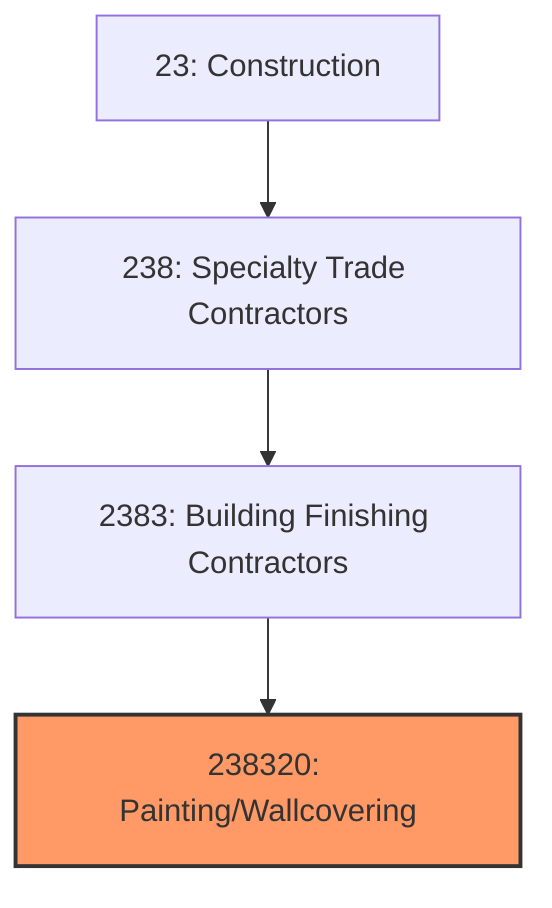

# Painting and Wall Covering Contractors

> This industry comprises establishments primarily engaged in interior and exterior painting, wall covering installation, and specialty coating applications for buildings and structures.

## Overview

Painting and Wall Covering Contractors (NAICS 238320) encompasses establishments that apply paint, stain, varnish, lacquer, and other coatings to interior and exterior building surfaces, as well as install wallpaper and other wall coverings. The industry serves commercial, industrial, and residential markets with both new construction and maintenance/repaint work.

Painting is one of the most visible aspects of construction quality and significantly impacts building aesthetics and protection. The industry includes general painting contractors, specialty industrial coating applicators, decorative painters, and wallcovering installers. Proper surface preparation is critical to coating performance and longevity.

## Market Context

The U.S. painting and wall covering contractor market represents approximately $45 billion in annual spending:

| Segment | Market Size | Key Drivers |
|---------|-------------|-------------|
| Commercial Interior/Exterior | $18 billion | New construction, tenant improvements |
| Residential Repaint | $12 billion | Home maintenance, renovations |
| Residential New Construction | $8 billion | Single-family, multi-family housing |
| Industrial/Specialty Coatings | $5 billion | Protective coatings, tanks, structures |
| Wall Coverings | $2 billion | Commercial, hospitality, high-end residential |

The market is driven by construction activity, property maintenance cycles, and the hospitality and commercial sectors that require periodic refreshing.

## Industry Hierarchy

## Key Statistics

| Metric | Value |
|--------|-------|
| NAICS Code | 238320 |
| Level | National Industry |
| Parent | [Building Finishing Contractors](./) |
| U.S. Establishments | ~45,000 |
| Annual Revenue | ~$45 billion |
| Employment | ~300,000 |

## Related Occupations

- [Painters](/occupations/Construction/Painters) - Apply paint and coatings
- [Paperhangers](/occupations/Construction/Paperhangers) - Install wallcoverings
- [Painting Helpers](/occupations/Construction/PaintingHelpers) - Assist painters with preparation
- [Industrial Painters](/occupations/Production/IndustrialPainters) - Apply specialty coatings
- [Construction Laborers](/occupations/Construction/ConstructionLaborers) - Support painting crews
- [Construction Managers](/occupations/Management/ConstructionManagers) - Oversee painting projects

## Core Business Processes

```mermaid
flowchart LR
    subgraph Estimating["Estimating"]
        E1["Site Visit"]
        E2["Specifications Review"]
        E3["Material Selection"]
        E4["Proposal"]
    end

    subgraph Preparation["Preparation"]
        P1["Protection"]
        P2["Surface Prep"]
        P3["Repairs"]
        P4["Priming"]
    end

    subgraph Application["Application"]
        A1["Coating Application"]
        A2["Multiple Coats"]
        A3["Detail Work"]
        A4["Final Inspection"]
    end

    E1 --> E2 --> E3 --> E4
    E4 --> P1 --> P2 --> P3 --> P4
    P4 --> A1 --> A2 --> A3 --> A4
```

### Estimating and Planning

Accurate estimating ensures profitable projects.

**Key Activities:**
- Conduct site visit and condition assessment
- Review specifications and color selections
- Calculate square footage and material needs
- Determine production rates and labor hours
- Select appropriate products and application methods
- Prepare detailed proposals

### Surface Preparation

Proper preparation is essential for coating adhesion and longevity.

**Key Activities:**
- Protect floors, furniture, and adjacent surfaces
- Clean and degrease surfaces
- Remove loose paint, scale, and debris
- Repair cracks, holes, and surface defects
- Sand and smooth surfaces
- Apply appropriate primers

### Coating Application

Skilled application achieves quality finishes.

**Key Activities:**
- Apply coatings per manufacturer specifications
- Use appropriate tools (brush, roll, spray)
- Achieve specified film thickness
- Complete multiple coats as required
- Execute detail work and cutting-in
- Perform quality inspection and touch-up

## Industry Value Chain

```mermaid
graph LR
    subgraph Inputs["Inputs & Resources"]
        I1["Paints/Coatings"]
        I2["Primers/Sealers"]
        I3["Wallcoverings"]
        I4["Equipment"]
        I5["Skilled Painters"]
    end

    subgraph Primary["Primary Activities"]
        A1["Estimating"]
        A2["Preparation"]
        A3["Application"]
        A4["Quality Control"]
    end

    subgraph Outputs["Deliverables"]
        O1["Interior Painting"]
        O2["Exterior Painting"]
        O3["Wallcoverings"]
        O4["Specialty Coatings"]
    end

    subgraph Customers["Customer Segments"]
        C1["General Contractors"]
        C2["Building Owners"]
        C3["Property Managers"]
        C4["Homeowners"]
    end

    Inputs --> Primary --> Outputs --> Customers
```

## Regulatory Environment

### Environmental Regulations
- **EPA Lead RRP Rule** - Renovation, Repair, and Painting Rule
- **VOC Regulations** - Volatile organic compound limits
- **SCAQMD Standards** - Strictest VOC limits (California)
- **OSHA Lead Standards** - Lead exposure protection

### Safety Standards
- **OSHA Fall Protection** - Elevated work requirements
- **OSHA Scaffold Standards** - Working platforms
- **Respiratory Protection** - Spray painting and coatings
- **Hazard Communication** - Material safety data sheets

### Industry Standards
- **PDCA Standards** - Painting and Decorating Contractors Association
- **SSPC Standards** - Steel structures painting
- **MPI Standards** - Master Painters Institute specifications
- **ASTM Standards** - Material and performance specifications

### Quality Standards
- **Surface Preparation Levels** - SP-1 through SP-10 for steel
- **Film Thickness** - Dry and wet mil specifications
- **Finish Levels** - Gloss, sheen, and appearance
- **Color Matching** - Delta E color tolerance

## Technology & Innovation

### Coating Technology
- **Low-VOC Paints** - Environmentally compliant products
- **Self-Priming Paints** - Combined primer and topcoat
- **Antimicrobial Coatings** - Healthcare and food service
- **Long-Life Exterior Coatings** - Extended durability products

### Application Technology
- **Airless Sprayers** - High-volume application
- **HVLP Sprayers** - Reduced overspray
- **Electrostatic Spray** - Metal and specialty applications
- **Automated Robotic Spraying** - Large-scale industrial

### Color Technology
- **Digital Color Matching** - Spectrophotometer analysis
- **Color Visualization** - Virtual room painting software
- **Custom Tinting** - Point-of-sale color matching
- **Color Memory Systems** - Digital color records

### Business Technology
- **Estimating Software** - Automated takeoff and pricing
- **Project Management** - Job scheduling and tracking
- **Mobile Documentation** - Digital punch lists
- **CRM Systems** - Customer management for repaint

## Project Types

### Commercial Painting
- Office buildings and tenant spaces
- Retail and restaurants
- Hotels and hospitality
- Healthcare facilities
- Educational institutions

### Residential Painting
- Interior repaint
- Exterior repaint
- New construction
- Cabinet refinishing
- Deck and fence staining

### Industrial Coatings
- Structural steel
- Tanks and vessels
- Bridges and infrastructure
- Industrial facilities
- Marine and offshore

### Specialty Work
- Decorative painting and faux finishes
- Commercial wallcovering
- Epoxy floor coatings
- Fireproofing
- Graffiti removal and prevention

## Industry Trends and Outlook

Key trends shaping painting and wall covering contractors:

- **Labor Shortage** - Difficulty finding skilled painters
- **VOC Compliance** - Stricter environmental regulations
- **Low-VOC Products** - Water-based and zero-VOC growth
- **Commercial Maintenance** - Recurring contract opportunities
- **Color Trends** - Shifting preferences and custom colors
- **Surface Texturing** - Decorative finishes and applications
- **Technology Adoption** - Estimating and project management
- **Health Focus** - Antimicrobial and hygienic coatings

The outlook is positive with construction activity and maintenance demand driving growth. The repaint market provides stable recurring revenue. Labor availability and environmental compliance are ongoing challenges.

---

*Source: NAICS 238320 - Painting and Wall Covering Contractors*
