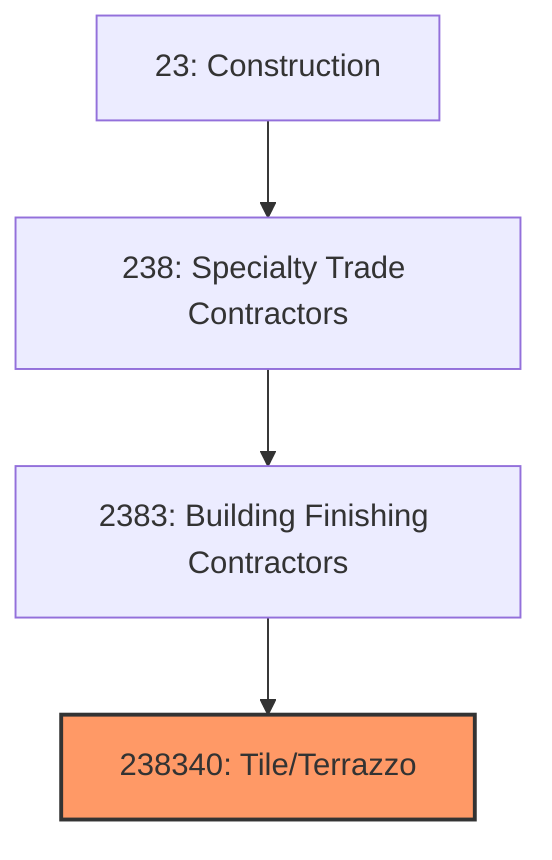

# Tile and Terrazzo Contractors

> This industry comprises establishments primarily engaged in setting and installing ceramic tile, marble, granite, slate, terrazzo, and other stone products for flooring, walls, and countertops.

## Overview

Tile and Terrazzo Contractors (NAICS 238340) encompasses establishments that install ceramic tile, porcelain tile, natural stone, terrazzo, and mosaic products for floors, walls, countertops, and specialty applications. This craft trade requires skilled labor for proper substrate preparation, layout, setting, and grouting to achieve durable, aesthetically pleasing installations.

The industry serves commercial, institutional, and residential markets with both new construction and renovation work. Tile and stone are preferred in high-moisture areas (bathrooms, kitchens), high-traffic spaces (lobbies, retail), and applications requiring durability and easy maintenance. Large-format tiles and thin porcelain panels are changing installation methods and expanding applications.

## Market Context

The U.S. tile and terrazzo contractor market represents approximately $18 billion in annual spending:

| Segment | Market Size | Key Drivers |
|---------|-------------|-------------|
| Commercial Tile | $7 billion | Hospitality, retail, healthcare, office |
| Residential Tile | $6 billion | Bathrooms, kitchens, flooring |
| Natural Stone | $3 billion | Countertops, flooring, facades |
| Terrazzo | $1.5 billion | Airports, schools, healthcare |
| Specialty/Mosaic | $0.5 billion | Pools, decorative, artistic |

The market is driven by construction activity, renovation work, and the durable, low-maintenance properties that make tile preferred in many applications.

## Industry Hierarchy

## Key Statistics

| Metric | Value |
|--------|-------|
| NAICS Code | 238340 |
| Level | National Industry |
| Parent | [Building Finishing Contractors](./) |
| U.S. Establishments | ~15,000 |
| Annual Revenue | ~$18 billion |
| Employment | ~85,000 |

## Related Occupations

- [Tile Setters](/occupations/Construction/TileSetters) - Install ceramic and stone tile
- [Terrazzo Workers](/occupations/Construction/TerrazzoWorkers) - Install terrazzo flooring
- [Marble Setters](/occupations/Construction/MarbleSetters) - Install stone products
- [Tile Helpers](/occupations/Construction/TileHelpers) - Assist tile setters
- [Construction Laborers](/occupations/Construction/ConstructionLaborers) - Support tile crews
- [Construction Managers](/occupations/Management/ConstructionManagers) - Oversee tile projects

## Core Business Processes

```mermaid
flowchart LR
    subgraph Planning["Planning"]
        P1["Layout Design"]
        P2["Material Selection"]
        P3["Takeoff/Ordering"]
        P4["Substrate Review"]
    end

    subgraph Preparation["Preparation"]
        R1["Surface Prep"]
        R2["Waterproofing"]
        R3["Layout Lines"]
        R4["Dry Fit"]
    end

    subgraph Installation["Installation"]
        I1["Setting"]
        I2["Cutting"]
        I3["Grouting"]
        I4["Sealing"]
    end

    P1 --> P2 --> P3 --> P4
    P4 --> R1 --> R2 --> R3 --> R4
    R4 --> I1 --> I2 --> I3 --> I4
```

### Layout and Planning

Proper planning ensures efficient installation and aesthetic results.

**Key Activities:**
- Review plans and specifications
- Develop tile layout and pattern
- Calculate material quantities with waste factor
- Verify substrate flatness and suitability
- Select setting materials and methods
- Plan tile cuts and pattern coordination

### Substrate Preparation

Proper substrate preparation ensures lasting installations.

**Key Activities:**
- Verify substrate flatness and integrity
- Apply waterproof membranes as required
- Install uncoupling membranes for crack isolation
- Establish layout lines and reference points
- Dry-fit tiles to verify layout
- Mix and stage setting materials

### Setting and Finishing

Skilled setting achieves quality, durable installations.

**Key Activities:**
- Apply setting materials per manufacturer specs
- Set tiles with proper spacing and alignment
- Cut tiles with wet saws and hand tools
- Apply grout and remove excess
- Clean and seal as required
- Protect completed work

## Industry Value Chain

```mermaid
graph LR
    subgraph Inputs["Inputs & Resources"]
        I1["Tile/Stone"]
        I2["Setting Materials"]
        I3["Grout/Sealers"]
        I4["Tools/Equipment"]
        I5["Skilled Setters"]
    end

    subgraph Primary["Primary Activities"]
        A1["Layout"]
        A2["Preparation"]
        A3["Setting"]
        A4["Finishing"]
    end

    subgraph Outputs["Deliverables"]
        O1["Tile Floors"]
        O2["Tile Walls"]
        O3["Stone Counters"]
        O4["Terrazzo"]
    end

    subgraph Customers["Customer Segments"]
        C1["General Contractors"]
        C2["Building Owners"]
        C3["Homeowners"]
        C4["Designers"]
    end

    Inputs --> Primary --> Outputs --> Customers
```

## Regulatory Environment

### Building Codes
- **International Building Code (IBC)** - Substrate and fire requirements
- **ADA Standards** - Slip resistance and accessibility
- **Fire Codes** - Fire-rated assemblies
- **Health Codes** - Food service and healthcare requirements

### Industry Standards
- **TCNA Handbook** - Tile Council of North America methods
- **ANSI Standards** - Tile and installation specifications
- **NTCA Guidelines** - National Tile Contractors Association
- **ASTM Standards** - Material specifications and testing

### Safety Standards
- **OSHA Silica Rule** - Respirable silica exposure limits
- **OSHA Fall Protection** - Elevated work requirements
- **Ergonomic Standards** - Knee protection and material handling
- **Tool Safety** - Wet saw and power tool requirements

### Quality Standards
- **Lippage Standards** - Maximum allowable tile offset
- **Grout Joint Widths** - Minimum spacing requirements
- **Flatness Tolerances** - ANSI A108 requirements
- **Waterproofing Standards** - ANSI A118.10 and 118.12

## Technology & Innovation

### Tile Products
- **Large Format Tile** - Up to 10 feet long thin panels
- **Gauged Porcelain Panels** - 3mm to 6mm thickness
- **Rectified Tile** - Precisely cut edges for tight joints
- **Anti-Slip Surfaces** - Coefficient of friction ratings

### Setting Systems
- **Uncoupling Membranes** - Crack isolation systems
- **Thin-Set Improvements** - Large format and heavy tile adhesives
- **Shower Systems** - Integrated waterproof pan assemblies
- **Heated Floor Systems** - Electric and hydronic integration

### Installation Tools
- **Leveling Systems** - Clips and wedges for lippage control
- **Large Format Tools** - Suction cups and transport systems
- **Wet Tile Saws** - Rail and bridge saws for large tiles
- **Vacuum Mixing** - Consistent mortar preparation

### Design Technology
- **Layout Software** - Pattern and cutting optimization
- **Visualization Tools** - 3D rendering of tile designs
- **Estimating Software** - Material and labor takeoff
- **Project Management** - Digital documentation

## Project Types

### Commercial Tile
- Hotel lobbies and bathrooms
- Retail storefronts and sales floors
- Restaurant kitchens and dining areas
- Healthcare patient rooms and corridors
- Office building common areas

### Residential Tile
- Bathroom floors and walls
- Kitchen backsplashes and floors
- Shower and tub surrounds
- Outdoor patios and pools
- Fireplace surrounds

### Terrazzo
- Airport terminals
- School corridors
- Healthcare facilities
- Retail and commercial lobbies
- Museums and cultural buildings

### Natural Stone
- Marble and granite countertops
- Stone flooring
- Exterior cladding
- Fireplace surrounds
- Specialty applications

## Industry Trends and Outlook

Key trends shaping tile and terrazzo contractors:

- **Large Format Tile** - Growing demand for bigger tiles
- **Labor Shortage** - Skilled tile setter shortage
- **Thin Porcelain Panels** - Expanding exterior and countertop use
- **Prefabricated Systems** - Shower systems and modular solutions
- **Silica Compliance** - Dust control requirements
- **Design Trends** - Large format, natural looks, patterns
- **Technology Adoption** - Leveling systems, laser layout
- **Sustainability** - Recycled content and local sourcing

The outlook is positive with construction activity and renovation demand driving growth. Large format tiles and thin panels are expanding applications while creating installation challenges. Labor availability remains the primary constraint.

---

*Source: NAICS 238340 - Tile and Terrazzo Contractors*
