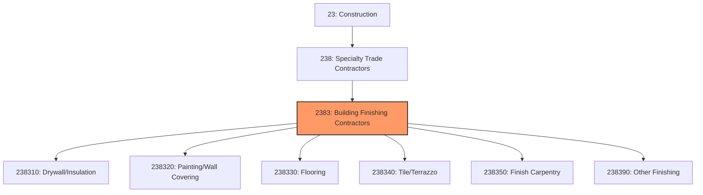
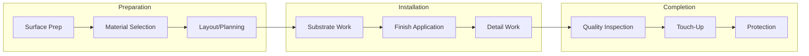

# Building Finishing Contractors

> This industry group comprises establishments primarily engaged in building finishing activities, such as drywall installation, painting, flooring, and interior carpentry.

## Overview

Building Finishing Contractors represents a significant category within the Specialty Trade Contractors subsector (NAICS 238), encompassing establishments that complete the interior finishing work that transforms building shells into functional, occupiable spaces. This includes drywall, plastering, painting, flooring, tile, carpeting, ceiling systems, and finish carpentry.

Finishing work is typically the final construction phase before occupancy, requiring careful coordination of multiple trades working in close proximity. The quality of finish work significantly impacts the perceived quality of the overall building and directly affects occupant satisfaction and property values.

## Market Context

The U.S. building finishing contractors market represents approximately $120 billion in annual spending:

| Segment | Market Size | Key Drivers |
|---------|-------------|-------------|
| Drywall and Insulation | $35 billion | Commercial construction, residential new/remodel |
| Painting and Coatings | $30 billion | New construction, repainting, specialty coatings |
| Flooring Installation | $25 billion | Carpet, resilient, wood, tile installation |
| Tile and Terrazzo | $15 billion | Commercial, hospitality, high-end residential |
| Finish Carpentry | $15 billion | Millwork, casework, custom finishes |

The market is driven by new construction activity, renovation and remodeling projects, tenant improvement work, and the hospitality and retail sectors requiring frequent refreshing.

## Industry Hierarchy

## Key Statistics

| Metric | Value |
|--------|-------|
| NAICS Code | 2383 |
| Level | Industry Group |
| Parent | [Specialty Trade Contractors](../) |
| Child Industries | 6 |
| U.S. Establishments | ~85,000 |
| Annual Revenue | ~$120 billion |
| Employment | ~700,000 |

## Sub-Industries

| Industry | Code | Description |
|----------|------|-------------|
| [Drywall and Insulation](./Drywall/) | 238310 | Drywall installation, taping, and insulation |
| [Painting and Wall Covering](./Painting/) | 238320 | Interior and exterior painting, wallcovering |
| [Flooring Contractors](./FlooringContractors/) | 238330 | Carpet, resilient, and wood flooring |
| [Tile and Terrazzo](./Tile/) | 238340 | Ceramic tile, stone, and terrazzo |
| [Finish Carpentry](./FinishCarpentryContractors/) | 238350 | Millwork, trim, and casework installation |
| [Other Finishing](./WallCoveringContractors/) | 238390 | Acoustical ceilings, specialties |

## Related Occupations

- [Drywall Installers](/occupations/Construction/DrywallInstallers) - Hang and finish drywall panels
- [Painters](/occupations/Construction/Painters) - Apply paint and wall coverings
- [Floor Layers](/occupations/Construction/FloorLayers) - Install carpet and resilient flooring
- [Tile Setters](/occupations/Construction/TileSetters) - Install ceramic tile and stone
- [Finish Carpenters](/occupations/Construction/FinishCarpenters) - Install trim and millwork
- [Ceiling Installers](/occupations/Construction/CeilingInstallers) - Install acoustical ceiling systems
- [Plasterers](/occupations/Construction/Plasterers) - Apply plaster and stucco finishes

## Core Business Processes

### Surface Preparation

Proper surface preparation is essential for quality finish work.

**Key Activities:**
- Inspect substrates for defects and moisture
- Repair or prepare surfaces for finishing
- Apply primers and underlayments as required
- Protect adjacent work from damage
- Coordinate with preceding trades

### Finish Installation

Installation requires skilled craftsmanship for quality results.

**Key Activities:**
- Install finish materials per specifications
- Execute patterns, layouts, and transitions
- Work around fixtures and penetrations
- Maintain consistency and quality standards
- Complete detail work and accessories

### Quality Control and Protection

Finished work must be protected until project completion.

**Key Activities:**
- Inspect completed work for defects
- Perform touch-up and repairs
- Apply sealers and protective coatings
- Install protection during remaining construction
- Complete punch list items

## Industry Value Chain

```mermaid
graph LR
    subgraph Inputs["Inputs & Resources"]
        I1["Drywall/Panels"]
        I2["Paint/Coatings"]
        I3["Flooring Materials"]
        I4["Skilled Labor"]
        I5["Tools/Equipment"]
    end

    subgraph Primary["Primary Activities"]
        A1["Surface Prep"]
        A2["Installation"]
        A3["Finishing"]
        A4["Protection"]
    end

    subgraph Outputs["Deliverables"]
        O1["Finished Walls"]
        O2["Painted Surfaces"]
        O3["Flooring Systems"]
        O4["Specialty Finishes"]
    end

    subgraph Customers["Customer Segments"]
        C1["General Contractors"]
        C2["Building Owners"]
        C3["Developers"]
        C4["Homeowners"]
    end

    Inputs --> Primary --> Outputs --> Customers
```

## Regulatory Environment

### Building Codes
- **International Building Code (IBC)** - Fire ratings, accessibility requirements
- **ADA Standards** - Flooring and surface requirements
- **Fire Rating Requirements** - Assembly ratings for wall and ceiling systems
- **VOC Regulations** - Limits on volatile organic compounds in coatings

### Industry Standards
- **ASTM Standards** - Material and installation specifications
- **Tile Council of North America (TCNA)** - Tile installation standards
- **Painting and Decorating Contractors of America** - Industry best practices
- **Ceiling and Interior Systems Construction Association** - Ceiling standards

### Safety Requirements
- **OSHA Construction Standards** - General safety requirements
- **Silica Exposure Rule** - Requirements for dust control
- **Lead Paint Regulations** - RRP Rule for renovation work
- **Fall Protection** - Requirements for elevated work

## Technology & Innovation

### Materials Technology
- **Low-VOC Coatings** - Environmentally friendly paints and finishes
- **Antimicrobial Surfaces** - Hospital-grade wall and floor systems
- **Luxury Vinyl Tile (LVT)** - High-performance resilient flooring
- **Large Format Tile** - Thin porcelain panels for efficient installation

### Installation Technology
- **Automated Drywall Finishing** - Mechanical taping and finishing
- **Spray Equipment** - Airless and HVLP application systems
- **Laser Leveling** - Precision layout and alignment
- **Modular Systems** - Pre-finished wall and ceiling panels

### Design Tools
- **Color Matching Technology** - Digital color analysis and matching
- **Visualization Software** - Virtual room design and material selection
- **Material Takeoff** - Automated quantity calculation
- **Mobile Documentation** - Digital punch lists and quality tracking

## Industry Trends and Outlook

Key trends shaping building finishing contractors:

- **Labor Shortages** - Difficulty finding skilled finish tradespeople
- **Prefabrication** - Pre-finished panels and modular systems
- **Large Format Materials** - Bigger tiles and panels for faster installation
- **Health and Wellness** - Antimicrobial and low-VOC materials
- **Durability Focus** - Commercial-grade finishes for high-traffic areas
- **Technology Adoption** - Digital tools for estimating and quality control
- **Sustainable Materials** - Recycled content and bio-based products

The outlook is positive with continued construction activity and renovation demand. Labor availability remains the primary constraint, driving adoption of prefabrication and more efficient installation methods.

---

*Source: NAICS 2383 - Building Finishing Contractors*
