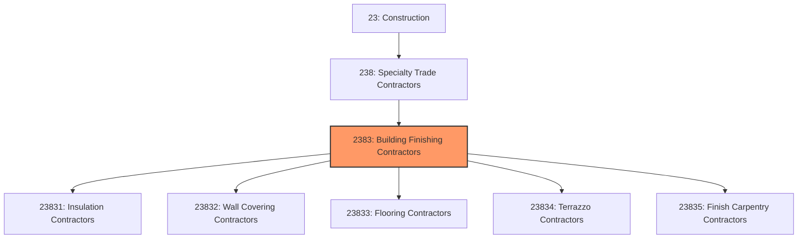
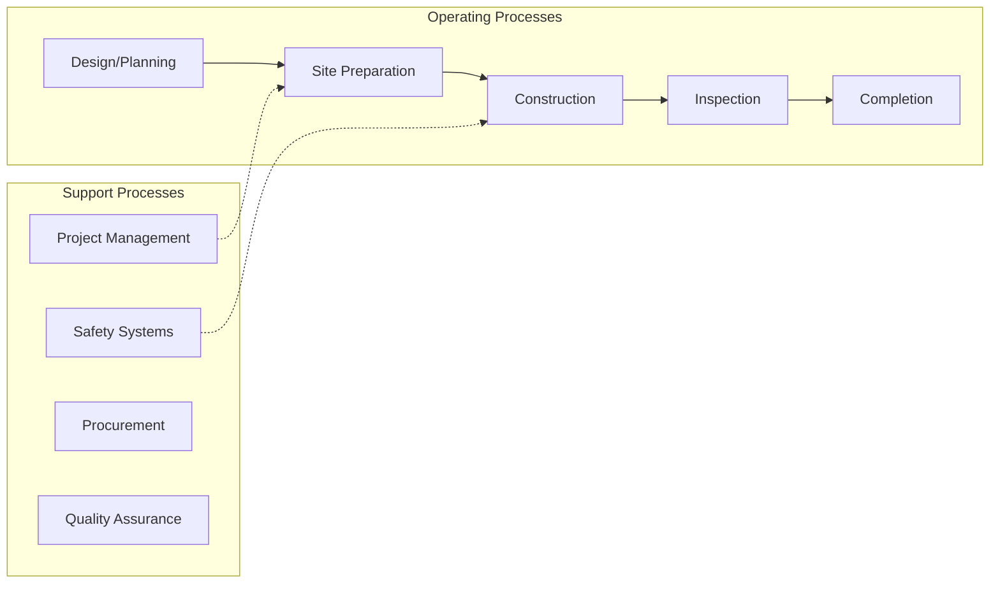

# Building Finishing Contractors

> This industry group comprises establishments primarily engaged in the specialty trades needed to finish buildings.

## Overview

Building Finishing Contractors represents an important category within the Construction sector (NAICS 23). This industry group encompasses establishments primarily engaged in building finishing contractors.

This industry group comprises establishments primarily engaged in the specialty trades needed to finish buildings. The work performed may include new work, additions, alterations, maintenance, and repairs.

## Industry Hierarchy

## Key Statistics

| Metric | Value |
|--------|-------|
| NAICS Code | 2383 |
| Level | Industry Group |
| Parent | [Specialty Trade Contractors](../) |
| Child Industries | 5 |

## Sub-Industries

| Industry | Code | Description |
|----------|------|-------------|
| [Insulation Contractors](./InsulationContractors/) | 23831 | See industry description for 238310 |
| [Wall Covering Contractors](./WallCoveringContractors/) | 23832 | See industry description for 238320 |
| [Flooring Contractors](./FlooringContractors/) | 23833 | See industry description for 238330 |
| [Terrazzo Contractors](./TerrazzoContractors/) | 23834 | See industry description for 238340 |
| [Finish Carpentry Contractors](./FinishCarpentryContractors/) | 23835 | See industry description for 238350 |

## Core Business Processes

## Industry Value Chain

```mermaid
graph LR
    subgraph Inputs["Inputs"]
        I1["Materials"]
        I2["Equipment"]
        I3["Labor"]
        I4["Plans"]
    end

    subgraph Primary["Primary Activities"]
        A1["Inbound Logistics"]
        A2["Core Operations"]
        A3["Quality Assurance"]
        A4["Outbound/Delivery"]
    end

    subgraph Outputs["Products/Services"]
        O1["Buildings"]
        O2["Infrastructure"]
        O3["Renovations"]
    end

    subgraph Customers["Markets"]
        C1["Property Owners"]
        C2["Government"]
        C3["Developers"]
        C4["Businesses"]
    end

    Inputs --> Primary --> Outputs --> Customers
```

---

*Source: NAICS 2383 - Building Finishing Contractors*
