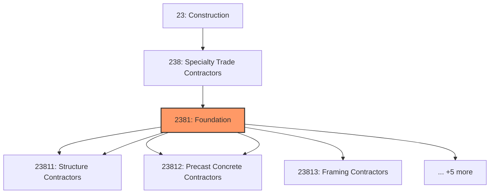
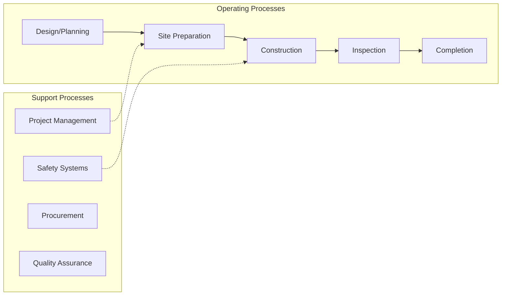

# Foundation

> This industry group comprises establishments primarily engaged in the specialty trades needed to complete the basic structure (i.

## Overview

Foundation represents an important category within the Construction sector (NAICS 23).

This industry group comprises establishments primarily engaged in the specialty trades needed to complete the basic structure (i.e., foundation, frame, and shell) of buildings. The work performed may include new work, additions, alterations, maintenance, and repairs.

## Industry Hierarchy

## Key Statistics

| Metric | Value |
|--------|-------|
| NAICS Code | 2381 |
| Level | Industry Group |
| Parent | [Specialty Trade Contractors](../) |
| Child Industries | 10 |

## Sub-Industries

| Industry | Code | Description |
|----------|------|-------------|
| [Poured Concrete Foundation](./PouredConcreteFoundation/) | 23811 | See industry description for 238110 |
| [Structure Contractors](./StructureContractors/) | 23811 | See industry description for 238110 |
| [Structural Steel](./StructuralSteel/) | 23812 | See industry description for 238120 |
| [Precast Concrete Contractors](./PrecastConcreteContractors/) | 23812 | See industry description for 238120 |
| [Framing Contractors](./FramingContractors/) | 23813 | See industry description for 238130 |
| [Masonry Contractors](./MasonryContractors/) | 23814 | See industry description for 238140 |
| [Glass](./Glass/) | 23815 | See industry description for 238150 |
| [Glazing Contractors](./GlazingContractors/) | 23815 | See industry description for 238150 |
| [Roofing Contractors](./RoofingContractors/) | 23816 | See industry description for 238160 |
| [Siding Contractors](./SidingContractors/) | 23817 | See industry description for 238170 |

## Related Occupations

See the [occupations directory](/occupations) for roles commonly found in this industry.

## Core Business Processes

## Industry Value Chain

```mermaid
graph LR
    subgraph Inputs["Inputs"]
        I1["Materials"]
        I2["Equipment"]
        I3["Labor"]
        I4["Plans"]
    end

    subgraph Primary["Primary Activities"]
        A1["Inbound Logistics"]
        A2["Core Operations"]
        A3["Quality Assurance"]
        A4["Outbound/Delivery"]
    end

    subgraph Outputs["Products/Services"]
        O1["Buildings"]
        O2["Infrastructure"]
        O3["Renovations"]
    end

    subgraph Customers["Markets"]
        C1["Property Owners"]
        C2["Government"]
        C3["Developers"]
        C4["Businesses"]
    end

    Inputs --> Primary --> Outputs --> Customers
```

---

*Source: NAICS 2381 - Foundation*
