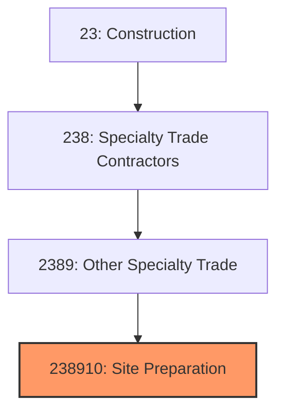

# Site Preparation Contractors

> This industry comprises establishments primarily engaged in site preparation activities, such as excavating and grading, demolition of buildings, and land clearing.

## Overview

Site Preparation Contractors (NAICS 238910) encompasses establishments that perform the foundational earthwork and demolition necessary before vertical construction can begin. This includes land clearing, grading, excavation, demolition, wrecking, and environmental remediation. These contractors transform raw land or existing sites into construction-ready conditions.

The industry serves as the essential first step in most construction projects, preparing sites for foundations, utilities, and building construction. Work may be performed as subcontractors to general contractors or directly for property owners and developers.

## Market Context

The U.S. site preparation contractors market represents approximately $50 billion in annual spending:

| Segment | Market Size | Key Drivers |
|---------|-------------|-------------|
| Excavation and Grading | $25 billion | New construction, site development |
| Demolition | $12 billion | Urban redevelopment, facility replacement |
| Land Clearing | $8 billion | Residential development, infrastructure |
| Environmental Remediation | $5 billion | Brownfield development, regulatory compliance |

The market is driven by construction activity, urban redevelopment requiring demolition, infrastructure projects, and the continuing shift from greenfield to infill development.

## Industry Hierarchy

## Key Statistics

| Metric | Value |
|--------|-------|
| NAICS Code | 238910 |
| Level | National Industry |
| Parent | [Other Specialty Trade Contractors](../) |
| U.S. Establishments | ~45,000 |
| Annual Revenue | ~$50 billion |
| Employment | ~250,000 |

## Related Occupations

- [Construction Laborers](/occupations/Construction/ConstructionLaborers) - Perform site clearing and preparation work
- [Operating Engineers](/occupations/Construction/OperatingEngineers) - Operate excavators, bulldozers, and graders
- [Demolition Workers](/occupations/Construction/DemolitionWorkers) - Safely dismantle structures
- [Hazmat Workers](/occupations/Construction/HazmatWorkers) - Handle hazardous materials removal
- [Surveyors](/occupations/Architecture/Surveyors) - Establish grades and property lines
- [Construction Managers](/occupations/Management/ConstructionManagers) - Oversee site preparation projects

## Core Business Processes

### Site Assessment and Planning

Proper planning prevents problems during construction.

**Key Activities:**
- Review geotechnical and environmental reports
- Identify underground utilities and obstructions
- Plan erosion and sediment control measures
- Obtain demolition and grading permits
- Coordinate utility disconnections and relocations
- Develop traffic control plans

### Demolition and Clearing

Removing existing structures and vegetation to prepare for new construction.

**Key Activities:**
- Disconnect and cap utilities
- Remove hazardous materials (asbestos, lead)
- Demolish structures systematically
- Separate materials for recycling
- Clear trees, stumps, and vegetation
- Remove debris from site

### Excavation and Grading

Earth moving to establish proper grades for construction.

**Key Activities:**
- Strip and stockpile topsoil
- Excavate to design grades
- Install temporary drainage
- Compact fill materials
- Establish subgrade for foundations and paving
- Install erosion and sediment controls

## Industry Value Chain

## Regulatory Environment

### Environmental Regulations
- **NPDES Stormwater Permits** - Erosion and sediment control requirements
- **EPA Asbestos NESHAP** - Asbestos handling during demolition
- **RCRA** - Hazardous waste management
- **Clean Air Act** - Dust and emission control

### Demolition Permits
- **Demolition Permits** - Local requirements before demolition
- **Utility Disconnection** - Verification of service termination
- **Historic Review** - Section 106 for federally-funded projects
- **Neighbor Notification** - Required notices before demolition

### Safety Standards
- **OSHA Excavation Standards** - Trench safety requirements
- **OSHA Demolition Standards** - Systematic demolition requirements
- **OSHA Hazmat Standards** - Lead and asbestos removal
- **Traffic Control** - MUTCD requirements for public roads

## Technology & Innovation

### Equipment Technology
- **GPS Machine Control** - Automated grading systems
- **Telematics** - Fleet tracking and equipment monitoring
- **Electric Equipment** - Zero-emission excavators and loaders
- **Remote Operation** - Teleoperated demolition equipment

### Planning Technology
- **3D Modeling** - Digital terrain models for grading
- **Drone Surveying** - Aerial mapping and progress monitoring
- **Volumetric Calculations** - Accurate cut/fill quantity estimates
- **Utility Mapping** - Subsurface utility detection

### Environmental Technology
- **Dust Suppression** - Water trucks and misting systems
- **Sediment Control** - Engineered best management practices
- **Recycling Systems** - On-site crushing and processing
- **Soil Remediation** - In-situ treatment technologies

## Project Types

### Excavation and Grading
- Building pad preparation
- Basement and foundation excavation
- Utility trenching
- Retention/detention pond construction
- Road subgrade preparation

### Demolition
- Building demolition
- Interior selective demolition
- Bridge and structure removal
- Industrial facility dismantling
- Implosion (specialized)

### Land Clearing
- Residential lot clearing
- Right-of-way clearing
- Agricultural land conversion
- Forestry operations

### Environmental
- Brownfield remediation
- Tank removal and closure
- Asbestos and lead abatement
- Contaminated soil removal

## Industry Trends and Outlook

Key trends shaping site preparation contractors:

- **Urban Redevelopment** - More demolition and infill work
- **Equipment Automation** - GPS-guided grading and excavation
- **Recycling Focus** - Higher diversion rates for demolition debris
- **Environmental Requirements** - Stricter erosion and sediment control
- **Electric Equipment** - Zero-emission equipment adoption
- **Operator Shortage** - Difficulty finding skilled equipment operators
- **Material Recovery** - Value in salvaged and recycled materials

The outlook is positive with construction activity and urban redevelopment driving demand. The industry faces workforce challenges as experienced operators retire, driving adoption of automation and improved training programs.

---

*Source: NAICS 238910 - Site Preparation Contractors*
