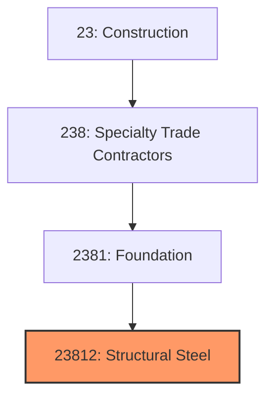
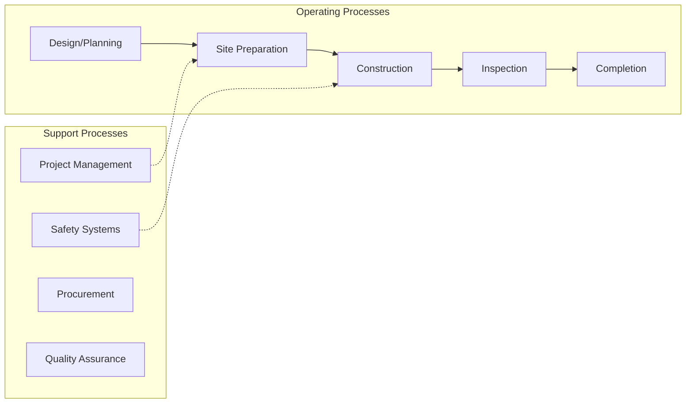

# Structural Steel

> See industry description for 238120.

## Overview

Structural Steel represents an important category within the Construction sector (NAICS 23).

## Industry Hierarchy

## Key Statistics

| Metric | Value |
|--------|-------|
| NAICS Code | 23812 |
| Level | Industry |
| Parent | [Foundation](../) |
| Child Industries | 0 |

## Related Occupations

- [Construction Managers](/occupations/Management/ConstructionManagers) - Plan and coordinate construction projects
- [Carpenters](/occupations/Construction/Carpenters) - Construct and repair building frameworks
- [Electricians](/occupations/Construction/Electricians) - Install and maintain electrical systems
- [Construction Laborers](/occupations/Construction/ConstructionLaborers) - Perform physical labor at construction sites

## Core Business Processes

## Industry Value Chain

```mermaid
graph LR
    subgraph Inputs["Inputs"]
        I1["Materials"]
        I2["Equipment"]
        I3["Labor"]
        I4["Plans"]
    end

    subgraph Primary["Primary Activities"]
        A1["Inbound Logistics"]
        A2["Core Operations"]
        A3["Quality Assurance"]
        A4["Outbound/Delivery"]
    end

    subgraph Outputs["Products/Services"]
        O1["Buildings"]
        O2["Infrastructure"]
        O3["Renovations"]
    end

    subgraph Customers["Markets"]
        C1["Property Owners"]
        C2["Government"]
        C3["Developers"]
        C4["Businesses"]
    end

    Inputs --> Primary --> Outputs --> Customers
```

## Regulatory Environment

- **OSHA** (Occupational Safety and Health Administration) - Enforces workplace safety standards
- **EPA** (Environmental Protection Agency) - Regulates construction environmental impact
- **State and Local Building Codes** - Govern construction standards and permitting
- **Department of Labor** - Enforces prevailing wage and labor requirements

## Technology & Innovation

- **Building Information Modeling (BIM)** - 3D digital representations for design and construction planning
- **Prefabrication and Modular Construction** - Off-site manufacturing of building components
- **Construction Robotics** - Automated bricklaying, 3D-printed structures, and drone site surveys
- **Green Building** - Sustainable materials, energy-efficient designs, and LEED certification

## Industry Outlook

The construction industry benefits from sustained infrastructure investment, housing demand, and commercial development. Labor shortages continue to drive adoption of modular construction, prefabrication, and automation. Green building practices and energy-efficient design are becoming standard requirements, while technology adoption in project management and building information modeling improves productivity.

## Market Context

Construction drives infrastructure development and economic growth, with increasing adoption of sustainable building practices and digital construction technologies.

| Aspect | Details |
|--------|---------|
| Industry Sector | Construction |
| NAICS/SIC Code | 23812 |
| Market Segment | Structural Steel |

## Key Business Processes

- Design and planning
- Site preparation
- Construction and assembly
- Quality inspection
- Project closeout

## Common Occupations

- [Construction Managers](/occupations/Management/ConstructionManagers)
- [Construction Laborers](/occupations/Construction/ConstructionLaborers)
- [Carpenters](/occupations/Construction/Carpenters)
- [Electricians](/occupations/Construction/Electricians)

## Regulations and Standards

- OSHA Construction Standards (29 CFR 1926)
- International Building Code (IBC)
- Local building permits and inspections
- EPA environmental regulations
- ADA accessibility requirements

## Technology and Tools

- Building Information Modeling (BIM)
- Project management software
- Drones for site surveys
- Prefabrication and modular construction
- Safety monitoring systems

## Industry Trends

- Digital transformation and automation adoption
- Sustainability and environmental compliance focus
- Workforce development and skills training
- Supply chain resilience and optimization
- Customer experience enhancement

---

*Source: NAICS 23812 - Structural Steel*
