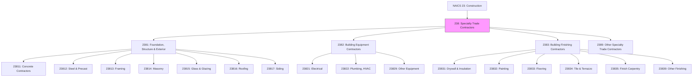
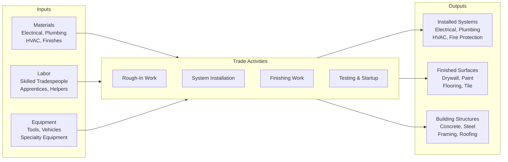

# Specialty Trade Contractors

> The Specialty Trade Contractors subsector comprises establishments whose primary activity is performing specific activities (e.g., pouring concrete, site preparation, plumbing, painting, and electrical work) involved in building construction or other activities that are similar for all types of construction.

## Overview

The Specialty Trade Contractors subsector (NAICS 238) encompasses establishments primarily engaged in performing specific trade activities required in building construction. Unlike general contractors who manage entire projects, specialty trade contractors focus on particular aspects of construction such as electrical work, plumbing, masonry, painting, and site preparation.

The work performed may include new construction, additions, alterations, maintenance, and repairs. Production work is typically subcontracted from general contractors or for-sale builders, but especially in remodeling and repair construction, work may be done directly for property owners.

Establishments primarily engaged in activities specific to heavy and civil engineering construction (such as painting lines on highways) are classified in Subsector 237. Establishments primarily engaged in selling construction materials are classified in Wholesale Trade or Retail Trade.

## Industry Hierarchy

## Key Statistics

| Metric | Value |
|--------|-------|
| NAICS Code | 238 |
| Level | Subsector |
| Parent Sector | [Construction](../) (23) |
| Industry Groups | 4 |
| National Industries | 18 |

## Sub-Industries

| Industry Group | Code | Description |
|----------------|------|-------------|
| Foundation, Structure, and Building Exterior | 2381 | Trades for completing the basic building structure |
| Building Equipment Contractors | 2382 | Installation of mechanical systems (electrical, plumbing, HVAC) |
| Building Finishing Contractors | 2383 | Trades for finishing building interiors |
| Other Specialty Trade Contractors | 2389 | Site preparation, demolition, and other specialties |

### Foundation, Structure, and Building Exterior Contractors (2381)

Establishments engaged in specialty trades needed to complete the basic structure (foundation, frame, and shell) of buildings.

| Industry | Code | Activities |
|----------|------|------------|
| Poured Concrete Foundation & Structure | 23811 | Concrete foundations, slabs, walls, and structural elements |
| Structural Steel and Precast Concrete | 23812 | Steel erection, precast panels, rebar installation |
| Framing Contractors | 23813 | Wood and metal framing for buildings |
| Masonry Contractors | 23814 | Brick, block, stone, and stucco work |
| Glass and Glazing Contractors | 23815 | Glass installation, curtain walls, storefronts |
| Roofing Contractors | 23816 | Roof installation and repair (all types) |
| Siding Contractors | 23817 | Siding installation (vinyl, metal, wood) |

### Building Equipment Contractors (2382)

Establishments engaged in installing or servicing equipment that forms part of building mechanical systems.

| Industry | Code | Activities |
|----------|------|------------|
| Electrical Contractors | 23821 | Electrical wiring, fixtures, panels, and systems |
| Plumbing, Heating, and Air-Conditioning | 23822 | Plumbing, HVAC systems, piping, and ductwork |
| Other Building Equipment Contractors | 23829 | Elevators, escalators, fire suppression, security systems |

### Building Finishing Contractors (2383)

Establishments engaged in specialty trades needed to finish building interiors.

| Industry | Code | Activities |
|----------|------|------------|
| Drywall and Insulation Contractors | 23831 | Drywall installation and finishing, insulation |
| Painting and Wall Covering Contractors | 23832 | Interior/exterior painting, wallpaper, coatings |
| Flooring Contractors | 23833 | Carpet, hardwood, laminate, and vinyl flooring |
| Tile and Terrazzo Contractors | 23834 | Ceramic tile, stone tile, and terrazzo |
| Finish Carpentry Contractors | 23835 | Trim, molding, cabinets, and millwork |
| Other Building Finishing Contractors | 23839 | Acoustical ceilings, window treatments |

### Other Specialty Trade Contractors (2389)

| Industry | Code | Activities |
|----------|------|------------|
| Site Preparation Contractors | 23891 | Excavation, grading, demolition, land clearing |
| All Other Specialty Trade Contractors | 23899 | Scaffolding, fence installation, concrete pumping |

## Related Occupations

- [Electricians](/occupations/Electricians) - Install and maintain electrical systems
- [Plumbers and Pipefitters](/occupations/Plumbers) - Install plumbing and piping
- [Carpenters](/occupations/Carpenters) - Frame and finish buildings
- [HVAC Technicians](/occupations/HVACTechnicians) - Install and service HVAC systems
- [Painters](/occupations/Painters) - Apply paint and finishes
- [Roofers](/occupations/Roofers) - Install and repair roofing systems
- [Masons](/occupations/Masons) - Build with brick, block, and stone
- [Drywall Installers](/occupations/DrywallInstallers) - Install and finish drywall
- [Floor Layers](/occupations/FloorLayers) - Install flooring materials
- [Glaziers](/occupations/Glaziers) - Install glass and glazing systems

## Core Business Processes

### Estimating and Bidding

Preparing competitive bids for specialty trade work based on project plans and specifications.

**Key Activities:**
- Review project drawings and specifications
- Perform quantity takeoffs
- Price materials and labor
- Calculate overhead and profit
- Submit competitive proposals

### Field Operations

Executing specialty trade work at construction sites according to plans and schedules.

**Key Activities:**
- Coordinate with general contractor and other trades
- Procure and manage materials
- Deploy trained crews to jobsites
- Install systems and components
- Ensure work meets codes and specifications

### Quality and Safety Management

Maintaining high standards of workmanship while ensuring worker safety.

**Key Activities:**
- Train crews on installation methods
- Conduct quality inspections
- Implement safety programs
- Maintain tools and equipment
- Address deficiencies promptly

## Industry Value Chain

## Market Segments

### New Construction
- **Residential**: Single-family, multifamily, and custom homes
- **Commercial**: Office buildings, retail, and hospitality
- **Industrial**: Manufacturing plants and warehouses
- **Institutional**: Schools, hospitals, and government buildings

### Renovation and Remodeling
- **Residential Remodeling**: Kitchen, bath, and whole-house renovations
- **Commercial Tenant Improvement**: Office fit-outs and retail build-outs
- **Adaptive Reuse**: Converting buildings to new uses

### Maintenance and Repair
- **Service Work**: Repairs and emergency service
- **Preventive Maintenance**: Scheduled system maintenance
- **Facility Maintenance**: Ongoing building upkeep

## Regulatory Environment

Specialty trade contractors operate under specific regulatory requirements:

- **Licensing**: State and local contractor licensing, trade-specific licenses
- **Building Codes**: International Building Code, mechanical, electrical, plumbing codes
- **Safety**: OSHA construction standards, trade-specific safety requirements
- **Apprenticeship**: Union apprenticeship programs, state-registered programs
- **Permits**: Trade-specific permits (electrical, plumbing, mechanical)
- **Inspections**: Code inspections at various stages of work
- **Insurance**: Workers compensation, general liability, professional liability

## Technology & Innovation

Specialty trade contractors are adopting new technologies:

- **Prefabrication**: Off-site fabrication of assemblies for faster installation
- **Tool Technology**: Cordless tools, laser levels, digital measuring devices
- **Mobile Apps**: Field reporting, time tracking, punch list management
- **BIM Coordination**: 3D coordination to avoid conflicts between trades
- **Connected Systems**: Smart building systems, IoT-enabled equipment
- **Green Technologies**: Energy-efficient systems, renewable energy installation
- **Virtual Reality**: Training and visualization
- **Robotics**: Bricklaying robots, automated drywall finishing

## Workforce Development

- **Apprenticeship Programs**: Multi-year training combining classroom and on-the-job learning
- **Trade Schools**: Technical education for specific trades
- **Continuing Education**: Code updates, new technology, and safety training
- **Certification Programs**: Industry certifications (e.g., NATE for HVAC, NICET for fire protection)

## Related Industries

- [Construction of Buildings](../Buildings/) - General building construction
- [Heavy and Civil Engineering](../CivilEngineering/) - Infrastructure construction
- [Electrical Equipment](/industries/ElectricalEquipment/) - Electrical materials and equipment
- [HVAC Equipment](/industries/HVACEquipment/) - Heating and cooling systems
- [Building Materials](/industries/BuildingMaterials/) - Construction material supply

---

*Source: NAICS 238 - Specialty Trade Contractors*
