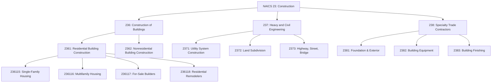
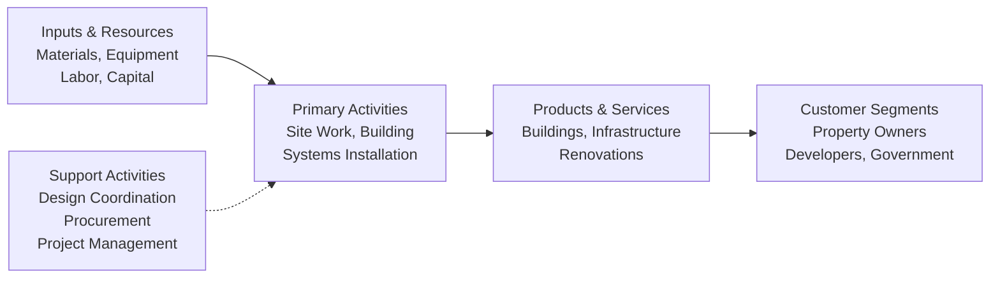

# Construction

> The Construction sector comprises establishments primarily engaged in the construction of buildings or engineering projects (e.g., highways and utility systems), including site preparation, new work, additions, alterations, and maintenance and repairs.

## Overview

Construction establishments are primarily engaged in erecting buildings and other structures, heavy construction (except buildings), and specialty trade activities. The sector includes general contractors, design-builders, construction managers, turnkey contractors, and specialty trade contractors. Production responsibilities are typically specified through prime contracts with project owners or subcontracts with other construction establishments.

The sector is divided into three major subsectors reflecting distinct production processes, equipment requirements, workforce skills, and capital demands: Construction of Buildings (236), Heavy and Civil Engineering Construction (237), and Specialty Trade Contractors (238).

## Industry Hierarchy

## Key Statistics

| Metric | Value |
|--------|-------|
| NAICS Code | 23 |
| Level | Sector |
| Subsectors | 3 |
| Industry Groups | 10 |
| Industries | 29 |

## Sub-Industries

| Subsector | Code | Description |
|-----------|------|-------------|
| [Construction of Buildings](./Buildings/) | 236 | General contractors and for-sale builders for residential and nonresidential buildings |
| [Heavy and Civil Engineering](./CivilEngineering/) | 237 | Engineering projects including highways, bridges, utilities, and land subdivision |
| [Specialty Trade Contractors](./SpecialtyTradeContractors/) | 238 | Specific trade activities including plumbing, electrical, masonry, and finishing |

## Related Occupations

- [Construction Managers](/occupations/Management/ConstructionManagers) - Project planning and coordination
- [Carpenters](/occupations/Construction/Carpenters) - Building and installing frameworks
- [Electricians](/occupations/Construction/Electricians) - Electrical system installation
- [Plumbers and Pipefitters](/occupations/PlumbersAndPipefitters) - Plumbing system installation
- [Operating Engineers](/occupations/Construction/OperatingEngineers) - Heavy equipment operation
- [Civil Engineers](/occupations/Architecture/CivilEngineers) - Infrastructure design and oversight

## Core Business Processes

```mermaid
flowchart LR
    subgraph PreConstruction["Pre-Construction"]
        P1["Bid/Estimate"]
        P2["Design Review"]
        P3["Permitting"]
        P4["Procurement"]
    end

    subgraph Construction["Construction"]
        C1["Site Prep"]
        C2["Foundation"]
        C3["Framing/Structure"]
        C4["MEP Systems"]
        C5["Finishing"]
    end

    subgraph PostConstruction["Post-Construction"]
        O1["Inspection"]
        O2["Punch List"]
        O3["Closeout"]
        O4["Warranty"]
    end

    P1 --> P2 --> P3 --> P4
    P4 --> C1 --> C2 --> C3 --> C4 --> C5
    C5 --> O1 --> O2 --> O3 --> O4
```

### Project Acquisition and Estimating

Developing competitive bids and estimates for construction projects based on project specifications, material costs, labor requirements, and market conditions.

**Key Activities:**
- Review project plans and specifications
- Calculate material takeoffs and quantities
- Estimate labor hours and costs
- Assess project risks and contingencies
- Submit competitive proposals

### Project Execution

Managing the on-site construction process from groundbreaking through substantial completion.

**Key Activities:**
- Coordinate subcontractors and suppliers
- Manage construction schedules and milestones
- Ensure quality control and safety compliance
- Process change orders and variations
- Document progress and maintain records

### Quality and Safety Management

Implementing comprehensive quality assurance and safety programs throughout the construction process.

**Key Activities:**
- Conduct safety training and toolbox talks
- Perform quality inspections and testing
- Maintain OSHA compliance
- Document incidents and near-misses
- Implement corrective actions

## Industry Value Chain

## Contractor Types

### General Contractors
Establishments responsible for all aspects of construction projects, often subcontracting specialized work. Also known as design-builders, construction managers, or turnkey contractors.

### For-Sale Builders
Establishments that build on land they own or control, selling completed buildings. Common in residential construction, also known as merchant builders or speculative builders.

### Specialty Trade Contractors
Establishments performing specific components of construction (masonry, electrical, plumbing, painting). Work is typically subcontracted from general contractors but may be performed directly for property owners, especially in remodeling.

## Regulatory Environment

The construction sector operates under extensive regulatory oversight:

- **Building Codes**: International Building Code (IBC), local amendments, and energy codes
- **OSHA Requirements**: Construction-specific safety standards (29 CFR 1926)
- **Environmental Regulations**: Stormwater management, erosion control, and hazardous materials
- **Licensing Requirements**: Contractor licensing, trade certifications, and bonding
- **Permitting**: Building permits, occupancy certificates, and inspections

## Technology & Innovation

The construction industry is undergoing significant digital transformation:

- **Building Information Modeling (BIM)**: 3D design coordination and clash detection
- **Prefabrication and Modular Construction**: Off-site manufacturing for improved quality and speed
- **Construction Technology**: Drones for surveying, GPS machine control, and project management software
- **Sustainable Building**: Green building certification (LEED, WELL), energy-efficient systems
- **Advanced Materials**: High-performance concrete, mass timber, and composite materials
- **Safety Technology**: Wearables, IoT sensors, and predictive analytics

---

*Source: NAICS 23 - Construction*
