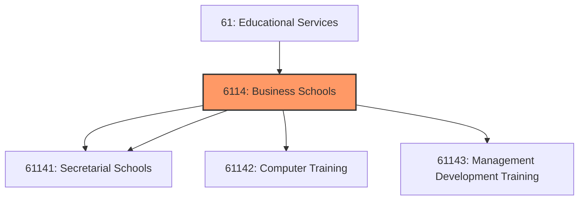
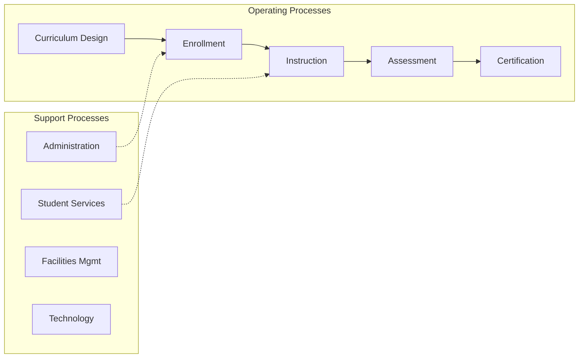

# Business Schools

> This industry group comprises establishments primarily engaged in one of the following: (1) offering courses in office procedures and secretarial and stenographic skills and may offer courses in basic office skills, such as word processing; (2) conducting computer training (except computer repair); or (3) offering an array of short duration courses and seminars for management and professional development.

## Overview

Business Schools represents an important category within the Educational Services sector (NAICS 61).

This industry group comprises establishments primarily engaged in one of the following: (1) offering courses in office procedures and secretarial and stenographic skills and may offer courses in basic office skills, such as word processing; (2) conducting computer training (except computer repair); or (3) offering an array of short duration courses and seminars for management and professional development. Instruction may be provided in diverse settings, such as the establishment's or client's training facilities, educational institutions, the workplace, or the home, and through diverse means, such as correspondence, television, the Internet, or other electronic and distance-learning methods. The training provided by these establishments may include the use of simulators and simulation methods.

## Industry Hierarchy

## Key Statistics

| Metric | Value |
|--------|-------|
| NAICS Code | 6114 |
| Level | Industry Group |
| Child Industries | 4 |

## Sub-Industries

| Industry | Code | Description |
|----------|------|-------------|
| [Business](./Business/) | 61141 | See industry description for 611410 |
| [Secretarial Schools](./SecretarialSchools/) | 61141 | See industry description for 611410 |
| [Computer Training](./ComputerTraining/) | 61142 | See industry description for 611420 |
| [Management Development Training](./ManagementDevelopmentTraining/) | 61143 | See industry description for 611430 |

## Related Occupations

See the [occupations directory](/occupations) for roles commonly found in this industry.

## Core Business Processes

## Industry Value Chain

---

*Source: NAICS 6114 - Business Schools*
