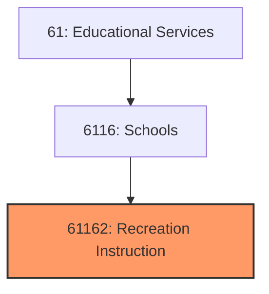
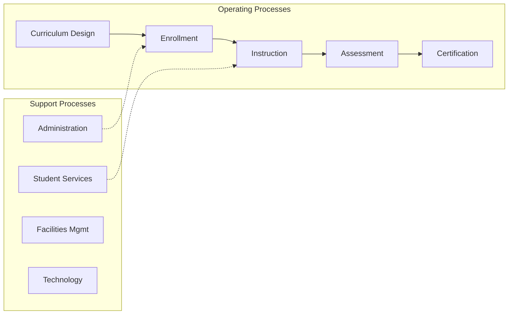

# Recreation Instruction

> See industry description for 611620.

## Overview

Recreation Instruction represents an important category within the Educational Services sector (NAICS 61).

## Industry Hierarchy

## Key Statistics

| Metric | Value |
|--------|-------|
| NAICS Code | 61162 |
| Level | Industry |
| Parent | [Schools](../) |
| Child Industries | 0 |

## Related Occupations

- [Education Administrators, Postsecondary](/occupations/Management/EducationAdministratorsPostsecondary) - Plan and coordinate academic programs
- [Education Administrators, K-12](/occupations/Management/EducationAdministratorsKindergartenThroughSecondary) - Manage school operations
- [Educational Counselors and Advisors](/occupations/SocialServices/EducationalGuidanceAndCareerCounselorsAndAdvisors) - Advise students on academic plans
- [Instructional Coordinators](/occupations/Education/InstructionalCoordinators) - Develop curricula and teaching standards

## Core Business Processes

## Industry Value Chain

```mermaid
graph LR
    subgraph Inputs["Inputs"]
        I1["Resources"]
        I2["Expertise"]
        I3["Technology"]
    end

    subgraph Primary["Primary Activities"]
        A1["Inbound Logistics"]
        A2["Core Operations"]
        A3["Quality Assurance"]
        A4["Outbound/Delivery"]
    end

    subgraph Outputs["Products/Services"]
        O1["Products"]
        O2["Services"]
        O3["Solutions"]
    end

    subgraph Customers["Markets"]
        C1["Businesses"]
        C2["Consumers"]
        C3["Government"]
        C4["Institutions"]
    end

    Inputs --> Primary --> Outputs --> Customers
```

## Regulatory Environment

- **Department of Education** - Sets federal education standards and administers funding
- **State Education Agencies** - Accredit institutions and certify educators
- **FERPA** (Family Educational Rights and Privacy Act) - Protects student records
- **ADA** (Americans with Disabilities Act) - Ensures accessibility in educational settings

## Technology & Innovation

- **EdTech Platforms** - Learning management systems, virtual classrooms, and adaptive learning
- **AI Tutoring** - Personalized learning paths, automated grading, and chatbot assistants
- **Virtual and Augmented Reality** - Immersive simulations for hands-on training and education
- **Credentialing Technology** - Digital badges, blockchain transcripts, and micro-credentials

## Industry Outlook

The education sector is evolving with technology-enabled learning, alternative credentialing, and lifelong learning models. Online and hybrid education formats continue to expand post-pandemic, while AI tutoring and adaptive learning platforms personalize student experiences. Workforce development programs are growing in response to skills gaps, and institutions are adapting curricula to meet changing employer needs.

## Market Context

Manufacturing transforms raw materials into finished goods, with Industry 4.0 driving automation, digitalization, and smart factory implementations.

| Aspect | Details |
|--------|---------|
| Industry Sector | Education |
| NAICS/SIC Code | 61162 |
| Market Segment | Recreation Instruction |

## Key Business Processes

- Production planning
- Manufacturing operations
- Quality assurance
- Inventory management
- Distribution and logistics

## Common Occupations

- [Industrial Production Managers](/occupations/Management/IndustrialProductionManagers)
- [Production Workers](/occupations/Production/ProductionWorkers)
- [Quality Control Inspectors](/occupations/Production/QualityControlInspectors)
- [Industrial Engineers](/occupations/Engineering/IndustrialEngineers)

## Regulations and Standards

- OSHA Manufacturing Standards
- EPA Environmental Regulations
- FDA regulations (where applicable)
- ISO quality standards
- Industry-specific certifications

## Technology and Tools

- Industrial automation and robotics
- Enterprise Resource Planning (ERP)
- Quality management systems
- Predictive maintenance
- IoT and smart manufacturing

## Industry Trends

- Digital transformation and automation adoption
- Sustainability and environmental compliance focus
- Workforce development and skills training
- Supply chain resilience and optimization
- Customer experience enhancement

---

*Source: NAICS 61162 - Recreation Instruction*
