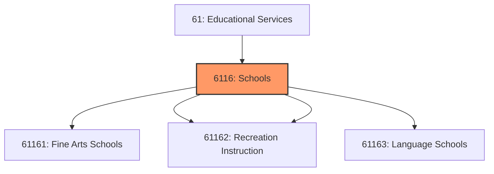
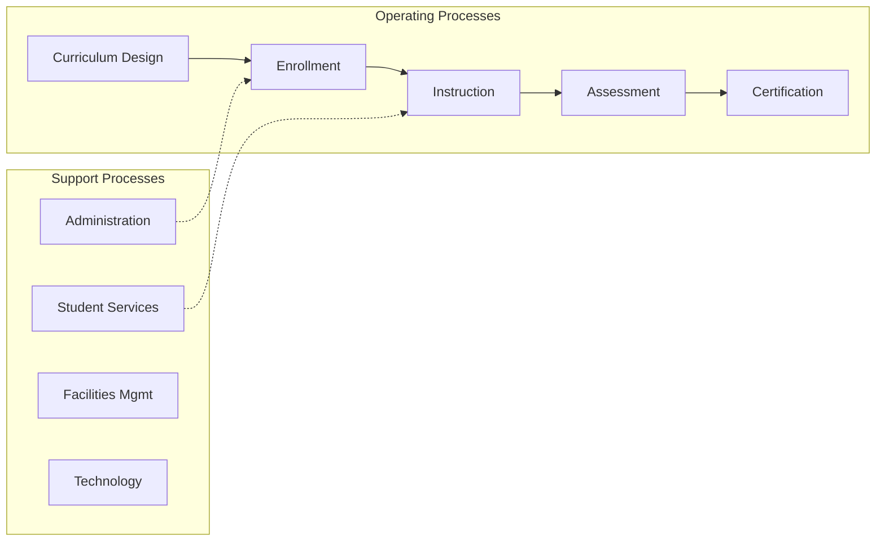

# Schools

> This industry group comprises establishments primarily engaged in offering or providing instruction (except academic schools, colleges, and universities; business, computer, and management instruction; and technical and trade instruction).

## Overview

Schools represents an important category within the Educational Services sector (NAICS 61).

This industry group comprises establishments primarily engaged in offering or providing instruction (except academic schools, colleges, and universities; business, computer, and management instruction; and technical and trade instruction). Instruction may be provided in diverse settings, such as the establishment's or client's training facilities, educational institutions, the workplace, or the home, and through diverse means, such as correspondence, television, the Internet, or other electronic and distance-learning methods. The training provided by these establishments may include the use of simulators and simulation methods.

## Industry Hierarchy

## Key Statistics

| Metric | Value |
|--------|-------|
| NAICS Code | 6116 |
| Level | Industry Group |
| Child Industries | 4 |

## Sub-Industries

| Industry | Code | Description |
|----------|------|-------------|
| [Fine Arts Schools](./FineArtsSchools/) | 61161 | See industry description for 611610 |
| [Sports](./Sports/) | 61162 | See industry description for 611620 |
| [Recreation Instruction](./RecreationInstruction/) | 61162 | See industry description for 611620 |
| [Language Schools](./LanguageSchools/) | 61163 | See industry description for 611630 |

## Related Occupations

See the [occupations directory](/occupations) for roles commonly found in this industry.

## Core Business Processes

## Industry Value Chain

```mermaid
graph LR
    subgraph Inputs["Inputs"]
        I1["Resources"]
        I2["Expertise"]
        I3["Technology"]
    end

    subgraph Primary["Primary Activities"]
        A1["Inbound Logistics"]
        A2["Core Operations"]
        A3["Quality Assurance"]
        A4["Outbound/Delivery"]
    end

    subgraph Outputs["Products/Services"]
        O1["Products"]
        O2["Services"]
        O3["Solutions"]
    end

    subgraph Customers["Markets"]
        C1["Businesses"]
        C2["Consumers"]
        C3["Government"]
        C4["Institutions"]
    end

    Inputs --> Primary --> Outputs --> Customers
```

## Market Context

Manufacturing transforms raw materials into finished goods, with Industry 4.0 driving automation, digitalization, and smart factory implementations.

| Aspect | Details |
|--------|---------|
| Industry Sector | Education |
| NAICS/SIC Code | 6116 |
| Market Segment | Schools |

## Key Business Processes

- Production planning
- Manufacturing operations
- Quality assurance
- Inventory management
- Distribution and logistics

## Common Occupations

- [Industrial Production Managers](/occupations/Management/IndustrialProductionManagers)
- [Production Workers](/occupations/Production/ProductionWorkers)
- [Quality Control Inspectors](/occupations/Production/QualityControlInspectors)
- [Industrial Engineers](/occupations/Engineering/IndustrialEngineers)

## Regulations and Standards

- OSHA Manufacturing Standards
- EPA Environmental Regulations
- FDA regulations (where applicable)
- ISO quality standards
- Industry-specific certifications

## Technology and Tools

- Industrial automation and robotics
- Enterprise Resource Planning (ERP)
- Quality management systems
- Predictive maintenance
- IoT and smart manufacturing

## Industry Trends

- Digital transformation and automation adoption
- Sustainability and environmental compliance focus
- Workforce development and skills training
- Supply chain resilience and optimization
- Customer experience enhancement

---

*Source: NAICS 6116 - Schools*
