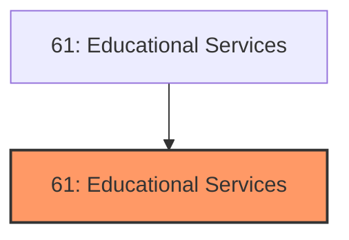
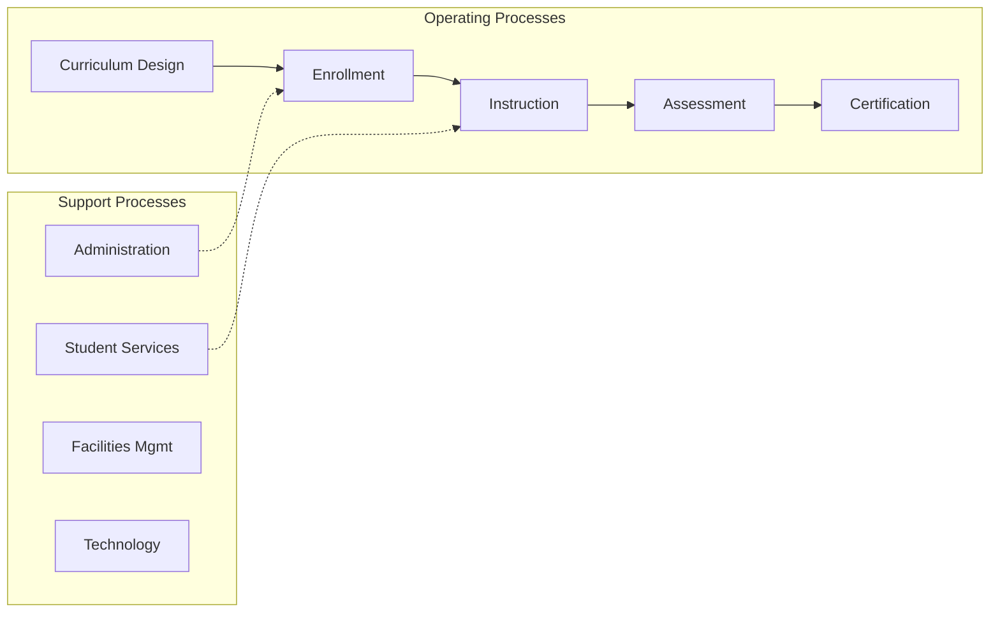

# Educational Services

> The Sector as a Whole The Educational Services sector comprises establishments that provide instruction and training in a wide variety of subjects.

## Overview

Educational Services represents an important category within the Educational Services sector (NAICS 61). This sector encompasses establishments primarily engaged in educational services.

The Sector as a Whole The Educational Services sector comprises establishments that provide instruction and training in a wide variety of subjects. This instruction and training is provided by specialized establishments, such as schools, colleges, universities, and training centers. These establishments may be privately owned and operated for profit or not for profit, or they may be publicly owned and operated. They may also offer food and/or accommodation services to their students. Educational services are usually delivered by teachers or instructors that explain, tell, demonstrate, supervise, and direct learning. Instruction is imparted in diverse settings, such as educational institutions, the workplace, or the home, and through diverse means, such as correspondence, television, the Internet, or other electronic and distance-learning methods. The training provided by these establishments may include the use of simulators and simulation methods. It can be adapted to the particular needs of the students, for example sign language can replace verbal language for teaching students with hearing impairments. All industries in the sector share this commonality of process, namely, labor inputs of instructors with the requisite subject matter expertise and teaching ability.

## Industry Hierarchy

## Key Statistics

| Metric | Value |
|--------|-------|
| NAICS Code | 61 |
| Level | Sector |
| Child Industries | 0 |

## Core Business Processes

## Industry Value Chain

```mermaid
graph LR
    subgraph Inputs["Inputs"]
        I1["Resources"]
        I2["Expertise"]
        I3["Technology"]
    end

    subgraph Primary["Primary Activities"]
        A1["Inbound Logistics"]
        A2["Core Operations"]
        A3["Quality Assurance"]
        A4["Outbound/Delivery"]
    end

    subgraph Outputs["Products/Services"]
        O1["Products"]
        O2["Services"]
        O3["Solutions"]
    end

    subgraph Customers["Markets"]
        C1["Businesses"]
        C2["Consumers"]
        C3["Government"]
        C4["Institutions"]
    end

    Inputs --> Primary --> Outputs --> Customers
```

---

*Source: NAICS 61 - Educational Services*
