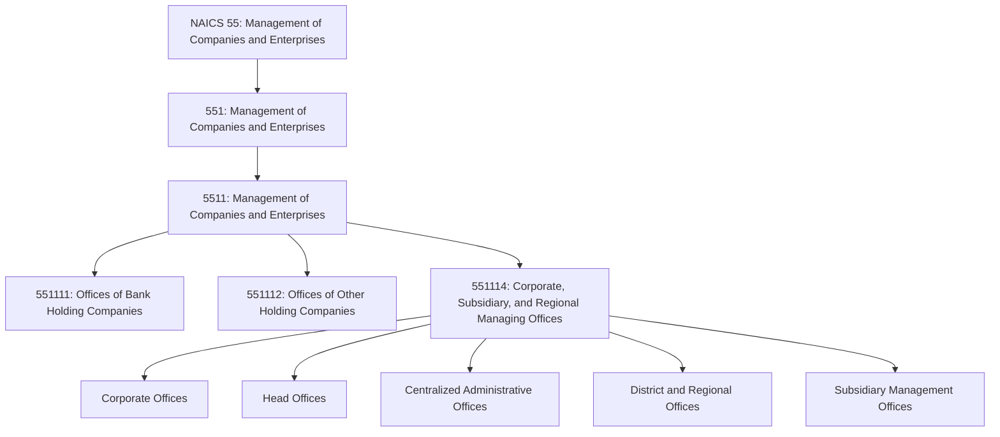
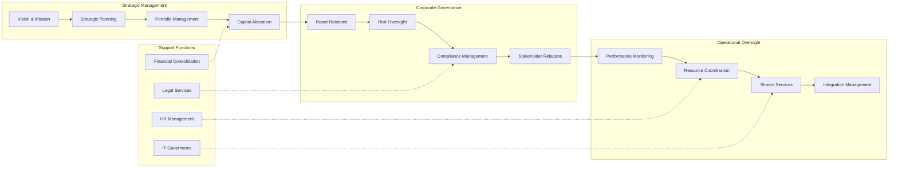
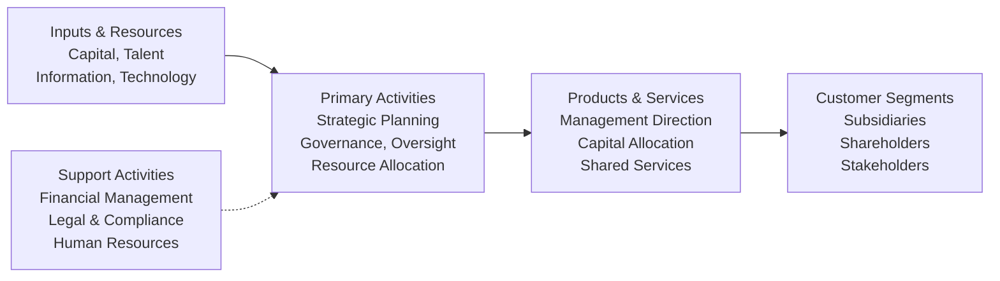

# Management of Companies and Enterprises

> The Management of Companies and Enterprises sector comprises establishments that hold securities or equity interests in companies for the purpose of owning a controlling interest or influencing management decisions, and establishments that administer, oversee, and manage other establishments of the company or enterprise.

## Overview

This sector encompasses two primary types of establishments: (1) holding companies that hold securities of (or other equity interests in) companies and enterprises for the purpose of owning a controlling interest or influencing management decisions, and (2) establishments (except government) that administer, oversee, and manage establishments of the company or enterprise, normally undertaking the strategic or organizational planning and decision-making role.

Establishments that administer, oversee, and manage may also hold the securities of the company or enterprise. The sector performs essential activities that are often undertaken in-house by establishments in many sectors of the economy. By consolidating these activities at centralized establishments, economies of scale are achieved.

This sector represents the strategic apex of corporate structures, where high-level decisions about resource allocation, investment strategy, organizational design, and long-term planning are made. These establishments provide the governance and strategic direction that guides subsidiary operations across diverse industries.

## Industry Hierarchy

## Key Statistics

| Metric | Value |
|--------|-------|
| NAICS Code | 55 |
| Level | Sector |
| Subsectors | 1 |
| Industry Groups | 1 |
| Industries | 3 |

## Sub-Industries

| Industry | Code | Description |
|----------|------|-------------|
| Offices of Bank Holding Companies | 551111 | Legal entities holding securities of banks for controlling interest without administering or managing |
| Offices of Other Holding Companies | 551112 | Legal entities (except bank holding companies) holding securities of companies for controlling interest without managing |
| Corporate, Subsidiary, and Regional Managing Offices | 551114 | Establishments administering, overseeing, and managing other establishments of the company or enterprise |

## Related Occupations

- [Chief Executives](/occupations/Management/ChiefExecutives) - Strategic leadership and organizational direction
- [General and Operations Managers](/occupations/Management/GeneralAndOperationsManagers) - Day-to-day operations oversight
- [Financial Managers](/occupations/Management/FinancialManagers) - Financial planning and capital allocation
- [Human Resources Managers](/occupations/Management/HumanResourcesManagers) - Workforce strategy and talent management
- [Administrative Services Managers](/occupations/Management/AdministrativeServicesManagers) - Facility and administrative coordination
- [Management Analysts](/occupations/Business/Operations/ManagementAnalysts) - Strategic planning and organizational improvement

## Core Business Processes

### Strategic Planning and Direction

Establishing the long-term vision, strategic objectives, and organizational structure for the enterprise and its subsidiaries.

**Key Activities:**
- Define corporate mission, vision, and values
- Develop multi-year strategic plans
- Set performance targets and key metrics
- Evaluate market opportunities and threats
- Make portfolio and investment decisions

### Corporate Governance

Ensuring proper oversight, accountability, and compliance across the enterprise through governance structures and processes.

**Key Activities:**
- Manage board of directors relations
- Oversee enterprise risk management
- Ensure regulatory compliance
- Manage investor and stakeholder relations
- Maintain corporate governance standards

### Portfolio and Investment Management

Managing the collection of businesses, assets, and investments to optimize enterprise value and strategic positioning.

**Key Activities:**
- Evaluate acquisition and divestiture opportunities
- Allocate capital across business units
- Monitor subsidiary performance
- Manage investment portfolios
- Optimize corporate structure

### Centralized Services

Providing shared services and functions that achieve economies of scale across the enterprise.

**Key Activities:**
- Consolidate financial reporting
- Provide centralized treasury services
- Coordinate legal and compliance functions
- Manage enterprise-wide IT systems
- Deliver shared HR and administrative services

## Industry Value Chain

## Establishment Types

### Holding Companies

Establishments that hold the securities of (or other equity interests in) companies and enterprises for the purpose of owning a controlling interest or influencing management decisions. These holding companies do not administer, oversee, and manage other establishments.

| Type | Description |
|------|-------------|
| Bank Holding Companies | Legal entities primarily engaged in holding securities of banks |
| Other Holding Companies | Legal entities holding securities of non-bank companies |
| Investment Holding | Companies holding diversified investment portfolios |

### Managing Offices

Establishments that administer, oversee, and manage other establishments of the company or enterprise, normally undertaking strategic or organizational planning and decision-making roles.

| Type | Description |
|------|-------------|
| Corporate Offices | Primary headquarters with enterprise-wide authority |
| Head Offices | Main administrative centers for company operations |
| Regional Offices | Geographic management centers for regional operations |
| District Offices | Local management oversight within regions |
| Subsidiary Offices | Management units overseeing specific subsidiaries |
| Centralized Administrative Offices | Shared service centers providing enterprise support |

## Regulatory Environment

This sector operates under various regulatory frameworks depending on the nature of holdings and operations:

- **Securities and Exchange Commission (SEC)**: Public company reporting, disclosure requirements
- **Bank Holding Company Act**: Bank holding company regulation (Federal Reserve)
- **Investment Company Act**: Investment company registration and compliance
- **Sarbanes-Oxley Act**: Corporate governance and financial reporting standards
- **State Corporate Law**: State-specific incorporation and governance requirements
- **Antitrust Regulations**: Merger review and competitive considerations

### Key Regulatory Considerations

- Public company disclosure and reporting requirements
- Bank holding company capital and activity restrictions
- Investment advisor and fund manager regulations
- Intercompany transfer pricing rules
- Corporate governance and fiduciary duties
- Tax consolidation and group relief provisions

## Technology & Innovation

The management of companies sector is leveraging technology to enhance oversight and decision-making:

- **Enterprise Resource Planning (ERP)**: Integrated systems for financial and operational data
- **Business Intelligence**: Advanced analytics and dashboards for performance monitoring
- **Governance, Risk, and Compliance (GRC)**: Integrated platforms for regulatory compliance
- **Board Portal Software**: Secure communication and document management for governance
- **Financial Planning & Analysis (FP&A)**: Sophisticated modeling and forecasting tools
- **Collaboration Platforms**: Digital tools for distributed management coordination
- **Data Analytics**: Machine learning for pattern recognition and predictive insights
- **Cybersecurity**: Enterprise-wide security architecture and monitoring

## Related Sectors and Distinctions

### Distinguished from Administrative Support (Sector 56)

Establishments providing day-to-day office administrative services for other companies on a contract or fee basis (such as financial planning, billing, recordkeeping, personnel, and logistics) are classified in Industry 56111, Office Administrative Services, not in this sector.

### Distinguished from Public Administration (Sector 92)

Government establishments primarily engaged in administering, overseeing, and managing governmental programs are classified in Sector 92, Public Administration.

### Key Distinction

The critical distinction is the **strategic and organizational planning and decision-making role**. Establishments in this sector make high-level decisions about the direction of the enterprise, rather than performing routine operational support activities.

---

*Source: NAICS 55 - Management of Companies and Enterprises*
