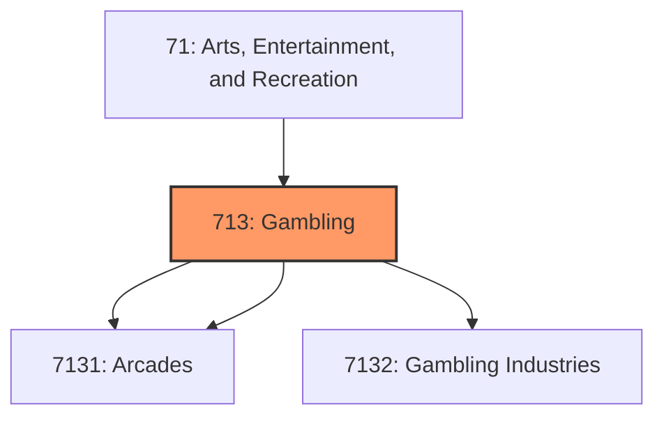
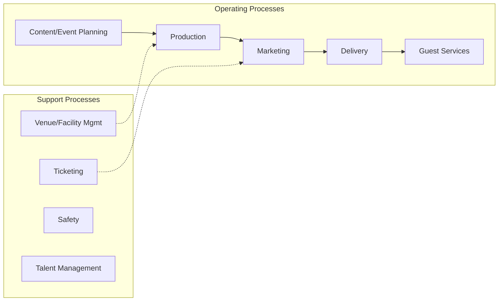

# Gambling

> Industries in the Amusement, Gambling, and Recreation Industries subsector (1) operate facilities where patrons can primarily engage in sports, recreation, amusement, or gambling activities and/or (2) provide other amusement and recreation services, such as supplying and servicing amusement devices in places of business operated by others; operating sports teams, clubs, or leagues engaged in playing games for recreational purposes; and guiding tours without using transportation equipment.

## Overview

Gambling represents an important category within the Arts, Entertainment, and Recreation sector (NAICS 71).

Industries in the Amusement, Gambling, and Recreation Industries subsector (1) operate facilities where patrons can primarily engage in sports, recreation, amusement, or gambling activities and/or (2) provide other amusement and recreation services, such as supplying and servicing amusement devices in places of business operated by others; operating sports teams, clubs, or leagues engaged in playing games for recreational purposes; and guiding tours without using transportation equipment. This subsector does not cover all establishments providing recreational services. Other sectors of NAICS also provide recreational services. Providers of recreational services are often engaged in processes classified in other sectors of NAICS. For example, operators of resorts and hunting and fishing camps provide both accommodation and recreational facilities and services. These establishments are classified in Subsector 721, Accommodation, partly to reflect the significant costs associated with the provision of accommodation services and partly to ensure consistency with international standards. Likewise, establishments using transportation equipment to provide recreational and entertainment services, such as those operating sightseeing buses, dinner cruises, or helicopter rides, are classified in Subsector 487, Scenic and Sightseeing Transportation. The industry groups in this subsector highlight particular types of activities: amusement parks and arcades, gambling industries, and other amusement and recreation industries. The groups, however, are not all-inclusive of the activity. The Gambling Industries industry group does not provide for full coverage of gambling activities. For example, casino hotels are classified in Subsector 721, Accommodation; and horse and dog racing tracks without casinos are classified in Industry Group 7112, Spectator Sports.

## Industry Hierarchy

## Key Statistics

| Metric | Value |
|--------|-------|
| NAICS Code | 713 |
| Level | Subsector |
| Parent | [Arts](../) |
| Child Industries | 3 |

## Sub-Industries

| Industry | Code | Description |
|----------|------|-------------|
| [Amusement Parks](./AmusementParks/) | 7131 | This industry group comprises establishments primarily engaged in operating amus |
| [Arcades](./Arcades/) | 7131 | This industry group comprises establishments primarily engaged in operating amus |
| [Gambling Industries](./GamblingIndustries/) | 7132 | This industry group comprises establishments (except casino hotels) primarily en |

## Related Occupations

See the [occupations directory](/occupations) for roles commonly found in this industry.

## Core Business Processes

## Industry Value Chain

```mermaid
graph LR
    subgraph Inputs["Inputs"]
        I1["Resources"]
        I2["Expertise"]
        I3["Technology"]
    end

    subgraph Primary["Primary Activities"]
        A1["Inbound Logistics"]
        A2["Core Operations"]
        A3["Quality Assurance"]
        A4["Outbound/Delivery"]
    end

    subgraph Outputs["Products/Services"]
        O1["Products"]
        O2["Services"]
        O3["Solutions"]
    end

    subgraph Customers["Markets"]
        C1["Businesses"]
        C2["Consumers"]
        C3["Government"]
        C4["Institutions"]
    end

    Inputs --> Primary --> Outputs --> Customers
```

---

*Source: NAICS 713 - Gambling*
