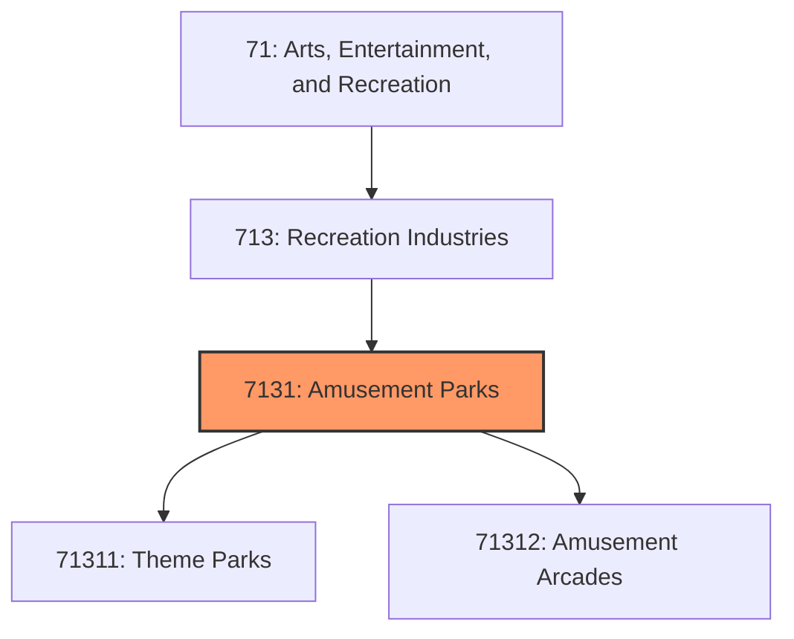
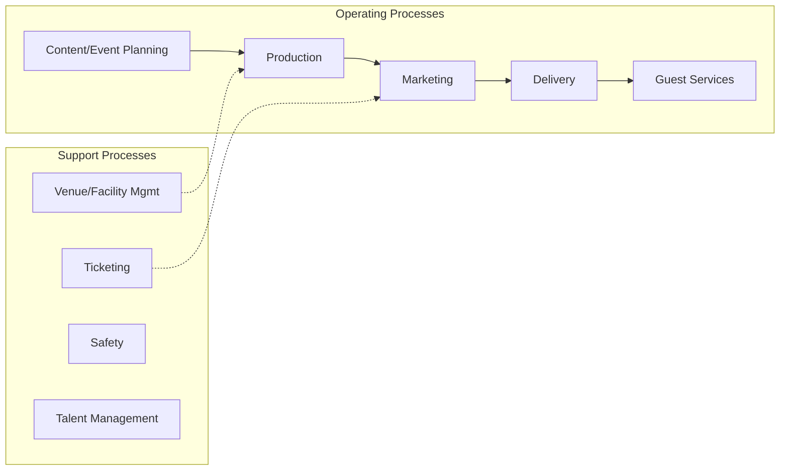

# Amusement Parks

> This industry group comprises establishments primarily engaged in operating amusement parks and amusement arcades and parlors.

## Overview

Amusement Parks represents an important category within the Arts, Entertainment, and Recreation sector (NAICS 71). This industry group encompasses establishments primarily engaged in amusement parks.

This industry group comprises establishments primarily engaged in operating amusement parks and amusement arcades and parlors.

## Industry Hierarchy

## Key Statistics

| Metric | Value |
|--------|-------|
| NAICS Code | 7131 |
| Level | Industry Group |
| Parent | [Recreation Industries](../) |
| Child Industries | 2 |

## Sub-Industries

| Industry | Code | Description |
|----------|------|-------------|
| [Theme Parks](./ThemeParks/) | 71311 | See industry description for 713110 |
| [Amusement Arcades](./AmusementArcades/) | 71312 | See industry description for 713120 |

## Core Business Processes

## Industry Value Chain

```mermaid
graph LR
    subgraph Inputs["Inputs"]
        I1["Resources"]
        I2["Expertise"]
        I3["Technology"]
    end

    subgraph Primary["Primary Activities"]
        A1["Inbound Logistics"]
        A2["Core Operations"]
        A3["Quality Assurance"]
        A4["Outbound/Delivery"]
    end

    subgraph Outputs["Products/Services"]
        O1["Products"]
        O2["Services"]
        O3["Solutions"]
    end

    subgraph Customers["Markets"]
        C1["Businesses"]
        C2["Consumers"]
        C3["Government"]
        C4["Institutions"]
    end

    Inputs --> Primary --> Outputs --> Customers
```

---

*Source: NAICS 7131 - Amusement Parks*
