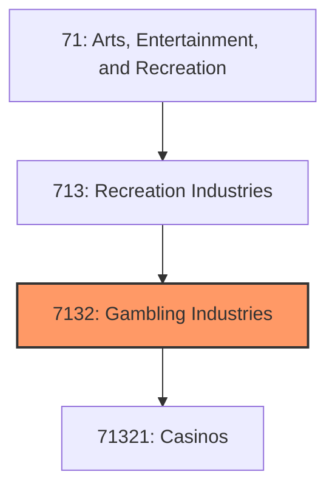
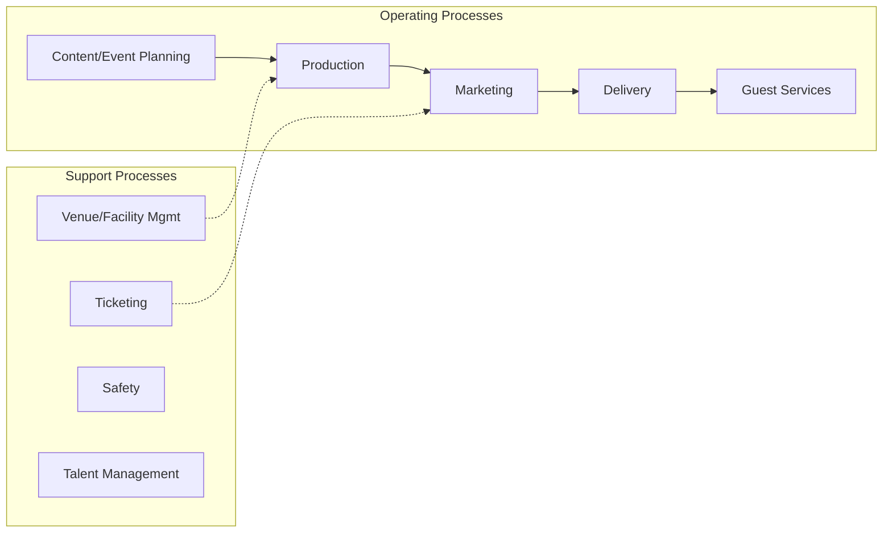

# Gambling Industries

> This industry group comprises establishments (except casino hotels) primarily engaged in operating gambling facilities, such as casinos, bingo halls, and video gaming terminals, or in the provision of gambling services, such as lotteries and off-track betting.

## Overview

Gambling Industries represents an important category within the Arts, Entertainment, and Recreation sector (NAICS 71). This industry group encompasses establishments primarily engaged in gambling industries.

This industry group comprises establishments (except casino hotels) primarily engaged in operating gambling facilities, such as casinos, bingo halls, and video gaming terminals, or in the provision of gambling services, such as lotteries and off-track betting. Casino hotels are classified in Industry 72112, Casino Hotels.

## Industry Hierarchy

## Key Statistics

| Metric | Value |
|--------|-------|
| NAICS Code | 7132 |
| Level | Industry Group |
| Parent | [Recreation Industries](../) |
| Child Industries | 1 |

## Sub-Industries

| Industry | Code | Description |
|----------|------|-------------|
| [Casinos](./Casinos/) | 71321 | See industry description for 713210 |

## Related Occupations

- [Entertainment and Recreation Managers](/occupations/Management/EntertainmentAndRecreationManagersExceptGambling) - Plan and direct entertainment activities
- [Actors](/occupations/ArtsMedia/Actors) - Play parts in stage, TV, or film productions
- [Producers and Directors](/occupations/ArtsMedia/ProducersAndDirectors) - Produce or direct performing arts
- [Athletes and Sports Competitors](/occupations/ArtsMedia/AthletesAndSportsCompetitors) - Compete in athletic events

## Core Business Processes

## Industry Value Chain

## Regulatory Environment

- **FCC** (Federal Communications Commission) - Regulates broadcasting of entertainment
- **State Athletic Commissions** - Govern professional sports and events
- **Copyright Office** - Manages intellectual property for creative works
- **Local Permitting Authorities** - Issue event and venue operation permits

## Technology & Innovation

- **Streaming and Digital Distribution** - OTT platforms, live streaming, and virtual events
- **Virtual and Augmented Reality** - Immersive experiences, VR gaming, and AR venue enhancements
- **AI Content Creation** - Generative AI for music, visual effects, and interactive storytelling
- **Sports Analytics** - Performance tracking, fan engagement platforms, and real-time statistics

## Industry Outlook

The arts, entertainment, and recreation sector has recovered strongly with live events, experiential entertainment, and sports driving growth. Streaming platforms and digital content distribution continue to reshape media business models. Virtual reality, AI-generated content, and immersive experiences represent new frontiers, while sports betting legalization creates additional revenue streams.

---

*Source: NAICS 7132 - Gambling Industries*
