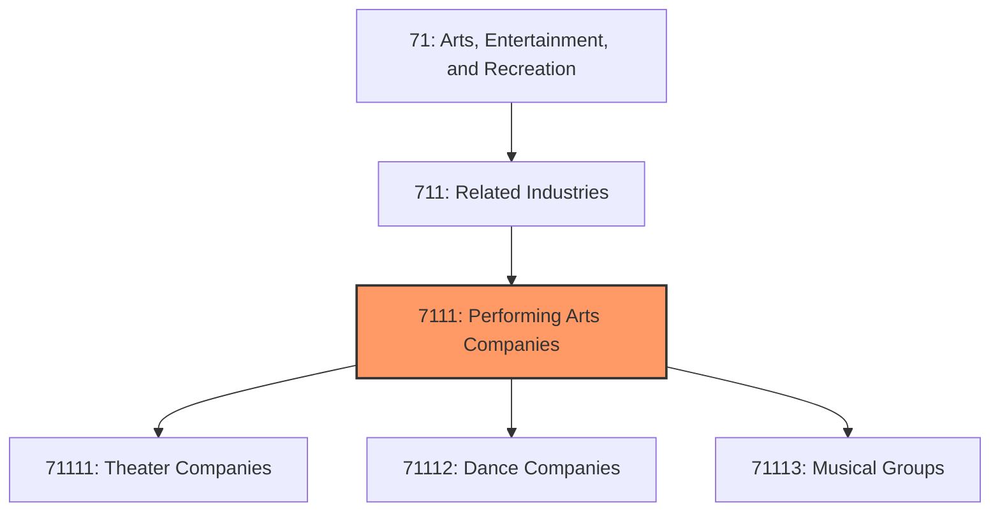
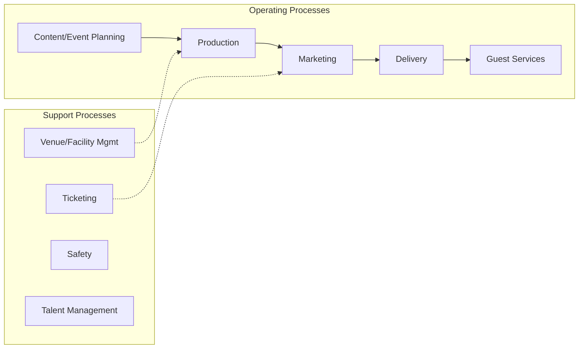

# Performing Arts Companies

> This industry group comprises establishments primarily engaged in producing live presentations involving the performances of actors and actresses, singers, dancers, musical groups and artists, and other performing artists.

## Overview

Performing Arts Companies represents an important category within the Arts, Entertainment, and Recreation sector (NAICS 71). This industry group encompasses establishments primarily engaged in performing arts companies.

This industry group comprises establishments primarily engaged in producing live presentations involving the performances of actors and actresses, singers, dancers, musical groups and artists, and other performing artists.

## Industry Hierarchy

## Key Statistics

| Metric | Value |
|--------|-------|
| NAICS Code | 7111 |
| Level | Industry Group |
| Parent | [Related Industries](../) |
| Child Industries | 3 |

## Sub-Industries

| Industry | Code | Description |
|----------|------|-------------|
| [Theater Companies](./TheaterCompanies/) | 71111 | See industry description for 711110 |
| [Dance Companies](./DanceCompanies/) | 71112 | See industry description for 711120 |
| [Musical Groups](./MusicalGroups/) | 71113 | See industry description for 711130 |

## Core Business Processes

## Industry Value Chain

```mermaid
graph LR
    subgraph Inputs["Inputs"]
        I1["Resources"]
        I2["Expertise"]
        I3["Technology"]
    end

    subgraph Primary["Primary Activities"]
        A1["Inbound Logistics"]
        A2["Core Operations"]
        A3["Quality Assurance"]
        A4["Outbound/Delivery"]
    end

    subgraph Outputs["Products/Services"]
        O1["Products"]
        O2["Services"]
        O3["Solutions"]
    end

    subgraph Customers["Markets"]
        C1["Businesses"]
        C2["Consumers"]
        C3["Government"]
        C4["Institutions"]
    end

    Inputs --> Primary --> Outputs --> Customers
```

---

*Source: NAICS 7111 - Performing Arts Companies*
