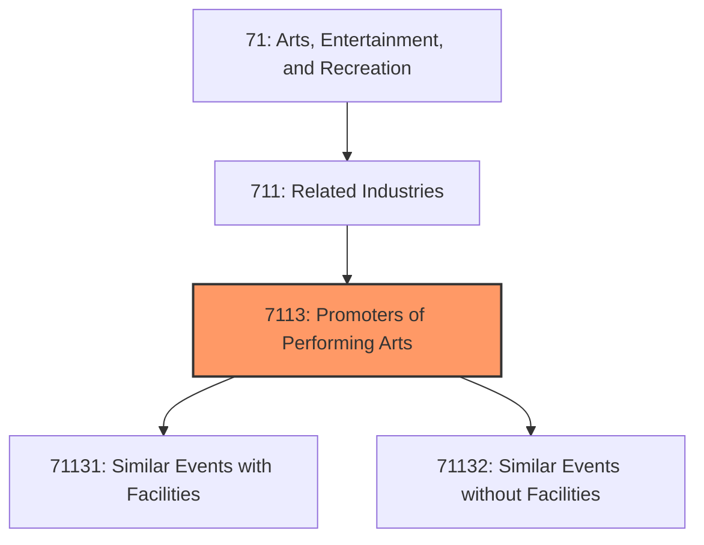
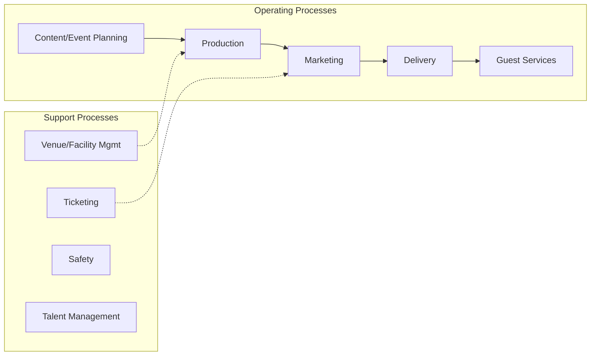

# Promoters of Performing Arts

> This industry group comprises establishments primarily engaged in organizing, promoting, and/or managing live performing arts productions, sports events, and similar events, held in facilities that they manage and operate or in facilities that are managed and operated by others.

## Overview

Promoters of Performing Arts represents an important category within the Arts, Entertainment, and Recreation sector (NAICS 71). This industry group encompasses establishments primarily engaged in promoters of performing arts.

This industry group comprises establishments primarily engaged in organizing, promoting, and/or managing live performing arts productions, sports events, and similar events, held in facilities that they manage and operate or in facilities that are managed and operated by others.

## Industry Hierarchy

## Key Statistics

| Metric | Value |
|--------|-------|
| NAICS Code | 7113 |
| Level | Industry Group |
| Parent | [Related Industries](../) |
| Child Industries | 2 |

## Sub-Industries

| Industry | Code | Description |
|----------|------|-------------|
| [Similar Events with Facilities](./SimilarEventsWithFacilities/) | 71131 | See industry description for 711310 |
| [Similar Events without Facilities](./SimilarEventsWithoutFacilities/) | 71132 | See industry description for 711320 |

## Core Business Processes

## Industry Value Chain

```mermaid
graph LR
    subgraph Inputs["Inputs"]
        I1["Resources"]
        I2["Expertise"]
        I3["Technology"]
    end

    subgraph Primary["Primary Activities"]
        A1["Inbound Logistics"]
        A2["Core Operations"]
        A3["Quality Assurance"]
        A4["Outbound/Delivery"]
    end

    subgraph Outputs["Products/Services"]
        O1["Products"]
        O2["Services"]
        O3["Solutions"]
    end

    subgraph Customers["Markets"]
        C1["Businesses"]
        C2["Consumers"]
        C3["Government"]
        C4["Institutions"]
    end

    Inputs --> Primary --> Outputs --> Customers
```

---

*Source: NAICS 7113 - Promoters of Performing Arts*
