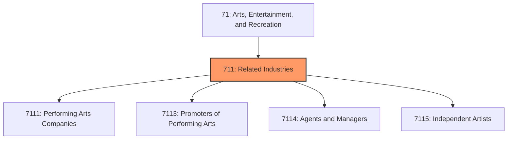
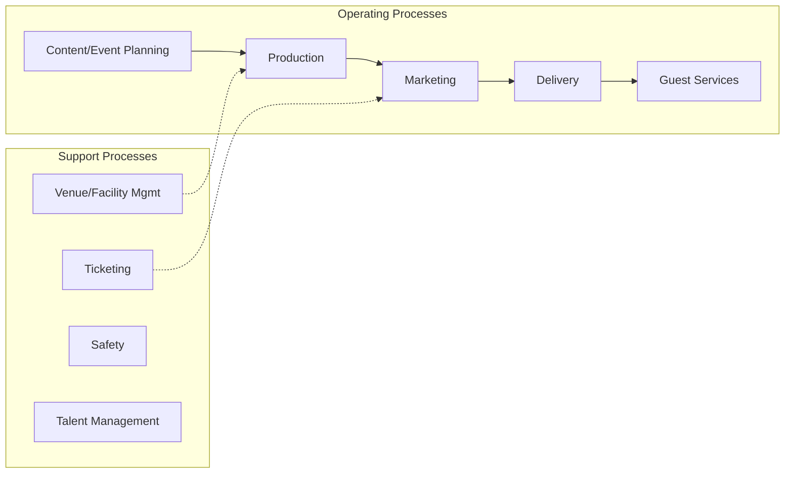

# Related Industries

> Industries in the Performing Arts, Spectator Sports, and Related Industries subsector group establishments that produce or organize and promote live presentations involving the performances of actors and actresses, singers, dancers, musical groups and artists, athletes, and other entertainers, including independent (i.

## Overview

Related Industries represents an important category within the Arts, Entertainment, and Recreation sector (NAICS 71). This subsector encompasses establishments primarily engaged in related industries.

Industries in the Performing Arts, Spectator Sports, and Related Industries subsector group establishments that produce or organize and promote live presentations involving the performances of actors and actresses, singers, dancers, musical groups and artists, athletes, and other entertainers, including independent (i.e., freelance) entertainers and the establishments that manage their careers. The classification recognizes four basic processes: (1) producing (i.e., presenting) events; (2) organizing, managing, and/or promoting events; (3) managing and representing entertainers; and (4) providing the artistic, creative, and technical skills necessary to the production of these live events. Also, this subsector contains four industries for performing arts companies. Each is defined on the basis of the particular skills of the entertainers involved in the presentations. The industry structure for this subsector makes a clear distinction between performing arts companies and performing artists (i.e., independent or freelance). Although not unique to arts and entertainment, freelancing is a particularly important phenomenon in this Performing Arts, Spectator Sports, and Related Industries subsector. Distinguishing this activity from the production activity is a meaningful process differentiation. This approach, however, is difficult to implement in the case of musical groups (i.e., companies) and artists. These establishments tend to be more loosely organized and it can be difficult to distinguish companies from freelancers. For this reason, NAICS includes one industry that covers both musical groups and musical artists. This subsector contains two industries for Industry Group 7113, Promoters of Performing Arts, Sports, and Similar Events, one for those that operate facilities and another for those that do not. This is because there are significant differences in cost structures between those promoters that manage and provide the staff to operate facilities and those that do not. In addition to promoters without facilities, other industries in this subsector include establishments that may operate without permanent facilities. These types of establishments include performing arts companies; musical groups and artists; spectator sports; and independent (i.e., freelance) artists, writers, and performers. Excluded from this subsector are nightclubs. Some nightclubs promote live entertainment on a regular basis and it can be argued that they could be classified in Industry Group 7113, Promoters of Performing Arts, Sports, and Similar Events. However, since most of these establishments function as any other drinking place when they do not promote entertainment and because most of their revenue is derived from sale of food and beverages, they are classified in Subsector 722, Food Services and Drinking Places.

## Industry Hierarchy

## Key Statistics

| Metric | Value |
|--------|-------|
| NAICS Code | 711 |
| Level | Subsector |
| Parent | [Entertainment](../) |
| Child Industries | 4 |

## Sub-Industries

| Industry | Code | Description |
|----------|------|-------------|
| [Performing Arts Companies](./PerformingArtsCompanies/) | 7111 | This industry group comprises establishments primarily engaged in producing live |
| [Promoters of Performing Arts](./PromotersOfPerformingArts/) | 7113 | This industry group comprises establishments primarily engaged in organizing, pr |
| [Agents and Managers](./AgentsAndManagers/) | 7114 | Agents and Managers |
| [Independent Artists](./IndependentArtists/) | 7115 | Independent Artists |

## Core Business Processes

## Industry Value Chain

---

*Source: NAICS 711 - Related Industries*
