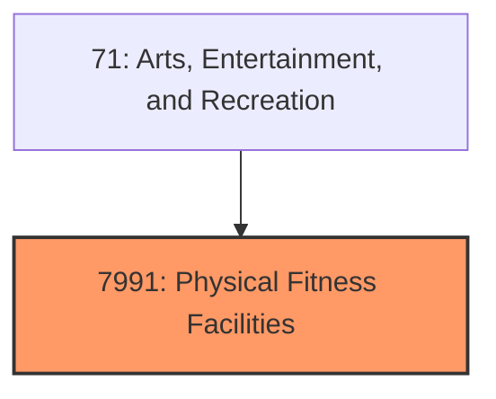
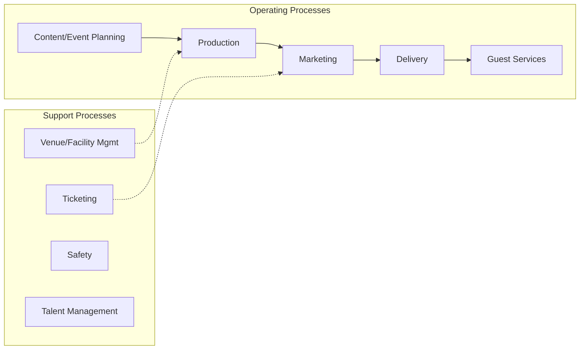

# Physical Fitness Facilities

> Physical Fitness Facilities.

## Overview

Physical Fitness Facilities represents an important category within the Arts, Entertainment, and Recreation sector (SIC 7991).

## Industry Hierarchy

## Key Statistics

| Metric | Value |
|--------|-------|
| SIC Code | 7991 |
| Level | SIC (7991) |
| Child Industries | 0 |

## Related Occupations

See the [occupations directory](/occupations) for roles commonly found in this industry.

## Core Business Processes

## Industry Value Chain

---

*Source: SIC 7991 - Physical Fitness Facilities*
