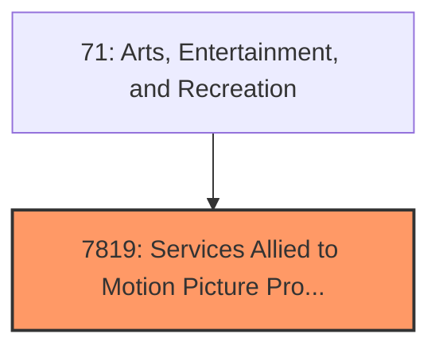
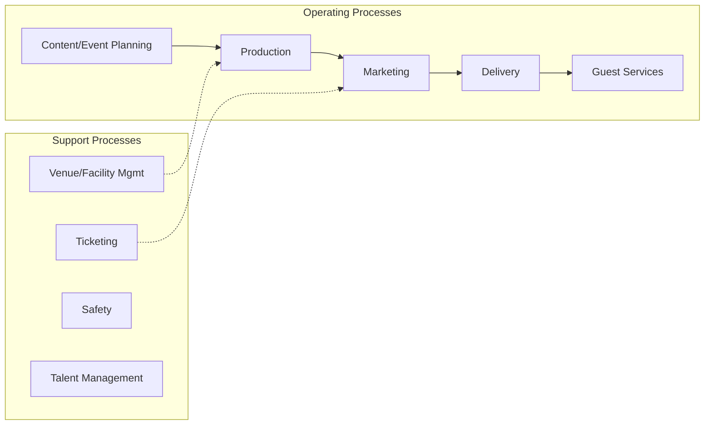

# Services Allied to Motion Picture Production

> Services Allied to Motion Picture Production.

## Overview

Services Allied to Motion Picture Production represents an important category within the Arts, Entertainment, and Recreation sector (SIC 7819).

## Industry Hierarchy

## Key Statistics

| Metric | Value |
|--------|-------|
| SIC Code | 7819 |
| Level | SIC (7819) |
| Child Industries | 0 |

## Related Occupations

- [Entertainment and Recreation Managers](/occupations/Management/EntertainmentAndRecreationManagersExceptGambling) - Plan and direct entertainment activities
- [Actors](/occupations/ArtsMedia/Actors) - Play parts in stage, TV, or film productions
- [Producers and Directors](/occupations/ArtsMedia/ProducersAndDirectors) - Produce or direct performing arts
- [Athletes and Sports Competitors](/occupations/ArtsMedia/AthletesAndSportsCompetitors) - Compete in athletic events

## Core Business Processes

## Industry Value Chain

## Regulatory Environment

- **FCC** (Federal Communications Commission) - Regulates broadcasting of entertainment
- **State Athletic Commissions** - Govern professional sports and events
- **Copyright Office** - Manages intellectual property for creative works
- **Local Permitting Authorities** - Issue event and venue operation permits

## Technology & Innovation

- **Streaming and Digital Distribution** - OTT platforms, live streaming, and virtual events
- **Virtual and Augmented Reality** - Immersive experiences, VR gaming, and AR venue enhancements
- **AI Content Creation** - Generative AI for music, visual effects, and interactive storytelling
- **Sports Analytics** - Performance tracking, fan engagement platforms, and real-time statistics

## Industry Outlook

The arts, entertainment, and recreation sector has recovered strongly with live events, experiential entertainment, and sports driving growth. Streaming platforms and digital content distribution continue to reshape media business models. Virtual reality, AI-generated content, and immersive experiences represent new frontiers, while sports betting legalization creates additional revenue streams.

## Market Context

Manufacturing transforms raw materials into finished goods, with Industry 4.0 driving automation, digitalization, and smart factory implementations.

| Aspect | Details |
|--------|---------|
| Industry Sector | Entertainment |
| NAICS/SIC Code | 7819 |
| Market Segment | Services Allied to Motion Picture Production |

## Key Business Processes

- Production planning
- Manufacturing operations
- Quality assurance
- Inventory management
- Distribution and logistics

## Common Occupations

- [Industrial Production Managers](/occupations/Management/IndustrialProductionManagers)
- [Production Workers](/occupations/Production/ProductionWorkers)
- [Quality Control Inspectors](/occupations/Production/QualityControlInspectors)
- [Industrial Engineers](/occupations/Engineering/IndustrialEngineers)

## Regulations and Standards

- OSHA Manufacturing Standards
- EPA Environmental Regulations
- FDA regulations (where applicable)
- ISO quality standards
- Industry-specific certifications

## Technology and Tools

- Industrial automation and robotics
- Enterprise Resource Planning (ERP)
- Quality management systems
- Predictive maintenance
- IoT and smart manufacturing

## Industry Trends

- Digital transformation and automation adoption
- Sustainability and environmental compliance focus
- Workforce development and skills training
- Supply chain resilience and optimization
- Customer experience enhancement

---

*Source: SIC 7819 - Services Allied to Motion Picture Production*
