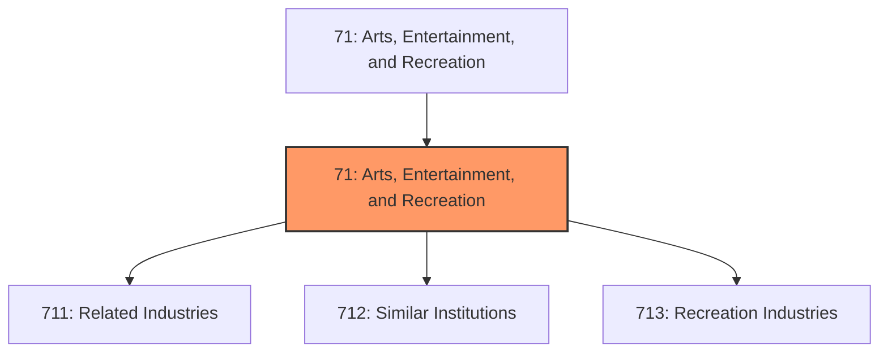
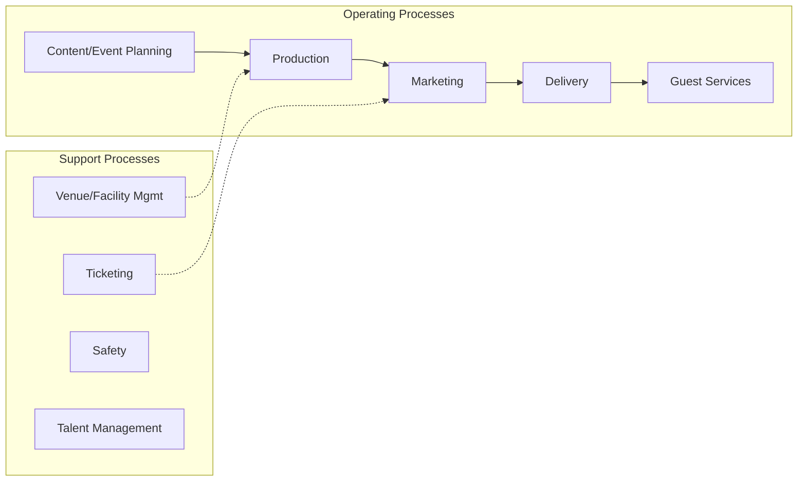

# Arts, Entertainment, and Recreation

> The Sector as a Whole The Arts, Entertainment, and Recreation sector includes a wide range of establishments that operate facilities or provide services to meet varied cultural, entertainment, and recreational interests of their patrons.

## Overview

Arts, Entertainment, and Recreation represents an important category within the Arts, Entertainment, and Recreation sector (NAICS 71). This sector encompasses establishments primarily engaged in arts, entertainment, and recreation.

The Sector as a Whole The Arts, Entertainment, and Recreation sector includes a wide range of establishments that operate facilities or provide services to meet varied cultural, entertainment, and recreational interests of their patrons. This sector comprises (1) establishments that are involved in producing, promoting, or participating in live performances, events, or exhibits intended for public viewing; (2) establishments that preserve and exhibit objects and sites of historical, cultural, or educational interest; and (3) establishments that operate facilities or provide services that enable patrons to participate in recreational activities or pursue amusement, hobby, and leisure-time interests. Some establishments that provide cultural, entertainment, or recreational facilities and services are classified in other sectors. Excluded from this sector are: (1) establishments that provide both accommodations and recreational facilities, such as hunting and fishing camps and resort and casino hotels, are classified in Subsector 721, Accommodation; (2) restaurants and night clubs that provide live entertainment in addition to the sale of food and beverages are classified in Subsector 722, Food Services and Drinking Places; (3) motion picture theaters, libraries and archives, and publishers of newspapers, magazines, books, periodicals, and computer software are classified in Sector 51, Information; and (4) establishments using transportation equipment to provide recreational and entertainment services, such as those operating sightseeing buses, dinner cruises, or helicopter rides, are classified in Subsector 487, Scenic and Sightseeing Transportation.

## Industry Hierarchy

## Key Statistics

| Metric | Value |
|--------|-------|
| NAICS Code | 71 |
| Level | Sector |
| Child Industries | 3 |

## Sub-Industries

| Industry | Code | Description |
|----------|------|-------------|
| [Related Industries](./RelatedIndustries/) | 711 | Industries in the Performing Arts, Spectator Sports, and Related Industries subs |
| [Similar Institutions](./SimilarInstitutions/) | 712 | Industries in the Museums, Historical Sites, and Similar Institutions subsector  |
| [Recreation Industries](./RecreationIndustries/) | 713 | Industries in the Amusement, Gambling, and Recreation Industries subsector (1) o |

## Core Business Processes

## Industry Value Chain

```mermaid
graph LR
    subgraph Inputs["Inputs"]
        I1["Resources"]
        I2["Expertise"]
        I3["Technology"]
    end

    subgraph Primary["Primary Activities"]
        A1["Inbound Logistics"]
        A2["Core Operations"]
        A3["Quality Assurance"]
        A4["Outbound/Delivery"]
    end

    subgraph Outputs["Products/Services"]
        O1["Products"]
        O2["Services"]
        O3["Solutions"]
    end

    subgraph Customers["Markets"]
        C1["Businesses"]
        C2["Consumers"]
        C3["Government"]
        C4["Institutions"]
    end

    Inputs --> Primary --> Outputs --> Customers
```

---

*Source: NAICS 71 - Arts, Entertainment, and Recreation*
